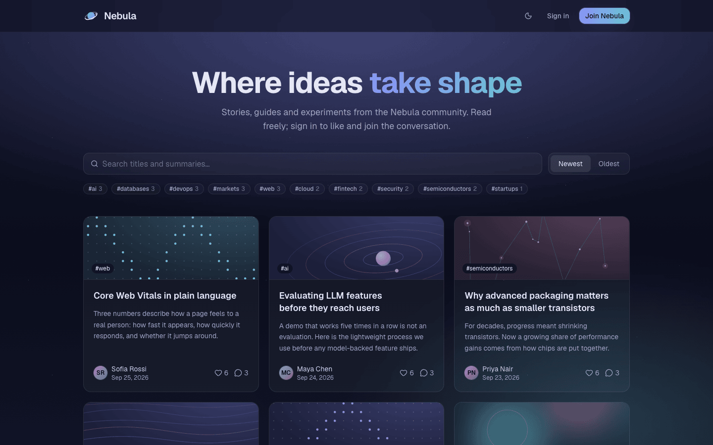
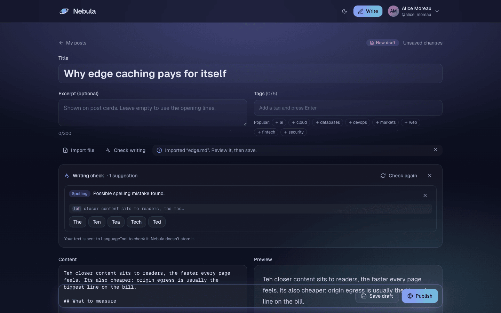
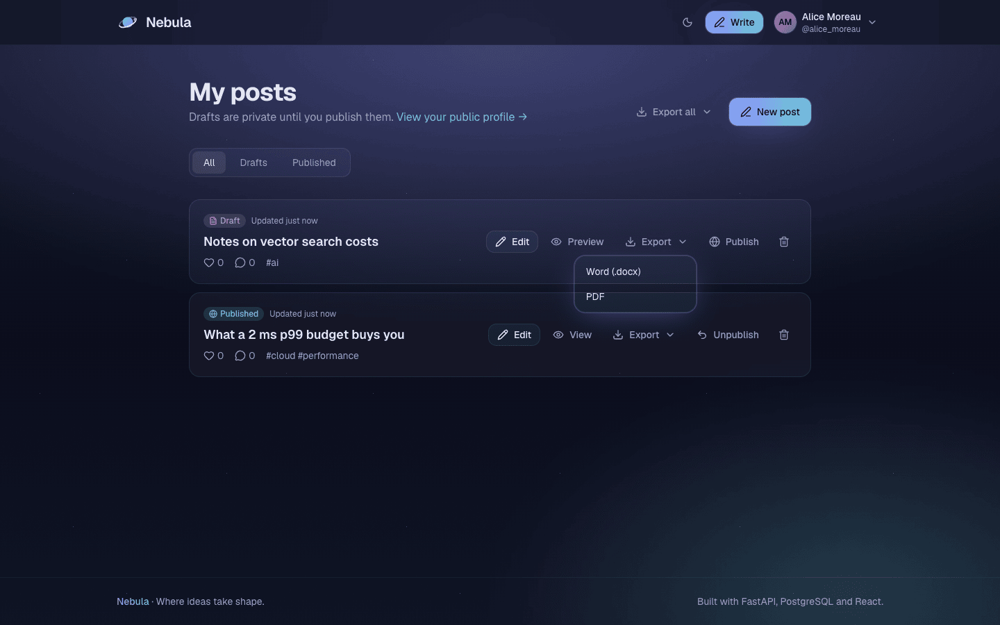
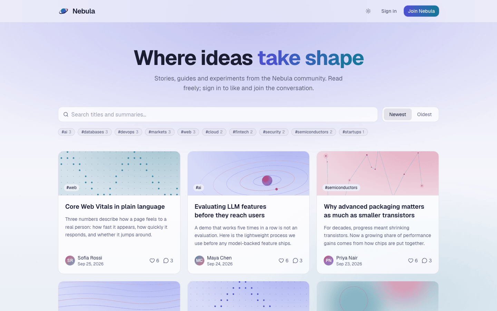
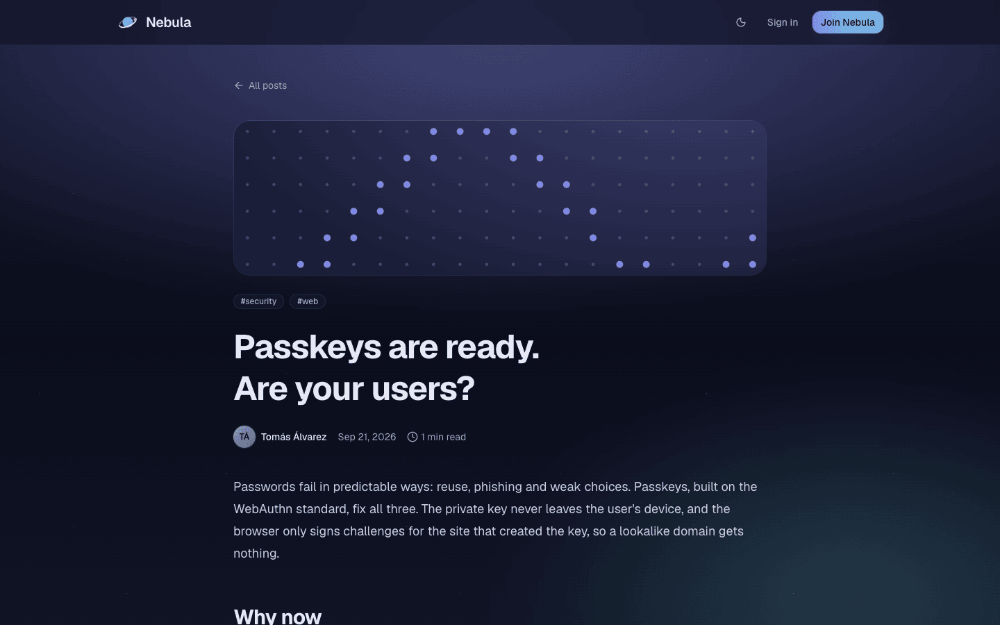
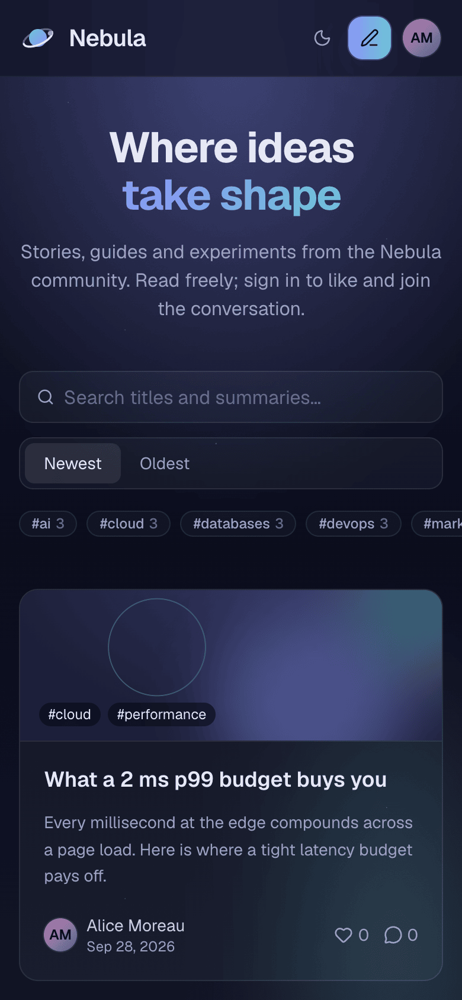
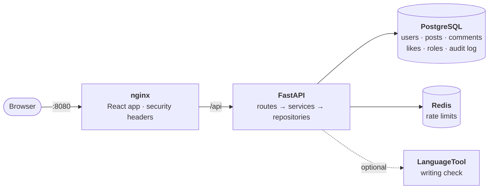

# 🌌 Nebula

> Where ideas take shape.

A production-grade, user-specific blog platform. Anyone can read. Signed-in authors write and publish their own posts, and readers like and discuss them.

[](https://github.com/mr-laboratory/nebula/actions/workflows/ci.yml)
[](https://github.com/mr-laboratory/nebula/releases)
[](LICENSE)



<table>
  <tr>
    <td width="50%"></td>
    <td width="50%"></td>
  </tr>
  <tr>
    <td align="center"><sub>Editor: import a file, check the writing, live preview</sub></td>
    <td align="center"><sub>Dashboard: drafts, publishing and Word/PDF export</sub></td>
  </tr>
</table>

## Contents

[Features](#features) · [Production-grade by design](#production-grade-by-design) · [Architecture](#architecture) · [Quickstart](#quickstart) · [Configuration](#configuration) · [Testing](#testing) · [API](#api) · [Project structure](#project-structure) · [Upcoming releases](#upcoming-releases)

## Features

**Reading (no account needed)**
- Public feed with search, tag filters, newest/oldest sort and pagination
- Post pages with rendered Markdown, reading time and generated cover art
- Author profiles with their published posts

**Writing (signed-in authors)**
- Create, edit, publish, unpublish and delete **your own** posts. Drafts stay private until you publish them.
- Markdown editor with live preview, tags, an optional excerpt, Cmd/Ctrl + S to save and an unsaved-changes guard
- **Import** a draft from a Markdown, text or Word file
- **Check writing**: spelling, grammar and style suggestions you can apply or ignore, one at a time
- **Export** one post or all of them as a Word document or a PDF
- A dashboard with filters for all posts, drafts and published posts

**Community**
- Like posts written by other people, and comment on published posts; edit or delete your own comments
- Authors can remove comments on their own posts
- Roles: **moderators** remove any post or comment, **admins** manage accounts. Every privileged action is written to an audit log.

**Experience**
- Responsive layout from phone to desktop, in light, dark or system mode
- Optimistic likes, skeleton loading states and clear, friendly error messages
- Accessible components: keyboard navigation, focus rings, labelled controls and reduced-motion support

| Light mode | Post page | Mobile |
|---|---|---|
|  |  |  |

A step-by-step guide for readers and authors is in [docs/usage.md](docs/usage.md).

## Production-grade by design

| Area | What's in place |
|---|---|
| **Authentication** | Argon2id password hashes. 15-minute JWT access tokens kept in memory, never in storage. Refresh tokens in an httpOnly, SameSite=Strict cookie, stored hashed, rotated on every use, with **reuse detection** that signs out the whole session family if a stolen token is replayed ([ADR 0002](docs/adr/0002-authentication.md)) |
| **Authorization** | Every rule is enforced by the API; the UI only hides buttons. Owners edit their own content, others get `403`, and hidden drafts return `404` so their existence is never revealed. Routes check **permissions**, not role names ([ADR 0005](docs/adr/0005-self-like-rule.md)) |
| **Privacy** | Explicit response schemas: emails, password hashes and tokens never appear in public responses. Logs are JSON with secrets and personal data redacted. Draft text sent to the writing check is never stored or logged |
| **Abuse protection** | Redis rate limits on sign-in (per address and per account), sign-up, token refresh, comments, likes, imports, exports and the writing check. Request-body cap, upload type sniffing, zip-bomb limits, no macro documents. Exports never fetch URLs |
| **Web security** | Strict Content Security Policy and security headers, sanitized Markdown (raw HTML disabled), safe link attributes, CORS allow-list, Problem Details (RFC 9457) errors with no stack traces |
| **Data** | PostgreSQL with foreign keys, CHECK constraints and versioned Alembic migrations. Soft deletes keep threads intact ([ADR 0004](docs/adr/0004-soft-delete.md)). Audit log is append-only, enforced by a database trigger. Backup and restore commands |
| **Performance** | Feed is always 3 queries (no N+1, and accidental lazy loads fail in tests). Each index is justified by `EXPLAIN ANALYZE` on 10,000 posts and guarded by a plan test. ETag / `304 Not Modified`, gzip, lazy-loaded pages |
| **Observability** | Request IDs on every response and log line, Prometheus metrics at an internal-only `/metrics`, separate liveness and readiness probes |
| **Code quality** | Layered backend: routes → services → repositories ([ADR 0003](docs/adr/0003-layered-backend.md)). Strict typing (mypy strict, TypeScript strict). Frontend API types generated from the OpenAPI schema, with CI failing if they drift |
| **Testing & CI** | 228 backend tests against real PostgreSQL and Redis, 71 frontend tests. Every pull request runs lint, types, tests, a Docker build with a full-stack smoke test, and a secret scan |
| **Containers** | Multi-stage images with no build tools at run time, non-root users, read-only filesystems, all Linux capabilities dropped, health-check-driven start-up, and only the web port published on `127.0.0.1` |
| **Repository hygiene** | gitleaks on every commit and in CI, GitHub push protection, CodeQL, Dependabot, actions pinned by commit SHA, a noreply-email guard, branch-per-change with pull requests, semantic-version releases |

## Architecture



**Stack:** FastAPI · SQLAlchemy 2 (async) · Alembic · PostgreSQL 16 · Redis · React 19 · Vite · TypeScript · Tailwind CSS v4 · TanStack Query · Motion · Docker Compose · GitHub Actions. All free and open source.

More detail, with a diagram for every feature flow: [docs/architecture.md](docs/architecture.md).

## Quickstart

### Run it with Docker

**Prerequisites:** `make`, `python3` and Docker (Docker Desktop, or [Colima](https://github.com/abiosoft/colima) on macOS).

```bash
git clone https://github.com/mr-laboratory/nebula.git && cd nebula
make up       # create .env with random secrets, build the images, migrate and start everything
make smoke    # optional: check the running stack end to end
```

Open **http://localhost:8080** and register an account. Stop with `make down`; your data is kept in a Docker volume.

Optional extras (these run on your machine, so they also need [uv](https://docs.astral.sh/uv/)):

```bash
make seed                                # demo authors, posts, likes and comments
make grant u=<username> role=moderator   # or role=admin
```

Demo authors have no usable password, so nobody can sign in as them. The stack runs in production mode, so the interactive API docs are off; use local development for `/docs`.

### Local development

**Prerequisites:** [uv](https://docs.astral.sh/uv/), [Node.js 24+](https://nodejs.org/), `make`, [pre-commit](https://pre-commit.com/) and Docker.

```bash
make setup    # install dependencies and git hooks, create .env with random secrets
make db-up    # start PostgreSQL and Redis
make migrate  # create the schema
make seed     # optional: demo data
make dev      # API on http://localhost:8000, interactive docs at /docs
make web      # in a second terminal: app on http://localhost:5173
```

Both modes use the same database, so `make seed` and `make grant` work for the Docker stack too.

### Commands

| Command | Purpose |
|---|---|
| `make up` / `make down` | Start / stop the whole app in Docker |
| `make smoke` / `make logs` | Check the running stack / follow API and web logs |
| `make check` | Everything CI runs, for the backend and the web app |
| `make test` / `make web-check` | Backend tests / web app lint, types, tests and build |
| `make lint` / `make fmt` / `make typecheck` | Check style / fix style / strict type checking |
| `make api-types` | Regenerate the OpenAPI schema and the frontend's API types |
| `make db-up` / `make db-down` | Start / stop PostgreSQL and Redis |
| `make migrate` / `make migration m="…"` | Apply migrations / generate one from model changes |
| `make seed` / `make seed-large` | Load demo data / load 10,000 posts for query tuning |
| `make explain` | Print query plans and timings for the main queries |
| `make grant u=… role=…` / `make revoke …` | Give or take a role |
| `make psql` | SQL shell on the local database |
| `make backup` / `make restore f=…` | Dump the database to `backups/` / restore a dump |

Run `make help` for the full list.

## Configuration

`make up` and `make setup` create `.env` from [.env.example](.env.example) with random secrets. `.env` is git-ignored. In production mode the API refuses to start with placeholder secrets.

| Variable | Default | Purpose |
|---|---|---|
| `APP_ENV` | `development` | `development`, `test` or `production` (Docker sets `production`: no `/docs`, strict secret checks) |
| `APP_DEBUG` · `LOG_LEVEL` | `false` · `INFO` | Debug mode and log verbosity |
| `API_PREFIX` | `/api/v1` | Base path of the API |
| `CORS_ORIGINS` | `http://localhost:5173` | Allowed browser origins, comma-separated |
| `JWT_SECRET` | *generated* | Signs access tokens |
| `ACCESS_TOKEN_EXPIRE_MINUTES` · `REFRESH_TOKEN_EXPIRE_DAYS` | `15` · `7` | Token lifetimes |
| `POSTGRES_USER` · `POSTGRES_PASSWORD` · `POSTGRES_DB` · `POSTGRES_HOST` · `POSTGRES_PORT` | `nebula` · *generated* · `nebula` · `localhost` · `5432` | Database connection |
| `REDIS_URL` | `redis://localhost:6379/0` | Rate-limit store |
| `WRITING_CHECK_ENABLED` | `true` | `false` removes the writing-check endpoint, so draft text never leaves the server |
| `LANGUAGETOOL_URL` · `LANGUAGETOOL_TIMEOUT_SECONDS` | public API · `3` | Where the writing check is sent |
| `METRICS_ENABLED` | `true` | Prometheus metrics at `/metrics` (internal only) |

## Testing

```bash
make check    # lint, format, types and tests for the backend and the web app, then a production build
make smoke    # against a running `make up` stack
```

| Suite | Covers |
|---|---|
| **Backend** (pytest, real PostgreSQL + Redis) | Sign-up, sign-in, token rotation and reuse detection, forged tokens · ownership and draft visibility · likes, comments and moderation · roles, lockout rules and audit entries · feed filters, pagination and query counts (no N+1) · query plans use the intended indexes · ETags and compression · import limits and file sniffing · export content and safety · writing-check masking and failures · log redaction, error format, metrics, migrations |
| **Frontend** (Vitest) | Session refresh and retry, permission helpers, draft and tag logic, writing-suggestion offsets, cover art, formatting helpers |
| **Smoke test** (full Docker stack) | App shell, API through the proxy, security headers, `/metrics` not exposed, PDF rendering, no container running as root |

## API

A versioned REST API under `/api/v1`, with JSON errors in the Problem Details format and an OpenAPI schema.

- Reference with every endpoint, rule and example: [docs/api.md](docs/api.md)
- Interactive docs: http://localhost:8000/docs while `make dev` is running
- Schema: [docs/openapi.json](docs/openapi.json)

## Documentation

| Document | What it covers |
|---|---|
| [User guide](docs/usage.md) | Reading, writing, importing, exporting and moderating, step by step |
| [Architecture](docs/architecture.md) | Components, request lifecycle, feature flows, security layers, deployment |
| [API reference](docs/api.md) | Endpoints, payloads, errors and rate limits |
| [Database](docs/database.md) | Schema, constraints, indexes and query plans, backups |
| [Architecture decisions](docs/adr/) | Why each major choice was made, and what it costs |
| [Learning log](docs/learning-log/) | Concepts and lessons, day by day (Phases 0–11 over five days) |

## Project structure

```
backend/
├── app/
│   ├── main.py            # application factory
│   ├── core/              # config, logging, middleware, errors, security, rate limits
│   ├── db/                # declarative base, engine and sessions
│   ├── models/            # ORM models
│   ├── schemas/           # request/response models (whitelisted fields)
│   ├── services/          # business rules and permission checks
│   ├── repositories/      # database queries (filters, pagination, eager loading)
│   ├── rendering/         # Word and PDF export
│   └── api/               # dependencies and v1 HTTP endpoints
├── migrations/            # Alembic schema migrations
├── scripts/               # seed data, query plans, roles, OpenAPI export
├── tests/
└── Dockerfile             # multi-stage API image (non-root)
frontend/
├── public/                # favicon, pre-paint theme script
├── src/
│   ├── api/               # HTTP client (token refresh), endpoints, generated types
│   ├── auth/              # session provider and route guard
│   ├── theme/             # light / dark / system mode
│   ├── components/        # layout, cards, cover art, Markdown, comments, UI primitives
│   ├── pages/             # feed, post, editor, dashboard, profile, sign-in
│   └── lib/               # pure helpers with tests
├── docker/                # nginx config and security headers
└── Dockerfile             # build → unprivileged nginx image
docker/                    # database init scripts
docs/                      # guides, architecture, API, database, ADRs, screenshots
scripts/                   # .env setup, backup / restore, smoke test
.github/                   # CI workflow, Dependabot, pull request template
docker-compose.yml         # PostgreSQL + Redis; with the `app` profile, the full stack
```

## Upcoming releases

Out of scope for 1.0 and planned for later releases:

- Highlight writing suggestions directly in the editor text, as you type
- A web page for admins: accounts, roles and the audit log (available through the API today)
- Keyset pagination for very large feeds
- Cover image uploads, with a moderation step
- Sign in with GitHub

## Security

Found a vulnerability? Please follow [SECURITY.md](SECURITY.md) and **do not** open a public issue.

## About

Built as part of the AI Bootcamp Week 1 assignment.

## License

[MIT](LICENSE)
