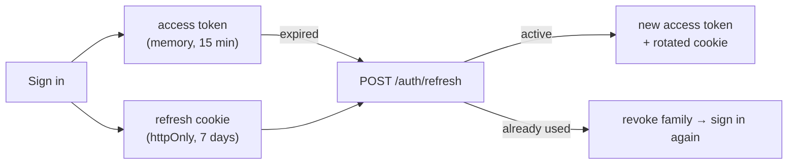

# ADR 0002 — Authentication: short-lived JWT plus a rotating refresh cookie

- **Status:** Accepted
- **Date:** 2026-09-26

## Context

Readers browse without an account, but authors, likes and comments need a signed-in user. The frontend is a single-page app served from the same origin as the API. Sessions should survive a page reload, be revocable, and limit the damage if a token is stolen. Every request that needs a user should be cheap to authenticate.

## Decision

| Piece | Choice |
|---|---|
| Passwords | Argon2id hashes; 12–128 characters; the same generic error for a wrong email or a wrong password |
| Access token | JWT signed with HS256 (pinned), 15-minute lifetime, checked for `iss`, `aud`, `exp` and token type. Held **in memory only** by the frontend and sent as `Authorization: Bearer` |
| Refresh token | Random, opaque, 7-day lifetime, stored **hashed** in `refresh_tokens`. Sent as an `httpOnly`, `Secure`, `SameSite=Strict` cookie scoped to `/api/v1/auth` |
| Rotation | Every refresh revokes the old token and issues a new one in the same **family**, under a row lock |
| Reuse detection | Presenting an already-used refresh token revokes the whole family, signing out both the thief and the real user |
| Sign-out | Revokes the family and clears the cookie |
| Frontend | One shared refresh at a time (a promise within the tab, a Web Lock across tabs), because refresh tokens are single use |

## Alternatives considered

- **Server-side sessions only** (session id cookie, lookup on every request): simple and revocable, but every authenticated request hits the store, and it couples the API to cookie-based CSRF defences on every route.
- **Long-lived JWT in `localStorage`**: stateless, but readable by any script that gets onto the page (XSS), and impossible to revoke before it expires.
- **Refresh token in `localStorage`**: same XSS exposure, for a much longer-lived credential.
- **OAuth / third-party sign-in only**: removes password handling, but adds an external dependency for the core flow. Kept on the roadmap as an extra option.

## Consequences

- Authenticating a request is a signature check plus one indexed user lookup (to honour deactivation); no session store is involved.
- A stolen access token works for at most 15 minutes. A stolen refresh token is detected the first time both copies are used.
- CSRF is blocked by `SameSite=Strict` and by the cookie being sent only to `/auth` routes; every other route needs the Bearer header, which a cross-site page can't set.
- A reload costs one refresh request. The frontend only tries it when a "has session" hint is set, so guests don't produce 401s.
- Refreshes must be serialized in the client; two parallel refreshes would look like token theft and end the session.
