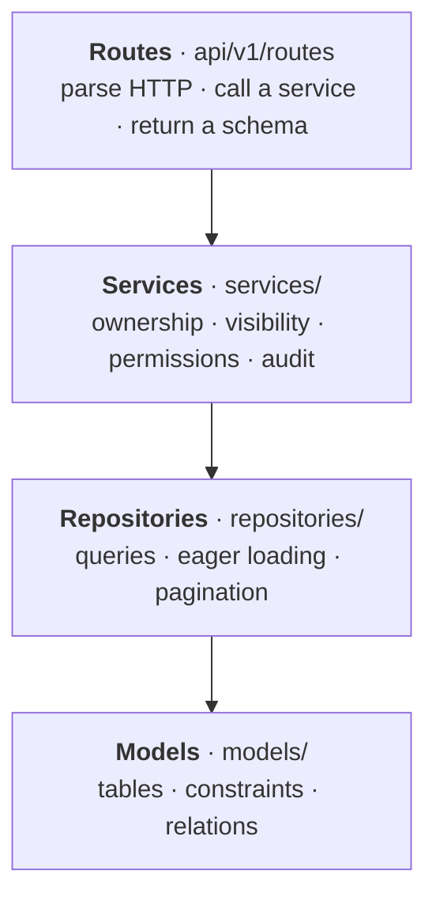

# ADR 0003 — Layered backend: routes, services, repositories

- **Status:** Accepted
- **Date:** 2026-09-26

## Context

Most of Nebula's rules are about who may do what: authors edit only their own posts, drafts stay hidden, nobody likes their own post, moderators delete but never rewrite. Those rules must hold for every endpoint, be testable without HTTP, and not get tangled with SQL or request parsing. Query performance (no N+1, index-friendly filters) also needs one obvious place to live.

## Decision

Split the backend into layers whose dependencies point downward only:

| Layer | Owns | Never does |
|---|---|---|
| Routes | Status codes, dependencies (`Depends`), response schemas | Business rules, SQL |
| Services | Every permission and visibility rule; domain errors (`ForbiddenError`, `NotFoundError`) | HTTP details |
| Repositories | SQL, eager loading, counts, pagination | Authorization |
| Schemas | Whitelisted input and output fields | Logic |

Domain errors are turned into Problem Details responses (RFC 9457) by one handler, so services never build HTTP responses. Relationships load with `lazy="raise"`, so an accidental lazy load fails in tests instead of adding hidden queries.

## Alternatives considered

- **Logic in route handlers**: fewer files, but each endpoint re-implements the ownership checks, and they drift.
- **Active-record models with methods**: convenient, but mixes persistence, rules and queries in one class and makes async sessions harder to reason about.
- **Full domain-driven design** (aggregates, unit of work, ports and adapters): more structure than an app of this size needs.

## Consequences

- A rule lives in exactly one service function and is tested directly, including the unhappy paths.
- Query counts are predictable: repositories load exactly what a response needs (the feed is always 3 queries).
- More files and some pass-through code for simple reads, accepted for consistency.
