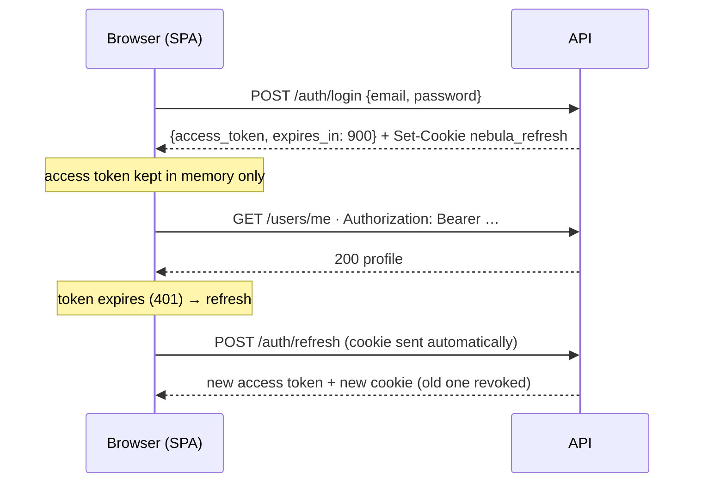

# API reference

Base URL: `http://localhost:8000/api/v1` · Interactive docs (OpenAPI): `/docs` (development only).

## Conventions

| Topic | Rule |
|---|---|
| Format | JSON in, JSON out. Timestamps are ISO 8601 UTC. IDs are UUIDs. |
| Authentication | `Authorization: Bearer <access_token>` on protected routes. |
| Errors | [RFC 9457 Problem Details](#errors) with `Content-Type: application/problem+json`. |
| Tracing | Every response carries `X-Request-ID`; quote it when reporting a problem. |
| Privacy | Responses use whitelisted schemas: password hashes, tokens and internal flags are never returned. |

## Authentication model



| Credential | Lifetime | Where it lives | Format |
|---|---|---|---|
| Access token | 15 min | SPA memory | JWT (HS256, `iss=nebula`, `aud=nebula-api`) |
| Refresh token | 7 days, **single use** | `nebula_refresh` cookie: `HttpOnly; Secure; SameSite=Strict; Path=/api/v1/auth` | Opaque random string, stored only as a SHA-256 hash |

**Rotation and reuse detection.** Every refresh revokes the presented token and issues a new one in the same *family* (one family per sign-in). Presenting an already-used token means it was copied, so the **whole family is revoked** and the user must sign in again.

> **Client note:** send at most one refresh request at a time. Two parallel refreshes with the same cookie look like reuse and end the session.

## Endpoints

| Method | Path | Auth | Success | Purpose |
|---|---|---|---|---|
| `POST` | `/auth/register` | — | `201` | Create an account |
| `POST` | `/auth/login` | — | `200` | Get an access token and refresh cookie |
| `POST` | `/auth/refresh` | cookie | `200` | Rotate the refresh cookie, get a new access token |
| `POST` | `/auth/logout` | cookie | `204` | Revoke the session |
| `GET` | `/users/me` | Bearer | `200` | Own profile, roles and permissions |
| `PATCH` | `/users/me` | Bearer | `200` | Update display name / bio |
| `GET` | `/health/live` | — | `200` | Process is running |
| `GET` | `/health/ready` | — | `200` / `503` | Database and Redis are reachable |

### `POST /auth/register`

```json
{ "email": "ada@example.com", "username": "ada", "password": "correct-horse-battery", "display_name": "Ada" }
```

| Field | Rules |
|---|---|
| `email` | Valid address; stored lowercase |
| `username` | 3–30 chars, `a-z 0-9 _`; stored lowercase |
| `password` | 12–128 characters (length over composition rules, per NIST SP 800-63B) |
| `display_name` | 1–60 characters |

`201` returns the [profile](#get-usersme). New accounts get the `user` role only. `409` if the email or username is taken (one combined message).

### `POST /auth/login`

```json
{ "email": "ada@example.com", "password": "correct-horse-battery" }
```

```json
{ "access_token": "eyJhbGciOiJIUzI1NiIs…", "token_type": "bearer", "expires_in": 900 }
```

Also sets the `nebula_refresh` cookie. A wrong password, unknown email and deactivated account all return the same `401 "Invalid email or password."` in the same amount of time, so the endpoint cannot be used to discover accounts.

### `POST /auth/refresh`

No body; the browser sends the cookie. Returns the same shape as login and replaces the cookie. `401` if the cookie is missing, expired, revoked or reused.

### `POST /auth/logout`

No body and no access token needed, so a user whose access token has expired can still sign out. It revokes the whole session family and clears the cookie. It always returns `204`, even without a cookie.

### `GET /users/me`

```json
{
  "id": "ddd0d364-eb90-4ac0-9352-7a8565e8ed1a",
  "email": "ada@example.com",
  "username": "ada",
  "display_name": "Ada",
  "bio": null,
  "created_at": "2026-09-25T18:23:46.892436Z",
  "roles": ["user"],
  "permissions": []
}
```

`email` appears only in the owner's own profile. Public author views (Phase 4) expose `username` and `display_name` only.

### `PATCH /users/me`

```json
{ "display_name": "Ada L.", "bio": "Writes about engines." }
```

Send at least one field. `display_name` cannot be null or empty. Email, username and roles are not editable here; unknown fields are ignored.

## Errors

```json
{
  "type": "about:blank",
  "title": "Unauthorized",
  "status": 401,
  "detail": "The access token is invalid or has expired.",
  "instance": "/api/v1/users/me",
  "request_id": "b1e4…"
}
```

| Status | When | Extra |
|---|---|---|
| `401` | Missing, expired or invalid credentials | `WWW-Authenticate: Bearer` |
| `403` | Signed in but not allowed | — |
| `404` | Not found, or not visible to you | — |
| `409` | Conflicts with existing data | — |
| `422` | Validation failed | `errors: [{loc, msg, type}]`; submitted values are **never echoed** |
| `429` | Rate limit exceeded | `Retry-After: <seconds>` |
| `500` | Unexpected failure | Generic message and `request_id` only |

## Rate limits

Fixed windows, counted in Redis. Emails are hashed before use as keys.

| Endpoint | Limit |
|---|---|
| `/auth/login` | 5 / minute per IP **and** 10 / 15 minutes per email |
| `/auth/register` | 10 / hour per IP |
| `/auth/refresh` | 30 / minute per IP |

If Redis is unavailable the limiter **fails open** (requests are allowed and a warning is logged). This keeps sign-in available during a cache outage, and Argon2 hashing still makes brute force slow.
