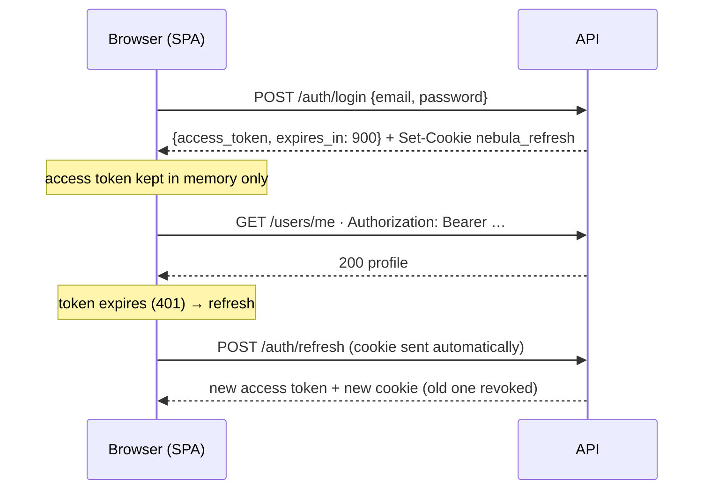
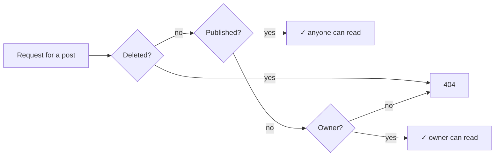

# API reference

Base URL: `http://localhost:8000/api/v1` · Interactive docs (OpenAPI): `/docs` (development only).

## Conventions

| Topic | Rule |
|---|---|
| Format | JSON in, JSON out. Timestamps are ISO 8601 UTC. IDs are UUIDs. |
| Authentication | `Authorization: Bearer <access_token>` on protected routes. |
| Errors | [RFC 9457 Problem Details](#errors) with `Content-Type: application/problem+json`. |
| Tracing | Every response carries `X-Request-ID`; quote it when reporting a problem. |
| Privacy | Responses use whitelisted schemas: password hashes, tokens and internal flags are never returned. |
| Strict input | Unknown body fields and query parameters are rejected with `422`, so server-controlled fields (`author_id`, `status`, `slug`) can't be set by clients. |
| Pagination | `?limit=` (1–100, default 20) and `?offset=` (0–10 000). Lists return `{items, total, limit, offset}`. |

## Authentication model



| Credential | Lifetime | Where it lives | Format |
|---|---|---|---|
| Access token | 15 min | SPA memory | JWT (HS256, `iss=nebula`, `aud=nebula-api`) |
| Refresh token | 7 days, **single use** | `nebula_refresh` cookie: `HttpOnly; Secure; SameSite=Strict; Path=/api/v1/auth` | Opaque random string, stored only as a SHA-256 hash |

**Rotation and reuse detection.** Every refresh revokes the presented token and issues a new one in the same *family* (one family per sign-in). Presenting an already-used token means it was copied, so the **whole family is revoked** and the user must sign in again.

> **Client note:** send at most one refresh request at a time. Two parallel refreshes with the same cookie look like reuse and end the session.

## Endpoints

| Method | Path | Auth | Success | Purpose |
|---|---|---|---|---|
| `POST` | `/auth/register` | — | `201` | Create an account |
| `POST` | `/auth/login` | — | `200` | Get an access token and refresh cookie |
| `POST` | `/auth/refresh` | cookie | `200` | Rotate the refresh cookie, get a new access token |
| `POST` | `/auth/logout` | cookie | `204` | Revoke the session |
| `GET` | `/users/me` | Bearer | `200` | Own profile, roles and permissions |
| `PATCH` | `/users/me` | Bearer | `200` | Update display name / bio |
| `GET` | `/users/me/posts` | Bearer | `200` | Own posts, drafts included |
| `GET` | `/users/{username}` | — | `200` | Public author profile |
| `GET` | `/posts` | — | `200` | Public feed: filter, search, paginate |
| `GET` | `/posts/{slug}` | optional | `200` | Read a post |
| `POST` | `/posts` | Bearer | `201` | Create a draft |
| `PATCH` | `/posts/{id}` | Bearer (owner) | `200` | Edit a post |
| `POST` | `/posts/{id}/publish` | Bearer (owner) | `200` | Make public (idempotent) |
| `POST` | `/posts/{id}/unpublish` | Bearer (owner) | `200` | Back to draft (idempotent) |
| `DELETE` | `/posts/{id}` | Bearer (owner or moderator) | `204` | Soft-delete |
| `PUT` | `/posts/{id}/like` | Bearer (not the author) | `200` | Like a post (idempotent) |
| `DELETE` | `/posts/{id}/like` | Bearer | `200` | Remove your like (idempotent) |
| `GET` | `/posts/{id}/comments` | optional | `200` | Comments, oldest first |
| `POST` | `/posts/{id}/comments` | Bearer | `201` | Add a comment |
| `PATCH` | `/comments/{id}` | Bearer (comment author) | `200` | Edit a comment |
| `DELETE` | `/comments/{id}` | Bearer (comment author, post author or moderator) | `204` | Delete a comment |
| `GET` | `/tags` | — | `200` | Tags in use, most popular first |
| `GET` | `/health/live` | — | `200` | Process is running |
| `GET` | `/health/ready` | — | `200` / `503` | Database and Redis are reachable |

### `POST /auth/register`

```json
{ "email": "ada@example.com", "username": "ada", "password": "correct-horse-battery", "display_name": "Ada" }
```

| Field | Rules |
|---|---|
| `email` | Valid address; stored lowercase |
| `username` | 3–30 chars, `a-z 0-9 _`; stored lowercase |
| `password` | 12–128 characters (length over composition rules, per NIST SP 800-63B) |
| `display_name` | 1–60 characters |

`201` returns the [profile](#get-usersme). New accounts get the `user` role only. `409` if the email or username is taken (one combined message).

### `POST /auth/login`

```json
{ "email": "ada@example.com", "password": "correct-horse-battery" }
```

```json
{ "access_token": "eyJhbGciOiJIUzI1NiIs…", "token_type": "bearer", "expires_in": 900 }
```

Also sets the `nebula_refresh` cookie. A wrong password, unknown email and deactivated account all return the same `401 "Invalid email or password."` in the same amount of time, so the endpoint cannot be used to discover accounts.

### `POST /auth/refresh`

No body; the browser sends the cookie. Returns the same shape as login and replaces the cookie. `401` if the cookie is missing, expired, revoked or reused.

### `POST /auth/logout`

No body and no access token needed, so a user whose access token has expired can still sign out. It revokes the whole session family and clears the cookie. It always returns `204`, even without a cookie.

### `GET /users/me`

```json
{
  "id": "ddd0d364-eb90-4ac0-9352-7a8565e8ed1a",
  "email": "ada@example.com",
  "username": "ada",
  "display_name": "Ada",
  "bio": null,
  "created_at": "2026-09-25T18:23:46.892436Z",
  "roles": ["user"],
  "permissions": []
}
```

`email` appears only in the owner's own profile. Public views never include it.

### `PATCH /users/me`

```json
{ "display_name": "Ada L.", "bio": "Writes about engines." }
```

Send at least one field. `display_name` cannot be null or empty. Email, username and roles are not editable here; unknown fields are rejected (`422`).

### `GET /users/{username}`

```json
{ "username": "ada", "display_name": "Ada", "bio": null, "created_at": "2026-09-25T18:23:46Z", "post_count": 3 }
```

`post_count` counts published posts only. `404` for unknown or deactivated accounts.

### `GET /users/me/posts`

Same page shape as the feed, including drafts, newest edit first. Optional `?status=draft|published`.

## Posts

### Visibility and permissions



| Action | Owner | Moderator | Other signed-in user |
|---|---|---|---|
| Read a draft | ✓ | `404` | `404` |
| Edit / publish / unpublish | ✓ | `403` | `403` (published) · `404` (draft) |
| Delete | ✓ | ✓ | `403` (published) · `404` (draft) |

A draft answers `404` rather than `403` to anyone but its author, so its existence is never revealed.

### `GET /posts`

| Parameter | Rules |
|---|---|
| `tag` | Exact tag name (case-insensitive) |
| `author` | Username |
| `q` | 1–100 chars, searched in title and excerpt; `%` and `_` match literally |
| `sort` | `newest` (default) or `oldest`, by publication date |
| `limit`, `offset` | See [pagination](#conventions) |

```json
{
  "items": [{
    "id": "4f0c…", "slug": "hello-world", "title": "Hello world",
    "excerpt": "Some *markdown* content.", "status": "published",
    "author": { "username": "ada", "display_name": "Ada" },
    "tags": ["python"],
    "like_count": 3, "comment_count": 2, "liked_by_me": false,
    "published_at": "2026-09-25T18:30:00Z", "created_at": "…", "updated_at": "…"
  }],
  "total": 1, "limit": 20, "offset": 0
}
```

List items never include `content`; `excerpt` falls back to the first 280 characters of it. `liked_by_me` is `null` when signed out. The page is loaded in 3 queries whatever its size (count; posts with authors, like and comment counts; tags).

### `GET /posts/{slug}`

The list item plus `content` (Markdown). Drafts are visible to their author only (send the Bearer token); everyone else gets `404`.

### `POST /posts`

```json
{ "title": "Hello world", "content": "Some *markdown* content.", "excerpt": "Optional summary", "tags": ["Python", "fastapi"] }
```

| Field | Rules |
|---|---|
| `title` | 1–200 characters |
| `content` | 1–100 000 characters (Markdown) |
| `excerpt` | Optional, ≤ 300 characters |
| `tags` | ≤ 5, each `a-z 0-9 -` and ≤ 40 characters; lowercased and de-duplicated |

Returns `201` with the full post and `Location: /api/v1/posts/{slug}`. New posts are drafts. The slug comes from the title (`hello-world`); if it is taken, a random suffix is added (`hello-world-3fa9c1`).

### `PATCH /posts/{id}`

Send only the fields to change (at least one). `excerpt: null` clears it. Retitling a post that has **never been published** also updates its slug; after the first publication the slug is permanent, so shared links keep working.

### `POST /posts/{id}/publish` · `/unpublish`

No body; returns the post. Repeating the call is harmless. `published_at` records the **first** publication and is kept if the post is unpublished.

### `DELETE /posts/{id}`

Soft delete: the post disappears everywhere, including for its author, and its slug is never reused. Moderators may delete any post but cannot edit it.

### `GET /tags`

```json
[{ "name": "python", "post_count": 12 }, { "name": "react", "post_count": 7 }]
```

Counts published posts only. `?limit=` 1–100, default 50.

## Likes

### `PUT /posts/{id}/like` · `DELETE /posts/{id}/like`

No body. Both return the post's current state, and repeating either call changes nothing:

```json
{ "like_count": 4, "liked_by_me": true }
```

| Case | Result |
|---|---|
| Your own post | `403` |
| Someone else's draft, deleted or unknown post | `404` |
| Your own draft | `409`: publish it first |

## Comments

Comments are flat (no replies-to-replies), plain text, and listed oldest first.

### `GET /posts/{id}/comments`

```json
{
  "items": [
    { "id": "9a1e…", "body": "Great read", "author": { "username": "bob", "display_name": "Bob" },
      "is_deleted": false, "edited": true, "created_at": "…" },
    { "id": "c47b…", "body": null, "author": null, "is_deleted": true, "edited": false, "created_at": "…" }
  ],
  "total": 2, "limit": 20, "offset": 0
}
```

Public for published posts; a draft's comments are visible to its author only. A deleted comment stays in place as a placeholder with its text and author removed, so the conversation keeps its shape. `total` counts placeholders; a post's `comment_count` does not.

### `POST /posts/{id}/comments` · `PATCH /comments/{id}`

```json
{ "body": "Great read" }
```

`body`: 1–5 000 characters after trimming whitespace. It is stored as plain text; clients must render it as text, never as HTML. Commenting follows the same rules as liking (`404` for hidden posts, `409` for your own draft). `edited` becomes `true` once the text changes.

| Action | Comment author | Post author | Moderator | Anyone else |
|---|---|---|---|---|
| Edit | ✓ | `403` | `403` | `403` |
| Delete | ✓ | ✓ | ✓ | `403` |

## Errors

```json
{
  "type": "about:blank",
  "title": "Unauthorized",
  "status": 401,
  "detail": "The access token is invalid or has expired.",
  "instance": "/api/v1/users/me",
  "request_id": "b1e4…"
}
```

| Status | When | Extra |
|---|---|---|
| `401` | Missing, expired or invalid credentials | `WWW-Authenticate: Bearer` |
| `403` | Signed in but not allowed | — |
| `404` | Not found, or not visible to you | — |
| `409` | Conflicts with existing data | — |
| `422` | Validation failed | `errors: [{loc, msg, type}]`; submitted values are **never echoed** |
| `429` | Rate limit exceeded | `Retry-After: <seconds>` |
| `500` | Unexpected failure | Generic message and `request_id` only |

## Rate limits

Fixed windows, counted in Redis. Emails and user IDs are hashed before use as keys.

| Endpoint | Limit |
|---|---|
| `/auth/login` | 5 / minute per IP **and** 10 / 15 minutes per email |
| `/auth/register` | 10 / hour per IP |
| `/auth/refresh` | 30 / minute per IP |
| `POST /posts/{id}/comments` | 10 / minute per user |
| `PATCH /comments/{id}` | 30 / minute per user |
| `PUT`/`DELETE /posts/{id}/like` | 60 / minute per user |

If Redis is unavailable the limiter **fails open** (requests are allowed and a warning is logged). This keeps sign-in available during a cache outage, and Argon2 hashing still makes brute force slow.
