# Architecture

How Nebula is structured and how each feature flows through it. For *why* each technology was chosen, see the [ADRs](adr/).

## 1. System overview


The API is **stateless**: session state lives in PostgreSQL and Redis, so instances can scale horizontally.

## 2. Backend layers

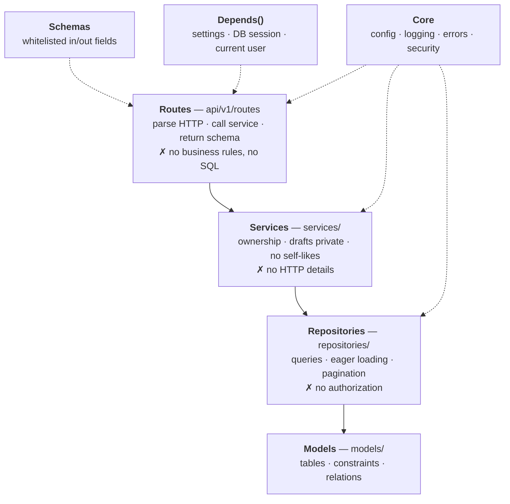

Dependencies point **downward only**.

## 3. Request lifecycle

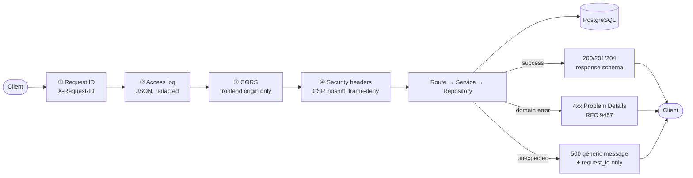

Error response shape:

```json
{ "type": "about:blank", "title": "Forbidden", "status": 403,
  "detail": "You can only edit your own posts",
  "instance": "/api/v1/posts/3f2c…", "request_id": "b1e4…" }
```

## 4. Feature flows

### 4.1 Browse and read (public)

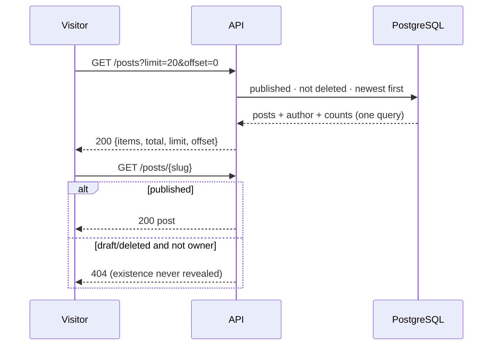

### 4.2 Sign-up, sign-in, refresh, sign-out

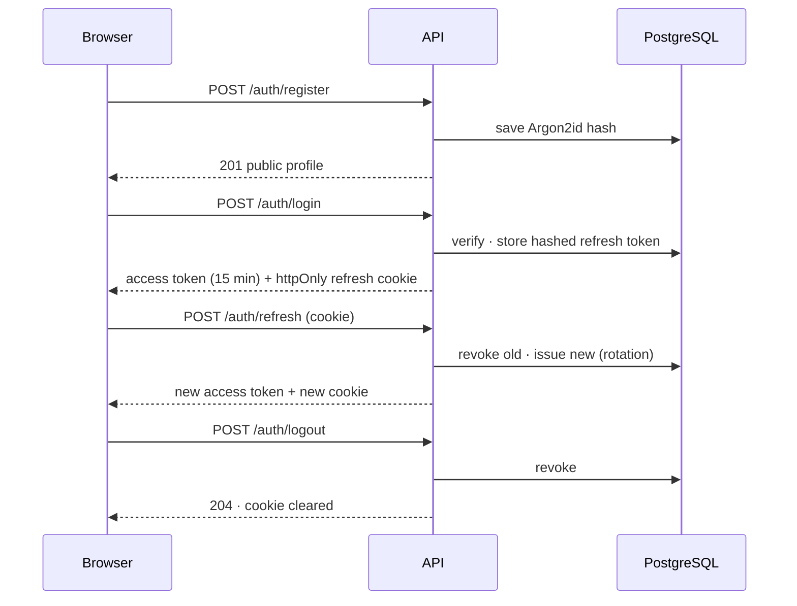

### 4.3 Author manages own posts

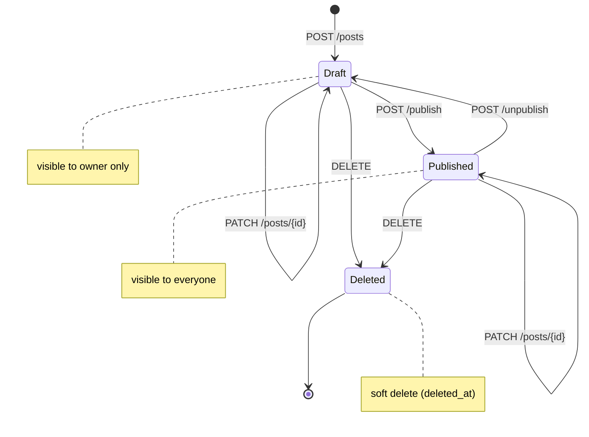

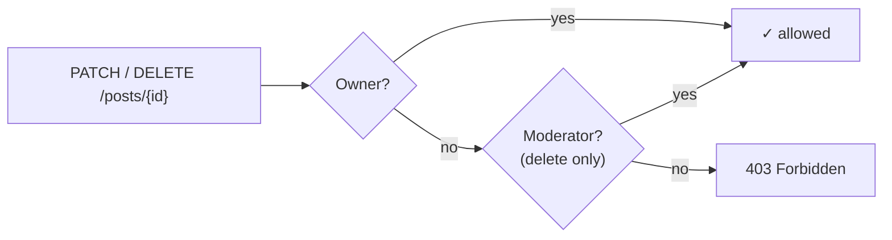

### 4.4 Likes

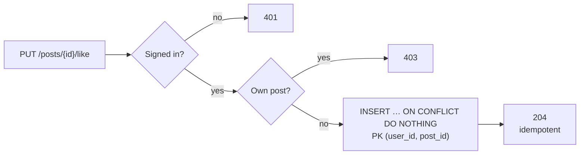

### 4.5 Comments

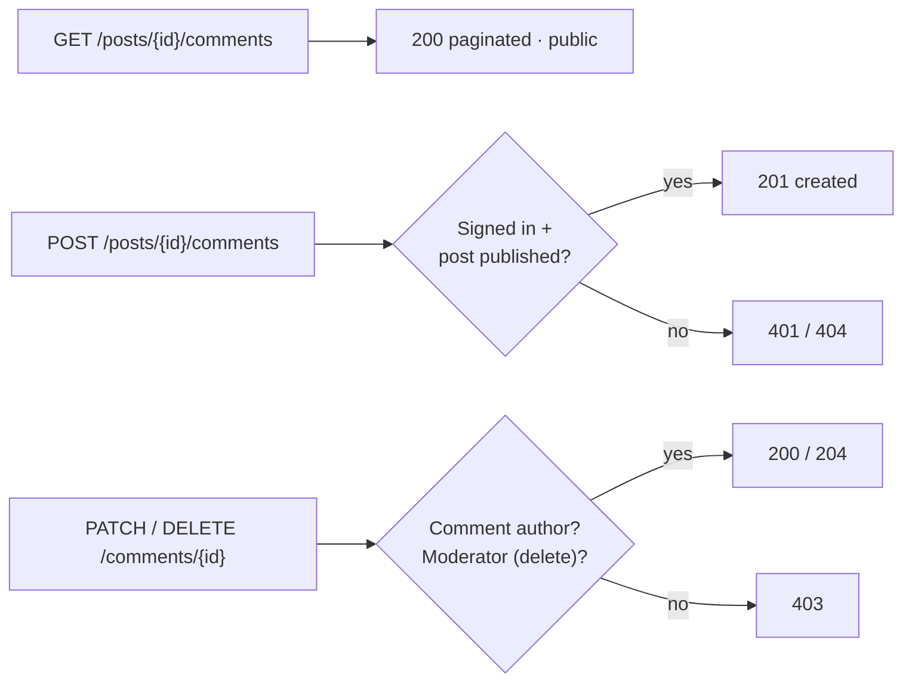

## 5. Data model

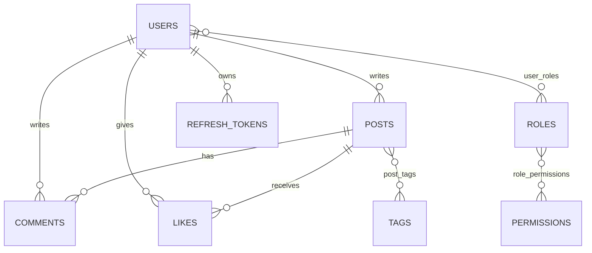

Full schema, constraints and design decisions: [database.md](database.md).

## 6. Security layers

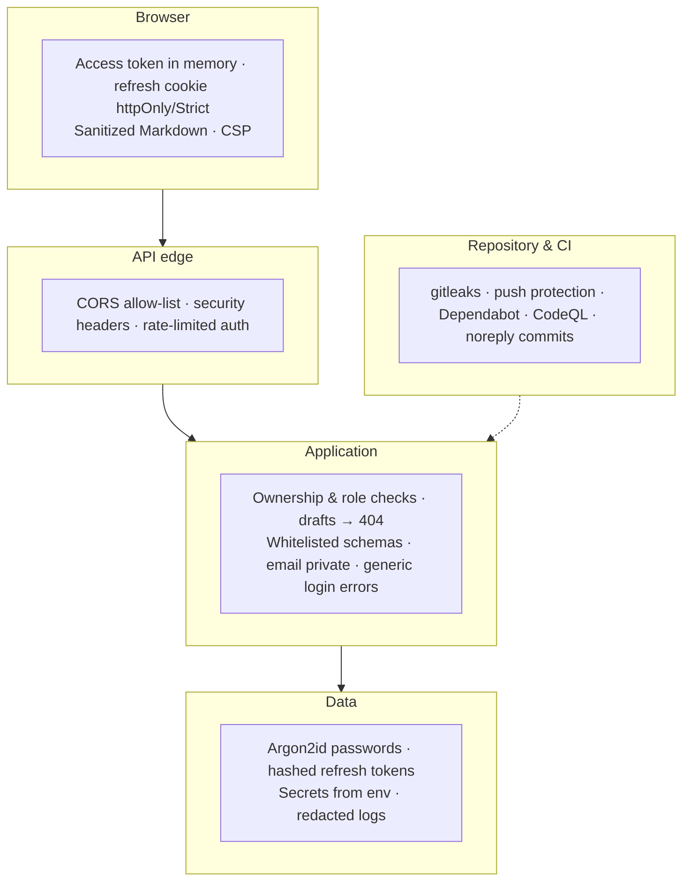

## 7. Observability

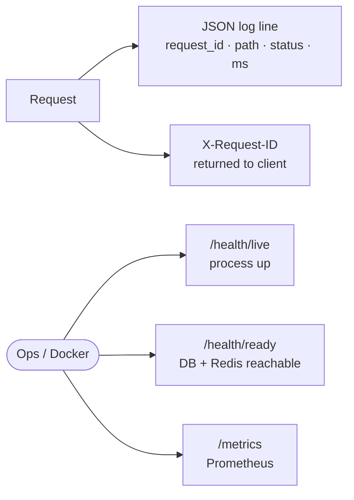

## 8. Implementation status

| Area | Status |
|---|---|
| Skeleton · config · logging · middleware · errors · liveness | ✅ Done (v0.1.0) |
| Database · migrations · readiness | ✅ Done (v0.2.0) |
| Authentication | Planned |
| Posts & public browsing | Planned |
| Likes & comments | Planned |
| Frontend | Planned |
| Indexes & query optimization | Planned |
| Roles (user / moderator) | Planned |
| Containers · CI · metrics | Planned |
