# Architecture

How Nebula is structured and how each feature flows through it. For *why* each technology was chosen, see the [ADRs](adr/).

## 1. System overview

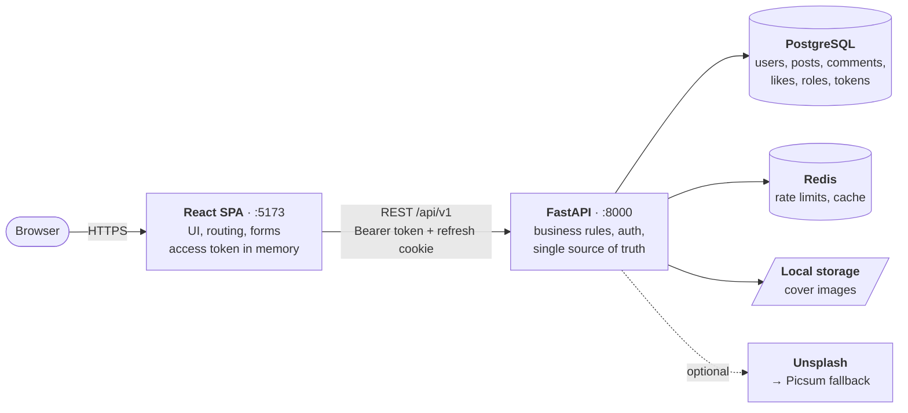

The API is **stateless**: session state lives in PostgreSQL and Redis, so instances can scale horizontally.

## 2. Backend layers

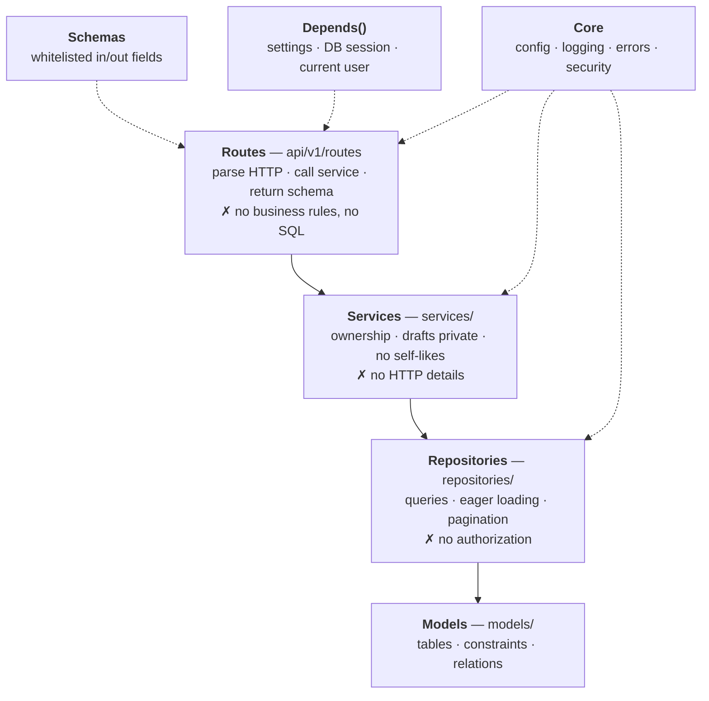

Dependencies point **downward only**.

## 3. Request lifecycle

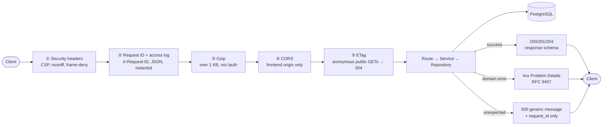

Error response shape:

```json
{ "type": "about:blank", "title": "Forbidden", "status": 403,
  "detail": "You can only edit your own posts",
  "instance": "/api/v1/posts/3f2c…", "request_id": "b1e4…" }
```

## 4. Feature flows

### 4.1 Browse and read (public)

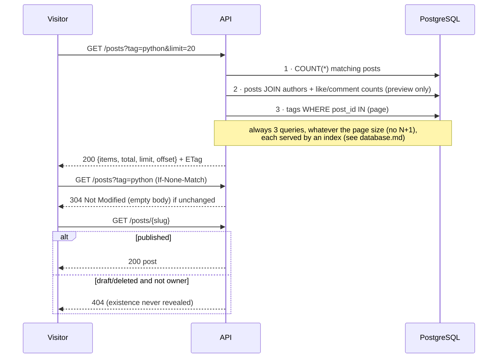

### 4.2 Sign-up, sign-in, refresh, sign-out

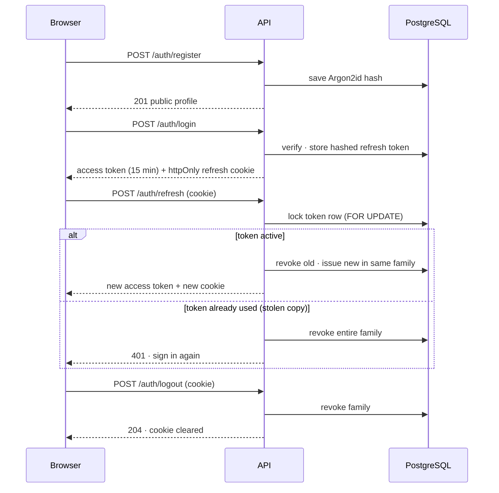

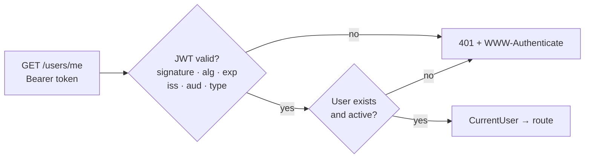

Endpoints, payloads, cookies and rate limits: [api.md](api.md).

### 4.3 Author manages own posts

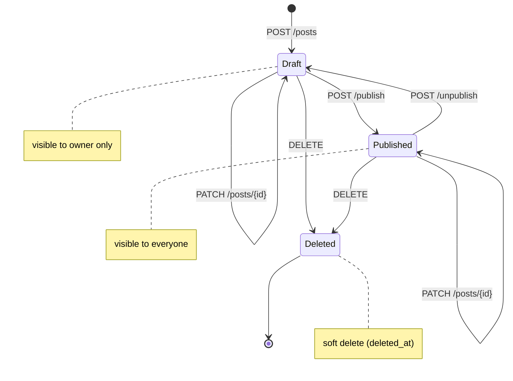

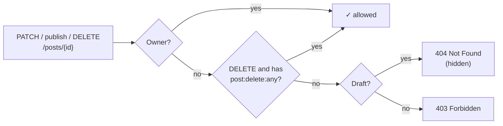

### 4.4 Likes

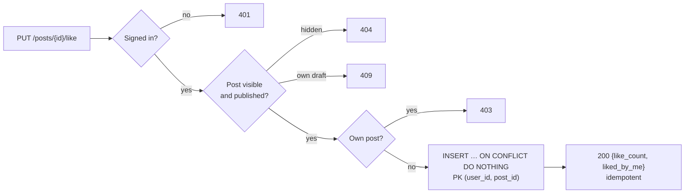

`DELETE` removes the row the same way. Counts are correlated subqueries inside the feed query, so the feed stays at 3 queries.

### 4.5 Comments

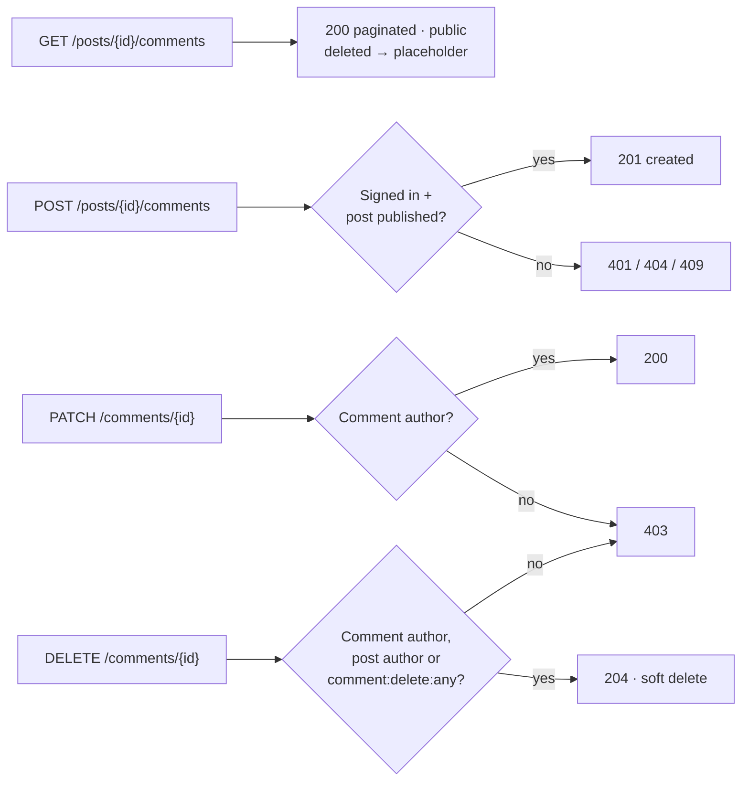

## 5. Frontend

A single-page app. In development Vite serves it on :5173 and proxies `/api` to the API, so the browser sees a single origin: the refresh cookie works as-is and no CORS preflights are needed.

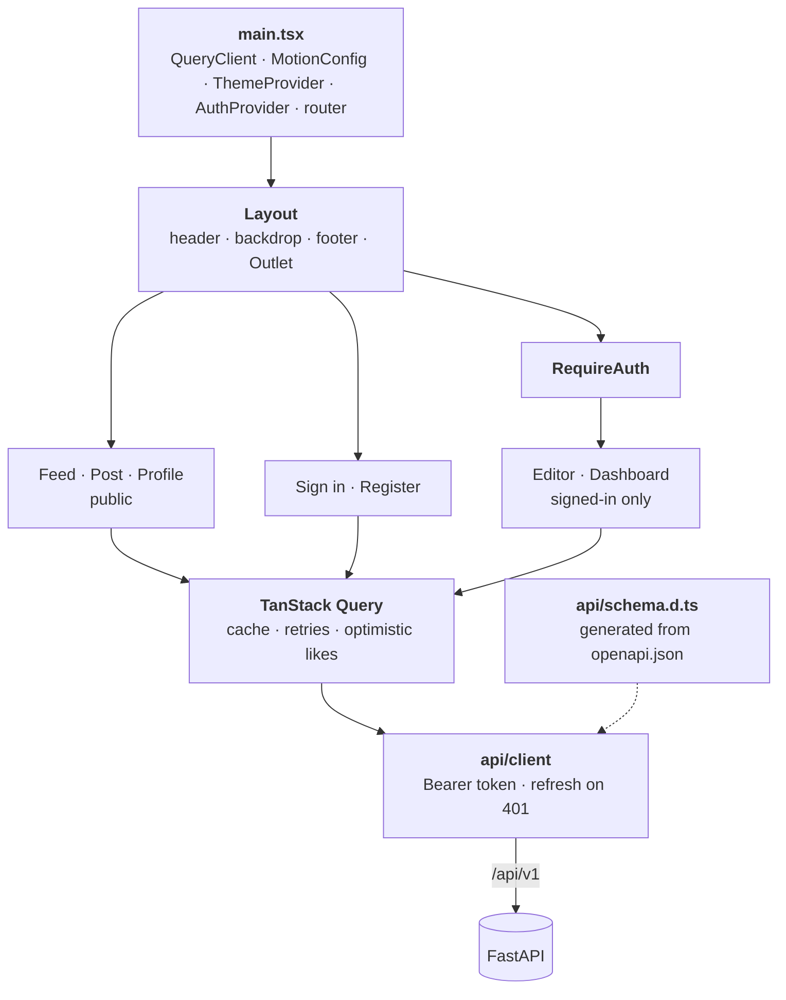

Only the feed ships in the first bundle. The other pages are lazy routes, so the Markdown pipeline (post page and editor) loads only when a reader opens a post.

### 5.1 Session handling

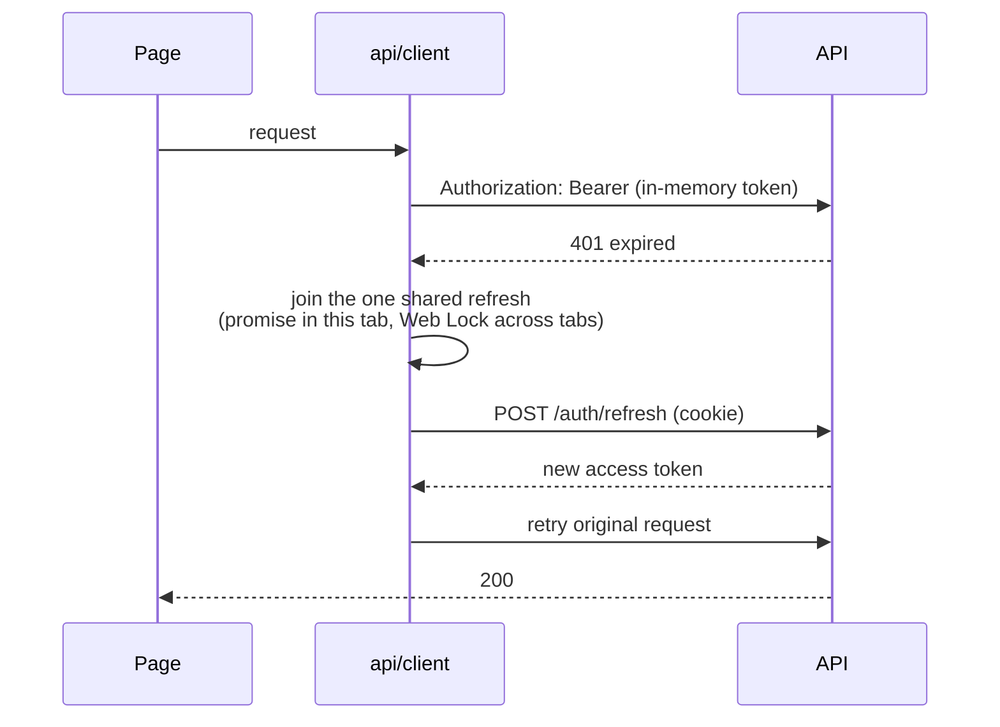

- The access token is **never stored**: a reload restores the session through one refresh call, which only happens if the "has session" hint is set, so guests don't cause 401s.
- Refreshes are serialized because refresh tokens are single use; two parallel ones would look like theft and end the session.
- Permission checks in the UI (`lib/permissions.ts`) only hide buttons. The API enforces every rule itself.

### 5.2 Rendering user content

| Content | How it's rendered |
|---|---|
| Post body (Markdown) | `react-markdown` with raw HTML disabled, then `rehype-sanitize`; external links open in a new tab with `rel="noopener noreferrer nofollow ugc"` |
| Comments, names, bios | Plain React text nodes, never HTML |
| Cover art | Generated SVG, deterministic per slug; no uploaded images |

### 5.3 Theming

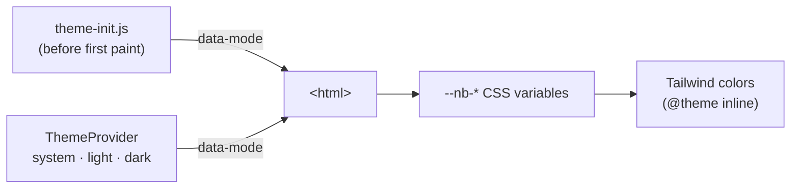

One attribute switches every color, so components never branch on the theme. The mode choice is saved in `localStorage`; "system" follows `prefers-color-scheme` live.

## 6. Data model

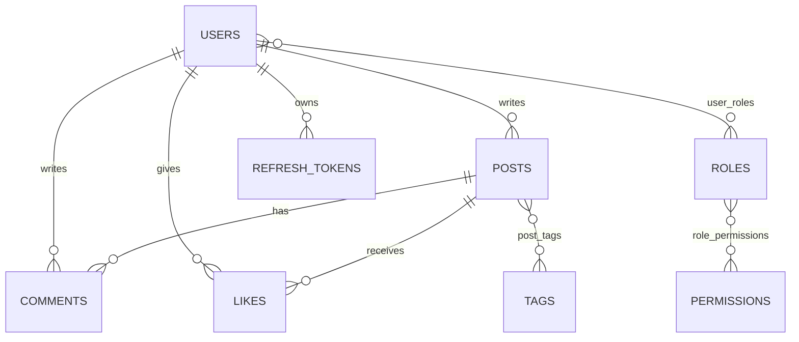

Full schema, constraints and design decisions: [database.md](database.md).

## 7. Security layers

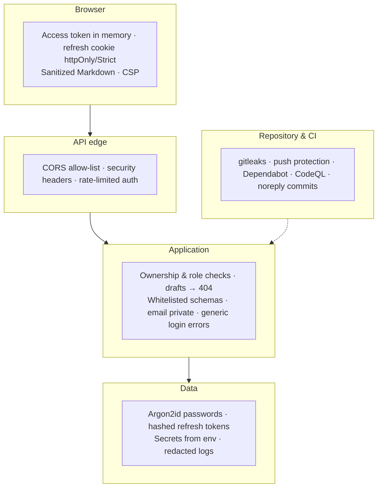

## 8. Observability


## 9. Implementation status

| Area | Status |
|---|---|
| Skeleton · config · logging · middleware · errors · liveness | ✅ Done (v0.1.0) |
| Database · migrations · readiness | ✅ Done (v0.2.0) |
| Authentication · rate limiting · profile | ✅ Done (v0.3.0) |
| Posts & public browsing | ✅ Done (v0.4.0) |
| Likes & comments | ✅ Done (v0.5.0) |
| Frontend (feed, posts, auth, editor, dashboard, theming) | ✅ Done (v0.6.0) |
| Indexes · query optimization · HTTP caching and compression | ✅ Done (v0.7.0) |
| Roles (user / moderator) | Planned |
| Containers · CI · metrics | Planned |
