# Architecture

How Nebula is structured and how each feature flows through it. For *why* each technology was chosen, see the [ADRs](adr/).

## 1. System overview

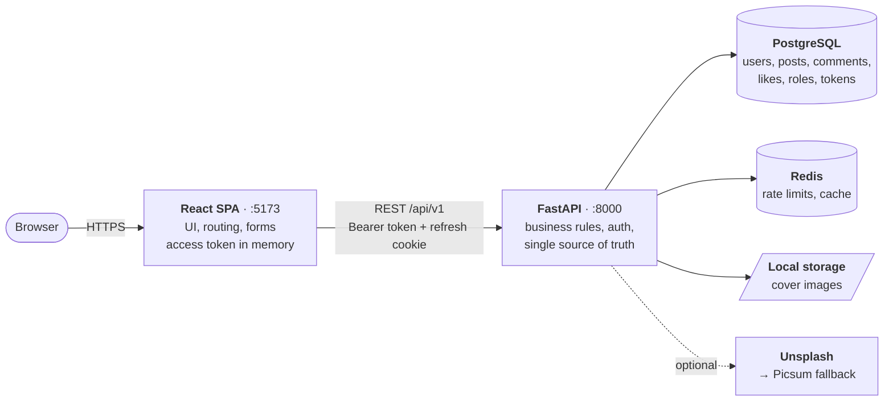
```mermaid
flowchart LR
    U([Browser]) -->|HTTPS| FE["<b>React SPA</b> · :5173<br/>UI, routing, forms<br/>access token in memory"]
    FE -->|"REST /api/v1<br/>Bearer token + refresh cookie"| API["<b>FastAPI</b> · :8000<br/>business rules, auth,<br/>single source of truth"]
    API --> PG[("<b>PostgreSQL</b><br/>users, posts, comments,<br/>likes, roles, tokens")]
    API --> RD[("<b>Redis</b><br/>rate limits, cache")]
    API --> FS[/"<b>Local storage</b><br/>cover images"/]
    API -.->|optional| UN["<b>Unsplash</b><br/>→ Picsum fallback"]
```

The API is **stateless**: session state lives in PostgreSQL and Redis, so instances can scale horizontally.

The ports above are for local development. In Docker, nginx serves the app and forwards `/api` on a single port (see [§9](#9-deployment-docker)).

## 2. Backend layers

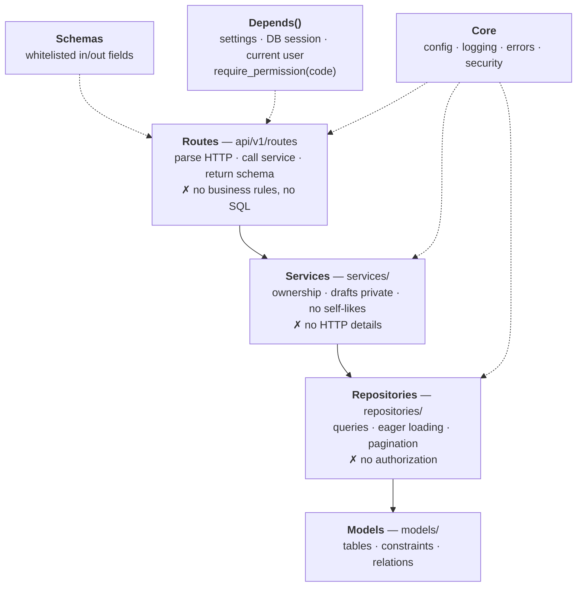
```mermaid
flowchart TB
    R["<b>Routes</b> — api/v1/routes<br/>parse HTTP · call service · return schema<br/>✗ no business rules, no SQL"]
    S["<b>Services</b> — services/<br/>ownership · drafts private · no self-likes<br/>✗ no HTTP details"]
    RP["<b>Repositories</b> — repositories/<br/>queries · eager loading · pagination<br/>✗ no authorization"]
    M["<b>Models</b> — models/<br/>tables · constraints · relations"]
    R --> S --> RP --> M
    SC["<b>Schemas</b><br/>whitelisted in/out fields"] -.-> R
    C["<b>Core</b><br/>config · logging · errors · security"] -.-> R & S & RP
    D["<b>Depends()</b><br/>settings · DB session · current user<br/>require_permission(code)"] -.-> R
```

Dependencies point **downward only**.

## 3. Request lifecycle

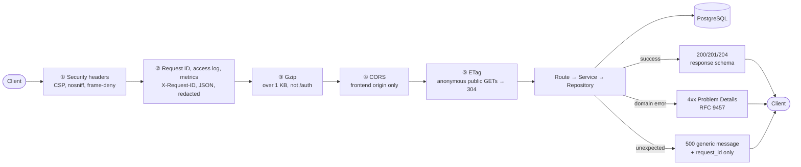
```mermaid
flowchart LR
    C([Client]) --> SH["① Security headers<br/>CSP, nosniff, frame-deny"] --> ID["② Request ID, access log, metrics<br/>X-Request-ID, JSON, redacted"] --> GZ["③ Gzip<br/>over 1 KB, not /auth"] --> CORS["④ CORS<br/>frontend origin only"] --> ET["⑤ ETag<br/>anonymous public GETs → 304"] --> RT["Route → Service → Repository"] --> DB[(PostgreSQL)]
    RT -->|success| OK["200/201/204<br/>response schema"]
    RT -->|domain error| PD["4xx Problem Details<br/>RFC 9457"]
    RT -->|unexpected| E5["500 generic message<br/>+ request_id only"]
    OK & PD & E5 --> C2([Client])
```

Error response shape:

```json
{ "type": "about:blank", "title": "Forbidden", "status": 403,
  "detail": "You can only edit your own posts",
  "instance": "/api/v1/posts/3f2c…", "request_id": "b1e4…" }
```

## 4. Feature flows

### 4.1 Browse and read (public)

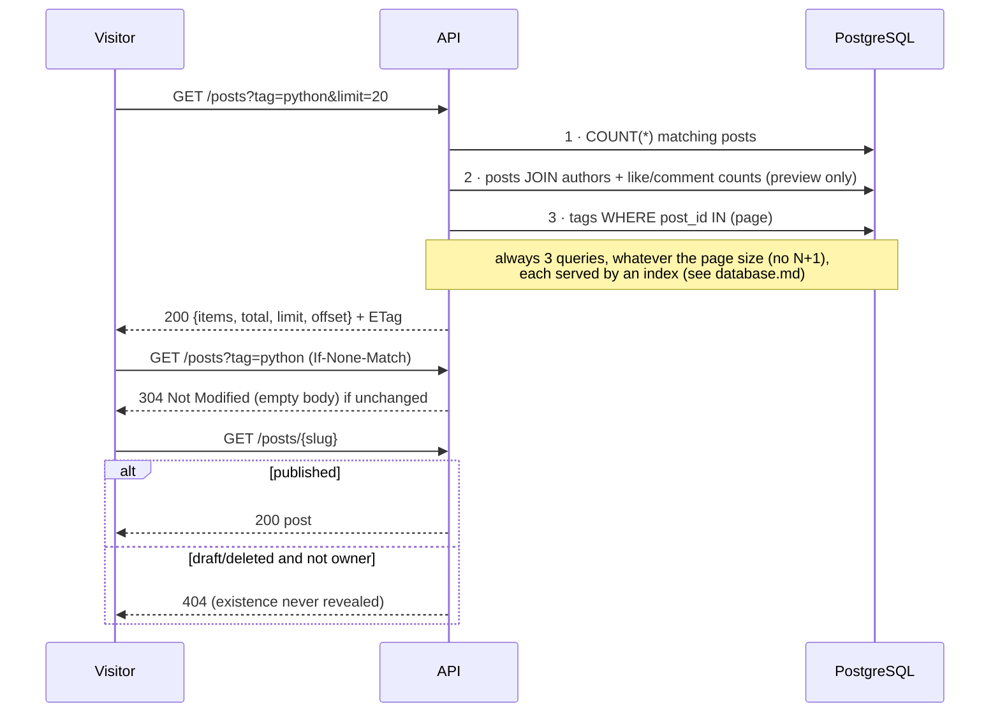
```mermaid
sequenceDiagram
    participant V as Visitor
    participant API
    participant DB as PostgreSQL
    V->>API: GET /posts?tag=python&limit=20
    API->>DB: 1 · COUNT(*) matching posts
    API->>DB: 2 · posts JOIN authors + like/comment counts (preview only)
    API->>DB: 3 · tags WHERE post_id IN (page)
    Note over API,DB: always 3 queries, whatever the page size (no N+1),<br/>each served by an index (see database.md)
    API-->>V: 200 {items, total, limit, offset} + ETag
    V->>API: GET /posts?tag=python (If-None-Match)
    API-->>V: 304 Not Modified (empty body) if unchanged
    V->>API: GET /posts/{slug}
    alt published
        API-->>V: 200 post
    else draft/deleted and not owner
        API-->>V: 404 (existence never revealed)
    end
```

### 4.2 Sign-up, sign-in, refresh, sign-out

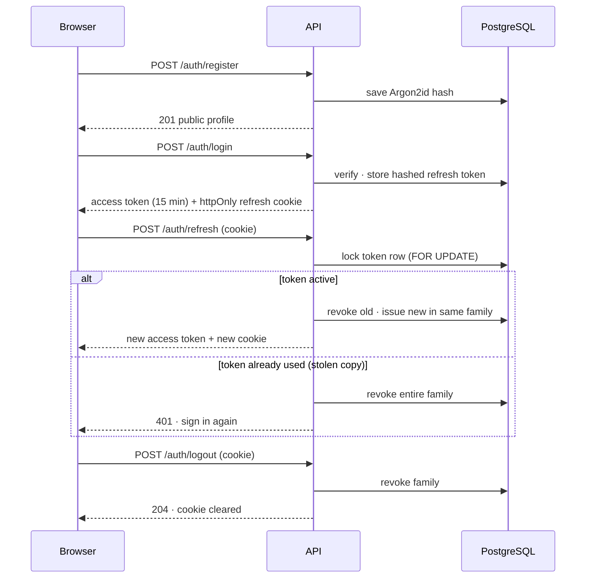
```mermaid
sequenceDiagram
    participant B as Browser
    participant API
    participant DB as PostgreSQL
    B->>API: POST /auth/register
    API->>DB: save Argon2id hash
    API-->>B: 201 public profile
    B->>API: POST /auth/login
    API->>DB: verify · store hashed refresh token
    API-->>B: access token (15 min) + httpOnly refresh cookie
    B->>API: POST /auth/refresh (cookie)
    API->>DB: lock token row (FOR UPDATE)
    alt token active
        API->>DB: revoke old · issue new in same family
        API-->>B: new access token + new cookie
    else token already used (stolen copy)
        API->>DB: revoke entire family
        API-->>B: 401 · sign in again
    end
    B->>API: POST /auth/logout (cookie)
    API->>DB: revoke family
    API-->>B: 204 · cookie cleared
```

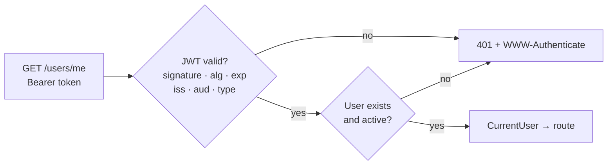
```mermaid
flowchart LR
    RQ["GET /users/me<br/>Bearer token"] --> V{"JWT valid?<br/>signature · alg · exp<br/>iss · aud · type"}
    V -->|no| X["401 + WWW-Authenticate"]
    V -->|yes| A{User exists<br/>and active?}
    A -->|no| X
    A -->|yes| OK[CurrentUser → route]
```

Endpoints, payloads, cookies and rate limits: [api.md](api.md).

### 4.3 Author manages own posts

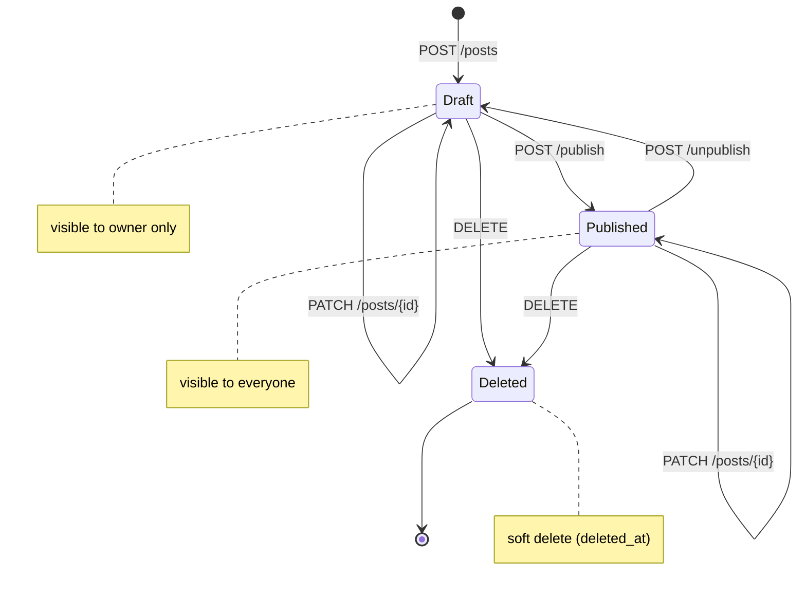
```mermaid
stateDiagram-v2
    [*] --> Draft: POST /posts
    Draft --> Draft: PATCH /posts/{id}
    Draft --> Published: POST /publish
    Published --> Draft: POST /unpublish
    Published --> Published: PATCH /posts/{id}
    Draft --> Deleted: DELETE
    Published --> Deleted: DELETE
    Deleted --> [*]
    note right of Draft: visible to owner only
    note right of Published: visible to everyone
    note right of Deleted: soft delete (deleted_at)
```

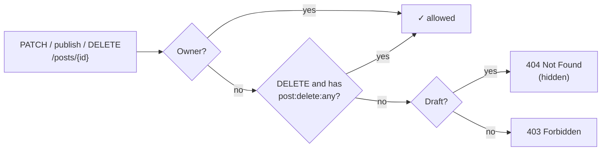
```mermaid
flowchart LR
    Q["PATCH / publish / DELETE<br/>/posts/{id}"] --> A{Owner?}
    A -->|yes| OK[✓ allowed]
    A -->|no| M{"DELETE and has<br/>post:delete:any?"}
    M -->|yes| OK
    M -->|no| DR{Draft?}
    DR -->|yes| NF["404 Not Found<br/>(hidden)"]
    DR -->|no| F[403 Forbidden]
```

### 4.4 Likes

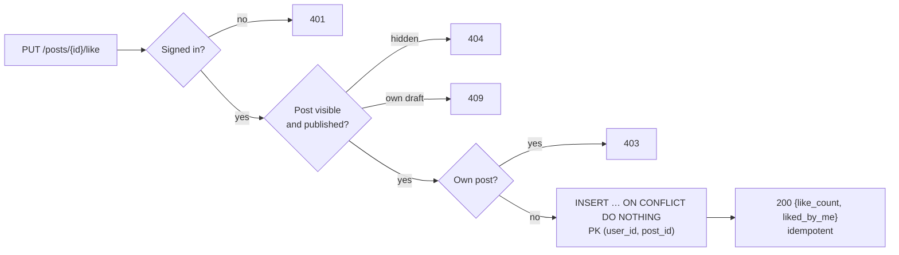
```mermaid
flowchart LR
    L["PUT /posts/{id}/like"] --> S{Signed in?}
    S -->|no| U[401]
    S -->|yes| V{"Post visible<br/>and published?"}
    V -->|"hidden"| NF[404]
    V -->|"own draft"| CF[409]
    V -->|yes| O{Own post?}
    O -->|yes| F[403]
    O -->|no| I["INSERT … ON CONFLICT DO NOTHING<br/>PK (user_id, post_id)"] --> N["200 {like_count, liked_by_me}<br/>idempotent"]
```

`DELETE` removes the row the same way. Counts are correlated subqueries inside the feed query, so the feed stays at 3 queries.

### 4.5 Comments

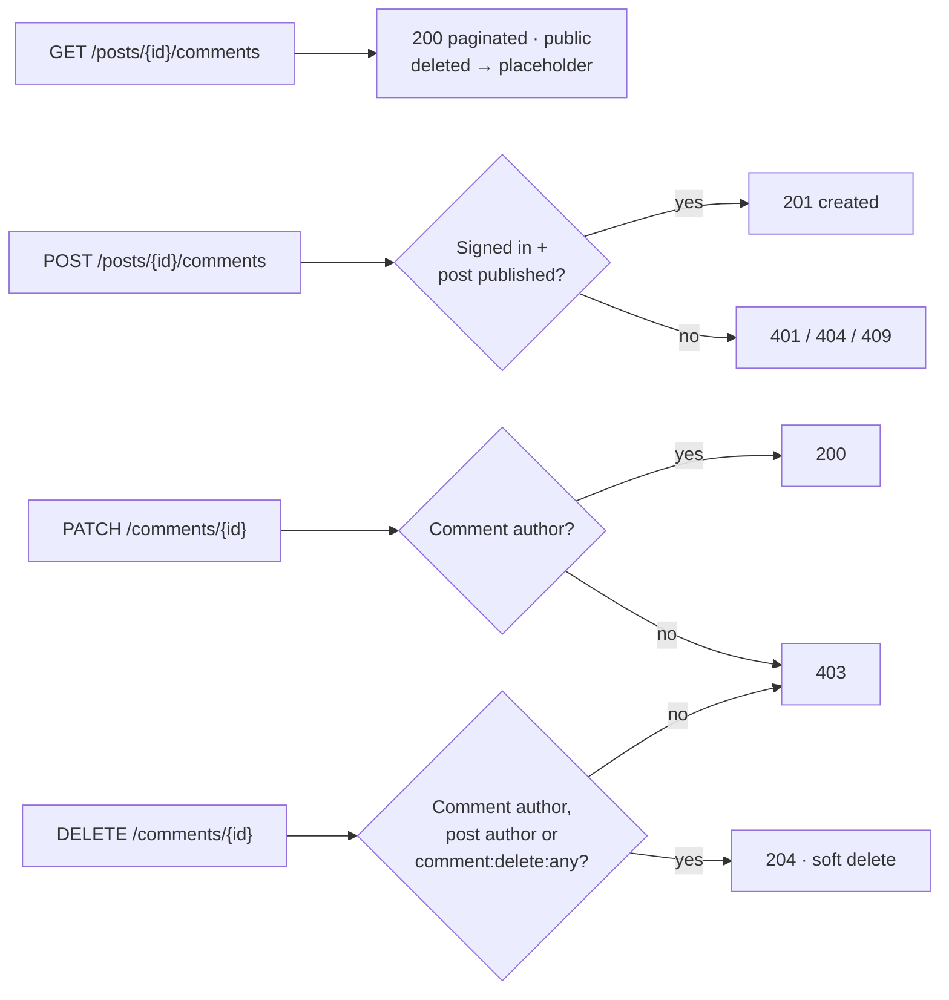
```mermaid
flowchart LR
    R["GET /posts/{id}/comments"] --> P["200 paginated · public<br/>deleted → placeholder"]
    C["POST /posts/{id}/comments"] --> S{"Signed in +<br/>post published?"}
    S -->|yes| K[201 created]
    S -->|no| X[401 / 404 / 409]
    E["PATCH /comments/{id}"] --> W{Comment author?}
    W -->|yes| Y[200]
    W -->|no| Z[403]
    D["DELETE /comments/{id}"] --> W2{"Comment author,<br/>post author or<br/>comment:delete:any?"}
    W2 -->|yes| Y2["204 · soft delete"]
    W2 -->|no| Z
```

### 4.6 Roles, moderation and audit

Routes ask for a **permission**, never a role name. Roles are bundles of permissions stored in the database.

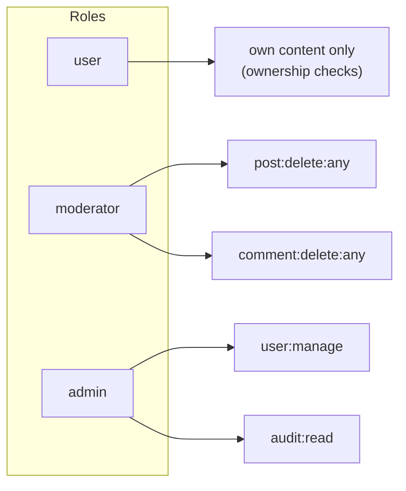
```mermaid
flowchart LR
    subgraph Roles
        U[user]
        M[moderator]
        A[admin]
    end
    M --> P1["post:delete:any"] & P2["comment:delete:any"]
    A --> P3["user:manage"] & P4["audit:read"]
    U --> P0["own content only<br/>(ownership checks)"]
```

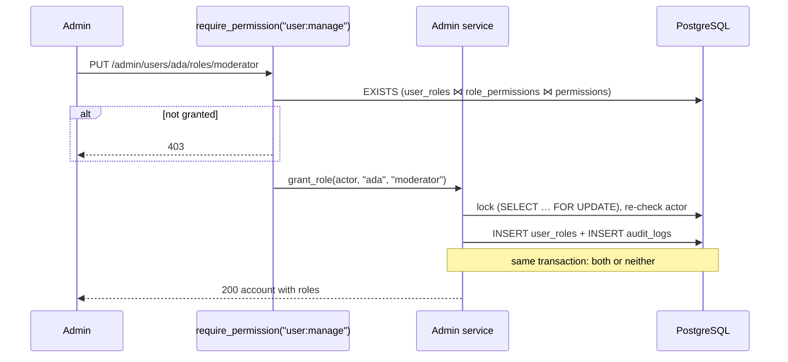
```mermaid
sequenceDiagram
    participant A as Admin
    participant G as require_permission("user:manage")
    participant S as Admin service
    participant DB as PostgreSQL
    A->>G: PUT /admin/users/ada/roles/moderator
    G->>DB: EXISTS (user_roles ⋈ role_permissions ⋈ permissions)
    alt not granted
        G-->>A: 403
    end
    G->>S: grant_role(actor, "ada", "moderator")
    S->>DB: lock (SELECT … FOR UPDATE), re-check actor
    S->>DB: INSERT user_roles + INSERT audit_logs
    Note over S,DB: same transaction: both or neither
    S-->>A: 200 account with roles
```

Lockout rules:
- An admin can't remove their own admin role or deactivate themselves.
- The last active admin can't be removed, not even from the CLI.

Account changes take a row lock, so two admins demoting each other at the same moment can't both succeed: the second one re-checks its permission after the first commits, and fails.

The first admin is created with `make grant u=… role=admin`. Running it needs database access, which is already the highest level of trust.

## 5. Frontend

A single-page app. In development Vite serves it on :5173 and proxies `/api` to the API, so the browser sees a single origin: the refresh cookie works as-is and no CORS preflights are needed.

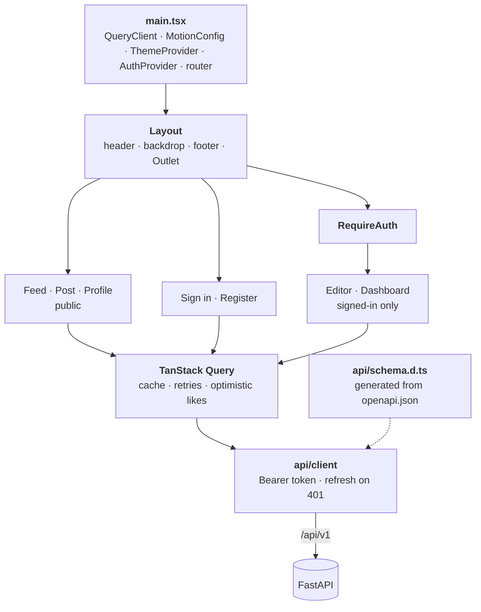
```mermaid
flowchart TB
    M["<b>main.tsx</b><br/>QueryClient · MotionConfig · ThemeProvider · AuthProvider · router"]
    M --> L["<b>Layout</b><br/>header · backdrop · footer · Outlet"]
    L --> P1["Feed · Post · Profile<br/>public"]
    L --> P2["Sign in · Register"]
    L --> G["<b>RequireAuth</b>"] --> P3["Editor · Dashboard<br/>signed-in only"]
    P1 & P2 & P3 --> Q["<b>TanStack Query</b><br/>cache · retries · optimistic likes"]
    Q --> C["<b>api/client</b><br/>Bearer token · refresh on 401"]
    C -->|"/api/v1"| API[(FastAPI)]
    T["<b>api/schema.d.ts</b><br/>generated from openapi.json"] -.-> C
```

Only the feed ships in the first bundle. The other pages are lazy routes, so the Markdown pipeline (post page and editor) loads only when a reader opens a post.

### 5.1 Session handling

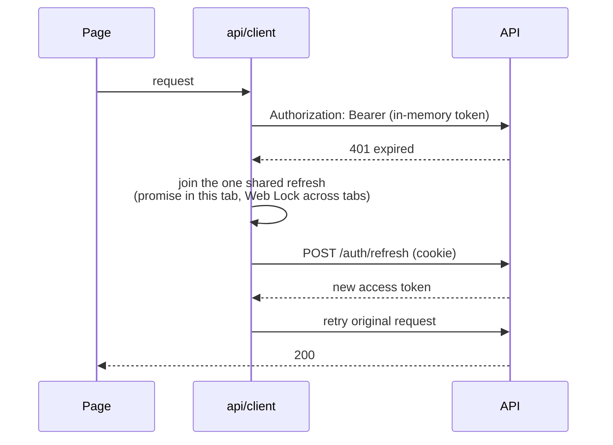
```mermaid
sequenceDiagram
    participant P as Page
    participant C as api/client
    participant API
    P->>C: request
    C->>API: Authorization: Bearer (in-memory token)
    API-->>C: 401 expired
    C->>C: join the one shared refresh<br/>(promise in this tab, Web Lock across tabs)
    C->>API: POST /auth/refresh (cookie)
    API-->>C: new access token
    C->>API: retry original request
    API-->>P: 200
```

- The access token is **never stored**: a reload restores the session through one refresh call, which only happens if the "has session" hint is set, so guests don't cause 401s.
- Refreshes are serialized because refresh tokens are single use; two parallel ones would look like theft and end the session.
- Permission checks in the UI (`lib/permissions.ts`) only hide buttons. The API enforces every rule itself.

### 5.2 Rendering user content

| Content | How it's rendered |
|---|---|
| Post body (Markdown) | `react-markdown` with raw HTML disabled, then `rehype-sanitize`; external links open in a new tab with `rel="noopener noreferrer nofollow ugc"` |
| Comments, names, bios | Plain React text nodes, never HTML |
| Cover art | Generated SVG, deterministic per slug; no uploaded images |

### 5.3 Theming

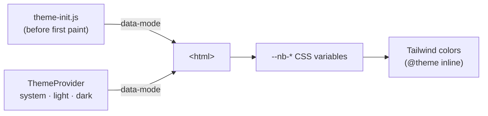
```mermaid
flowchart LR
    S["theme-init.js<br/>(before first paint)"] -->|"data-mode"| H["&lt;html&gt;"]
    TP["ThemeProvider<br/>system · light · dark"] -->|"data-mode"| H
    H --> V["--nb-* CSS variables"] --> TW["Tailwind colors<br/>(@theme inline)"]
```

One attribute switches every color, so components never branch on the theme. The mode choice is saved in `localStorage`; "system" follows `prefers-color-scheme` live.

## 6. Data model

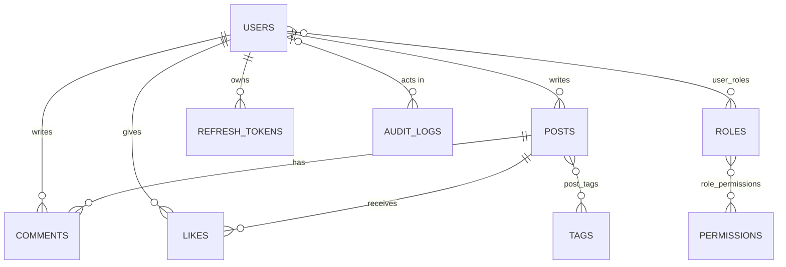
```mermaid
erDiagram
    USERS ||--o{ POSTS : writes
    USERS ||--o{ COMMENTS : writes
    POSTS ||--o{ COMMENTS : has
    USERS ||--o{ LIKES : gives
    POSTS ||--o{ LIKES : receives
    POSTS }o--o{ TAGS : "post_tags"
    USERS }o--o{ ROLES : "user_roles"
    ROLES }o--o{ PERMISSIONS : "role_permissions"
    USERS ||--o{ REFRESH_TOKENS : owns
    USERS |o--o{ AUDIT_LOGS : "acts in"
```

Full schema, constraints and design decisions: [database.md](database.md).

## 7. Security layers

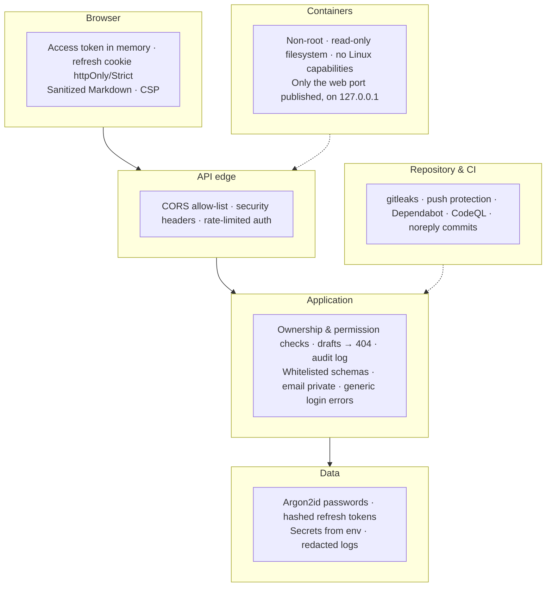
```mermaid
flowchart TB
    subgraph Browser
        B1["Access token in memory · refresh cookie httpOnly/Strict<br/>Sanitized Markdown · CSP"]
    end
    subgraph Edge["API edge"]
        B2["CORS allow-list · security headers · rate-limited auth"]
    end
    subgraph App["Application"]
        B3["Ownership & permission checks · drafts → 404 · audit log<br/>Whitelisted schemas · email private · generic login errors"]
    end
    subgraph Data
        B4["Argon2id passwords · hashed refresh tokens<br/>Secrets from env · redacted logs"]
    end
    subgraph Repo["Repository & CI"]
        B5["gitleaks · push protection · Dependabot · CodeQL · noreply commits"]
    end
    subgraph Runtime["Containers"]
        B6["Non-root · read-only filesystem · no Linux capabilities<br/>Only the web port published, on 127.0.0.1"]
    end
    Browser --> Edge --> App --> Data
    Repo -.-> App
    Runtime -.-> Edge
```

## 8. Observability

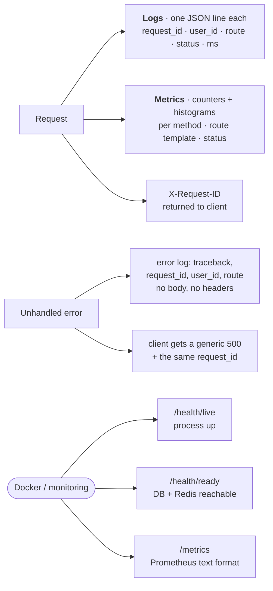
```mermaid
flowchart LR
    RQ[Request] --> LG["<b>Logs</b> · one JSON line each<br/>request_id · user_id · route · status · ms"]
    RQ --> MX["<b>Metrics</b> · counters + histograms<br/>per method · route template · status"]
    RQ --> HD["X-Request-ID<br/>returned to client"]
    ERR[Unhandled error] --> LG2["error log: traceback,<br/>request_id, user_id, route<br/>no body, no headers"]
    ERR --> E5["client gets a generic 500<br/>+ the same request_id"]
    OPS([Docker / monitoring]) --> LV["/health/live<br/>process up"]
    OPS --> RY["/health/ready<br/>DB + Redis reachable"]
    OPS --> MT["/metrics<br/>Prometheus text format"]
```

| Signal | Answers | Where |
|---|---|---|
| **Logs** | What happened to *this* request? | stdout (`make logs`). Every line has the request id; signed-in requests add the user's id, never a name or email |
| **Metrics** | How many, how fast, how many failed, over time? | `GET /metrics`: `nebula_http_requests_total`, `nebula_http_request_duration_seconds`, plus process metrics |
| **Health** | Should this container get traffic, or be restarted? | `/health/live` (process up), `/health/ready` (dependencies up) |

**Metric labels are bounded.** Routes are recorded as templates (`/api/v1/posts/{slug}`). Unknown paths share one `unmatched` series and unknown methods share `OTHER`. Each label combination is a time series held in memory, so letting clients pick label values would let them exhaust it.

**`/metrics` is internal.** It sits outside `/api`, so nginx never forwards it. Only containers on the Compose network can scrape it. To turn it off, set `METRICS_ENABLED=false`.

Traces (spans across services) aren't needed with a single API. The request id plays that role in the logs.

## 9. Deployment (Docker)

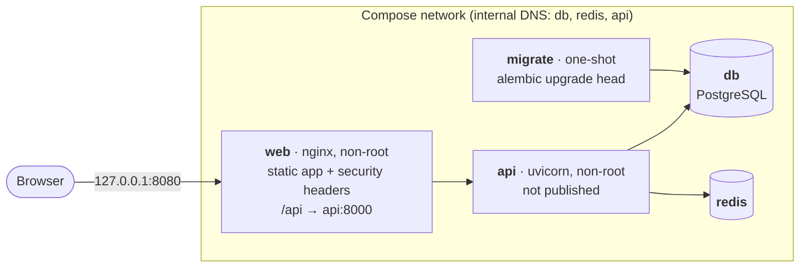
```mermaid
flowchart LR
    B([Browser]) -->|"127.0.0.1:8080"| W
    subgraph net["Compose network (internal DNS: db, redis, api)"]
        W["<b>web</b> · nginx, non-root<br/>static app + security headers<br/>/api → api:8000"]
        A["<b>api</b> · uvicorn, non-root<br/>not published"]
        M["<b>migrate</b> · one-shot<br/>alembic upgrade head"]
        D[("<b>db</b><br/>PostgreSQL")]
        R[("<b>redis</b>")]
        W --> A --> D & R
        M --> D
    end
```

Start-up order comes from health checks, not timing:

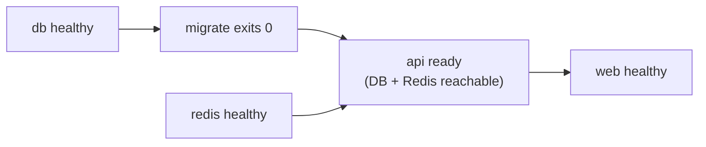
```mermaid
flowchart LR
    D["db healthy"] --> M["migrate exits 0"] --> A["api ready<br/>(DB + Redis reachable)"] --> W["web healthy"]
    R["redis healthy"] --> A
```

| Image | Build stage | Runtime stage |
|---|---|---|
| `backend/Dockerfile` | uv installs the locked, production-only dependencies | `python:3.13-slim` + the virtualenv + app code. No uv, tests or dev tools. Runs as uid 10001 |
| `frontend/Dockerfile` | Node 24 runs `npm ci` and the Vite build | Unprivileged nginx + the built files. No Node, no source |

**Hardening** (`docker-compose.yml`):
- Every app container has a read-only filesystem, drops all Linux capabilities and sets `no-new-privileges`.
- Only the web port is published, and only on `127.0.0.1`.

**Proxy and client IPs:** nginx *overwrites* `X-Forwarded-For` with the real client address. The API trusts that header for its rate limits, which is safe only because the API port is unreachable except through nginx.

**Liveness vs readiness:** the image's own `HEALTHCHECK` checks liveness. Compose overrides it with readiness, because `depends_on` should wait until the API can serve, not just run.

**Configuration:** images contain no configuration or secrets. `.env` supplies secrets at run time, and Compose sets the in-network hostnames and `APP_ENV=production`, which disables `/docs` and rejects placeholder secrets.

**CI:** on every pull request, the Docker job builds both images, starts the stack with `--wait`, and runs `scripts/smoke-test.sh`. That script checks the app shell, the API through the proxy, the security headers, that `/metrics` is internal only, and that no container runs as root.

**Backups:** `make backup` writes a `pg_dump` custom-format file to the git-ignored `backups/` folder, readable only by you. `make restore f=…` asks for confirmation, then restores it in one transaction. See [database.md](database.md#backups).

## 10. Implementation status

| Area | Status |
|---|---|
| Skeleton · config · logging · middleware · errors · liveness | ✅ Done (v0.1.0) |
| Database · migrations · readiness | ✅ Done (v0.2.0) |
| Authentication · rate limiting · profile | ✅ Done (v0.3.0) |
| Posts & public browsing | ✅ Done (v0.4.0) |
| Likes & comments | ✅ Done (v0.5.0) |
| Frontend (feed, posts, auth, editor, dashboard, theming) | ✅ Done (v0.6.0) |
| Indexes · query optimization · HTTP caching and compression | ✅ Done (v0.7.0) |
| Roles (user / moderator / admin) · account management · audit log | ✅ Done (v0.8.0) |
| Docker full stack · metrics · backups | ✅ Done (v0.9.0) |
