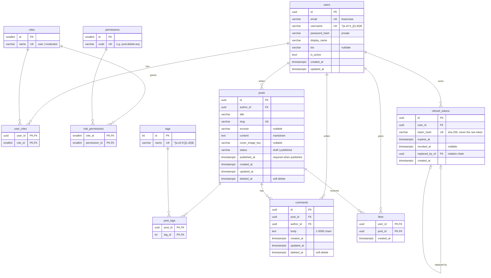
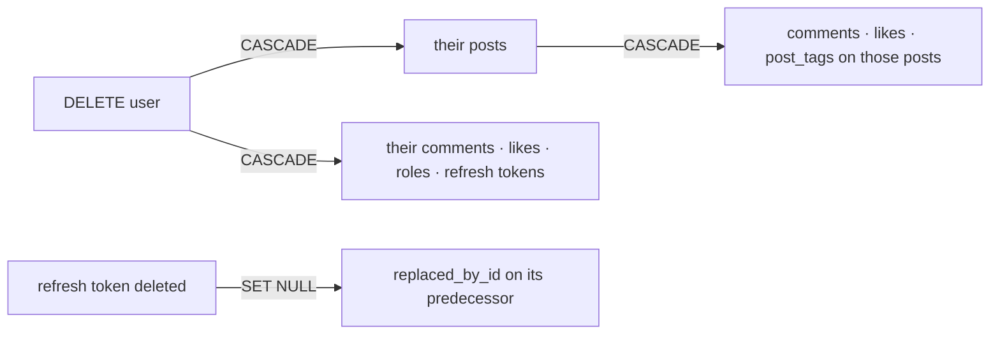

# Database

PostgreSQL 16, accessed through SQLAlchemy 2 (async, asyncpg driver). Schema changes are managed exclusively by Alembic migrations in [`backend/migrations/`](../backend/migrations/).

## Schema

## Integrity rules enforced by the database

The API validates input too, but these rules hold even if application code has a bug.

| Rule | Constraint |
|---|---|
| One account per email / username | `uq_users_email`, `uq_users_username` |
| Emails stored lowercase (case-insensitive uniqueness) | `ck_users_email_lowercase` |
| URL-safe usernames and tag names | `ck_users_username_format`, `ck_tags_name_format` |
| Post status is `draft` or `published` | `ck_posts_post_status` |
| A published post always has a publish date | `ck_posts_published_has_date` |
| Unique post URLs | `uq_posts_slug` |
| Comments are 1–5000 characters | `ck_comments_body_length` |
| A user can like a post only once | `pk_likes` (composite key) |
| Refresh tokens are unique and stored hashed | `uq_refresh_tokens_token_hash` |

## Deletion behaviour

Posts and comments are **soft-deleted** in normal use (`deleted_at` is set), so threads keep their history and accidental deletes are recoverable. The cascade rules apply to hard deletes, such as account removal.

## Design decisions

| Decision | Why |
|---|---|
| UUID primary keys for user-facing rows | IDs in URLs cannot be guessed or used to count records |
| Small integer keys for roles, permissions and tags | Tiny lookup tables; compact join tables |
| `timestamptz` everywhere | Unambiguous instants; the client formats for the user's time zone |
| Status as `varchar` + CHECK, not a native `ENUM` | Adding a status is a one-line migration; native enums are awkward to alter |
| Deterministic constraint names (naming convention) | Stable, readable migrations and clear error messages |
| Roles and permissions seeded by the initial migration | Reference data every environment needs; demo data lives in the seed script |
| No `created_by` / `updated_by` columns | `author_id` records ownership; moderator actions will be recorded in an audit log |
| Relationships load with `lazy="raise"` | Accidental N+1 queries fail loudly in tests instead of silently slowing the app |
| Performance indexes deferred | Added with `EXPLAIN ANALYZE` evidence once real queries exist |

## Working with the database

| Command | Purpose |
|---|---|
| `make db-up` / `make db-down` | Start / stop Postgres and Redis (data persists in a Docker volume) |
| `make migrate` | Apply pending migrations |
| `make migration m="add x"` | Autogenerate a migration from model changes; **always review it** |
| `make seed` | Reset and load deterministic demo data (refuses to run in production) |
| `make psql` | SQL shell on the local database |

Tests run against a separate `<POSTGRES_DB>_test` database. The suite migrates it once, runs each test inside a transaction that is rolled back, and verifies that models and migrations have not drifted apart (`alembic check`).
