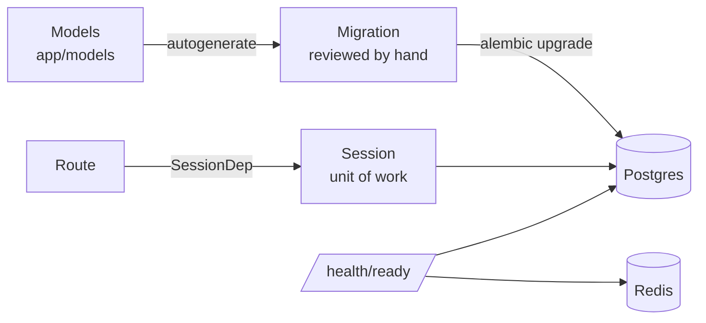

# Day 1 — Foundations: setup, backend skeleton and data layer

## Phase 0 — Machine & repository setup

**Built:** free toolchain (Xcode CLT, Homebrew, gh, uv, fnm/Node, Docker CLI + Colima, gitleaks, pre-commit) and a public repo with a security-first scaffold.

| Concept | Where it's applied |
|---|---|
| **Git & GitHub Flow** — `main` always releasable; one branch per phase; merge via PR | Branch protection on `main`; PR #1 |
| **Secrets hygiene** — config via env vars; only placeholders are public | [`.gitignore`](../../.gitignore), [`.env.example`](../../.env.example) |
| **Shift-left security** — stop leaks *before* they enter history | [`.pre-commit-config.yaml`](../../.pre-commit-config.yaml): gitleaks, private-key detection, noreply-email guard |
| **Defence in depth** — a second net on the server | GitHub secret scanning + push protection, Dependabot |
| **Architecture Decision Records** — record *why*, not *how* | [ADR 0001](../adr/0001-tech-stack.md) |

**Lesson learned:** never run destructive git commands (`git stash -u`, `git reset --hard`) in a repo with no commits — there is nothing to restore from. Commit first, then experiment.

## Phase 1 — Backend skeleton

**Built:** FastAPI app factory, typed settings, JSON logging, middleware stack, Problem Details errors, liveness endpoint, 19 tests, Makefile, CI.

```mermaid
flowchart LR
    C([curl / browser]) --> UV[uvicorn<br/>ASGI server] --> SH[Security headers] --> RC[Request context<br/>id · log · crash guard] --> CORS --> R[Router] --> H[Handler]
```

| Concept | What it means | Where it's applied |
|---|---|---|
| **Client–server** | The backend is a stateless JSON API; any client talks HTTP to it | [`app/main.py`](../../backend/app/main.py) |
| **ASGI & async** | uvicorn accepts connections; one process serves many requests while each awaits I/O | `make dev` |
| **Request/response lifecycle** | Request → middleware (outer→inner) → route → response → middleware (inner→outer) | [`core/middleware.py`](../../backend/app/core/middleware.py) |
| **Middleware** | Cross-cutting logic written once, applied to every request | Request ID, access log, CORS, security headers |
| **12-factor config** | Settings come from the environment, validated at startup (fail fast) | [`core/config.py`](../../backend/app/core/config.py) |
| **Structured logging** | JSON lines, correlated by `request_id`, secrets redacted | [`core/logging.py`](../../backend/app/core/logging.py) |
| **Exception handling** | Domain errors → one standard shape (RFC 9457); crashes → generic 500 | [`core/errors.py`](../../backend/app/core/errors.py) |
| **Dependency injection** | Components receive what they need (e.g. `create_app(settings)`), so tests swap in fakes | [`tests/conftest.py`](../../backend/tests/conftest.py) |
| **Ports** | API 8000 · frontend 5173 · Postgres 5432 · Redis 6379 | [`Makefile`](../../Makefile) |
| **Lockfiles & reproducibility** | `uv.lock` pins every package version for laptop, CI and Docker | [`backend/uv.lock`](../../backend/uv.lock) |
| **CI** | Every PR is checked on a clean machine; actions pinned to SHAs, read-only token | [`.github/workflows/ci.yml`](../../.github/workflows/ci.yml) |

**Security details worth remembering**

- Validation errors return field names only — never the submitted values (a rejected password is not echoed).
- Client-supplied `X-Request-ID` values are accepted only if short and alphanumeric, preventing log injection.
- The `Server` header is removed, and API docs are disabled in production.
- `make env` generates random secrets; `.env` is created with `600` permissions.

**Not applicable yet:** database readiness check (Phase 2), rate limiting (Phase 3, needs Redis).

## Phase 2 — Data layer

**Built:** Postgres + Redis in Docker, 11-table schema with database-enforced rules, Alembic migrations, readiness probe, deterministic seed data, 37 tests against a real database.

```mermaid
flowchart LR
    M[Models<br/>app/models] -->|autogenerate| MG[Migration<br/>reviewed by hand] -->|alembic upgrade| DB[(Postgres)]
    R[Route] -->|SessionDep| S[Session<br/>unit of work] --> DB
    RD[/health/ready/] --> DB & RE[(Redis)]
```

| Concept | What it means | Where it's applied |
|---|---|---|
| **Containers** | Postgres and Redis run in isolated, reproducible containers, bound to `127.0.0.1` only | [`docker-compose.yml`](../../docker-compose.yml) |
| **Relational modelling** | Entities → tables; relationships → foreign keys; many-to-many → junction tables | [`app/models/`](../../backend/app/models/) |
| **Constraints as the last line of defence** | UNIQUE, CHECK, FK and composite keys make invalid data impossible, whatever the code does | [`docs/database.md`](../database.md) |
| **ORM** | Python classes map to tables; queries are built in Python, parameterised (no SQL injection) | SQLAlchemy 2 |
| **Connection pooling** | Reuse a few open connections instead of opening one per request | [`db/session.py`](../../backend/app/db/session.py) |
| **Unit of work** | One transaction per request: commit on success, roll back on error | [`api/deps.py`](../../backend/app/api/deps.py) |
| **Migrations** | Versioned, reviewable, reversible schema changes, identical on every machine | [`migrations/`](../../backend/migrations/) |
| **Liveness vs readiness** | *Live*: the process runs. *Ready*: its dependencies answer, so it can take traffic | [`routes/health.py`](../../backend/app/api/v1/routes/health.py) |
| **App lifespan** | Create shared clients at startup, close them cleanly at shutdown | [`app/main.py`](../../backend/app/main.py) |
| **Test isolation** | Separate test DB; every test runs in a transaction that is rolled back | [`tests/conftest.py`](../../backend/tests/conftest.py) |
| **Seed data** | Deterministic fake data (fixed seed) for demos and manual testing | [`scripts/seed.py`](../../backend/scripts/seed.py) |

**Security details worth remembering**

- The database URL is built from settings at runtime; no credentials exist in `alembic.ini` or any committed file, and the URL masks the password when printed.
- Readiness failures return only `ok` / `fail`; the server log records the exception *type*, never its message (which can contain hosts or credentials).
- SQL echo is disabled: it would log bound parameters such as password hashes.
- Seeded accounts use `example.com` (a reserved domain) and an unusable password hash, so they cannot log in.
- The seed script refuses to run when `APP_ENV=production`.

**Lessons learned**

- Autogenerated migrations must be reviewed: the first draft created the post-status CHECK three times.
- In Python 3.13, type hints are evaluated when a class is defined, so models that reference each other need `from __future__ import annotations`.
- A request dependency's cleanup can run *after* the response is sent; `Depends(..., scope="function")` makes the commit finish first, so a failed commit is never reported as success.

**Not applicable yet:** password hashing and login (Phase 3), performance indexes (Phase 7, backed by `EXPLAIN ANALYZE`).
