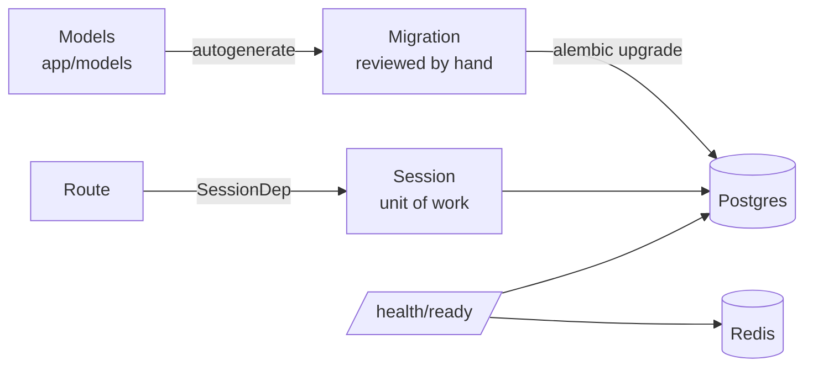

# Day 2 — Database, migrations & readiness

## Phase 2 — Data layer

**Built:** Postgres + Redis in Docker, 11-table schema with database-enforced rules, Alembic migrations, readiness probe, deterministic seed data, 37 tests against a real database.

| Concept | What it means | Where it's applied |
|---|---|---|
| **Containers** | Postgres and Redis run in isolated, reproducible containers, bound to `127.0.0.1` only | [`docker-compose.yml`](../../docker-compose.yml) |
| **Relational modelling** | Entities → tables; relationships → foreign keys; many-to-many → junction tables | [`app/models/`](../../backend/app/models/) |
| **Constraints as the last line of defence** | UNIQUE, CHECK, FK and composite keys make invalid data impossible, whatever the code does | [`docs/database.md`](../database.md) |
| **ORM** | Python classes map to tables; queries are built in Python, parameterised (no SQL injection) | SQLAlchemy 2 |
| **Connection pooling** | Reuse a few open connections instead of opening one per request | [`db/session.py`](../../backend/app/db/session.py) |
| **Unit of work** | One transaction per request: commit on success, roll back on error | [`api/deps.py`](../../backend/app/api/deps.py) |
| **Migrations** | Versioned, reviewable, reversible schema changes, identical on every machine | [`migrations/`](../../backend/migrations/) |
| **Liveness vs readiness** | *Live*: the process runs. *Ready*: its dependencies answer, so it can take traffic | [`routes/health.py`](../../backend/app/api/v1/routes/health.py) |
| **App lifespan** | Create shared clients at startup, close them cleanly at shutdown | [`app/main.py`](../../backend/app/main.py) |
| **Test isolation** | Separate test DB; every test runs in a transaction that is rolled back | [`tests/conftest.py`](../../backend/tests/conftest.py) |
| **Seed data** | Deterministic fake data (fixed seed) for demos and manual testing | [`scripts/seed.py`](../../backend/scripts/seed.py) |

**Security details worth remembering**

- The database URL is built from settings at runtime; no credentials exist in `alembic.ini` or any committed file, and the URL masks the password when printed.
- Readiness failures return only `ok` / `fail`; the server log records the exception *type*, never its message (which can contain hosts or credentials).
- SQL echo is disabled: it would log bound parameters such as password hashes.
- Seeded accounts use `example.com` (a reserved domain) and an unusable password hash, so they cannot log in.
- The seed script refuses to run when `APP_ENV=production`.

**Lessons learned**

- Autogenerated migrations must be reviewed: the first draft created the post-status CHECK three times.
- In Python 3.13, type hints are evaluated when a class is defined, so models that reference each other need `from __future__ import annotations`.
- A request dependency's cleanup can run *after* the response is sent; `Depends(..., scope="function")` makes the commit finish first, so a failed commit is never reported as success.

**Not applicable yet:** password hashing and login (Phase 3), performance indexes (Phase 8, backed by `EXPLAIN ANALYZE`).
