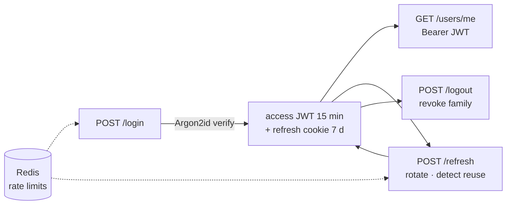
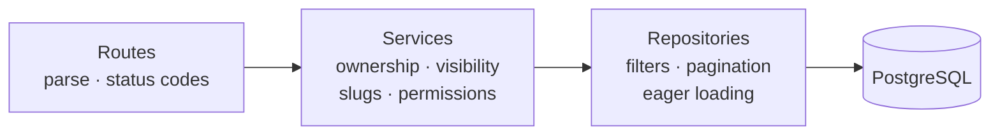
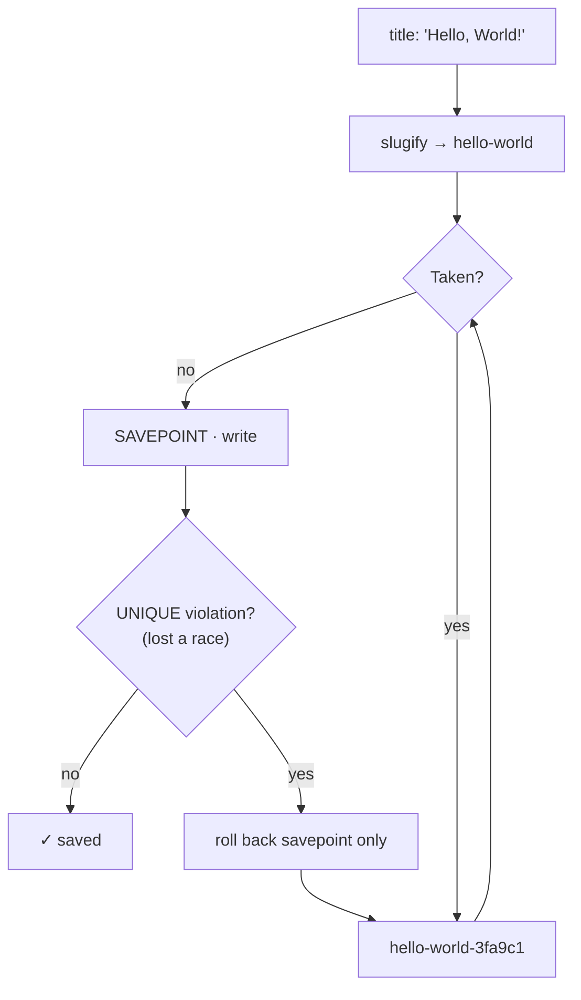

# Day 2 — Authentication and posts

## Phase 3 — Auth

**Built:** Registration, login, rotating refresh sessions with theft detection, logout, `/users/me`, Redis rate limiting, and 28 new tests (65 in total), including forged-token and log-leak checks.

```mermaid
flowchart LR
    L[POST /login] -->|Argon2id verify| T["access JWT 15 min<br/>+ refresh cookie 7 d"]
    T --> ME["GET /users/me<br/>Bearer JWT"]
    T --> RF["POST /refresh<br/>rotate · detect reuse"] --> T
    T --> LO["POST /logout<br/>revoke family"]
    RL[(Redis<br/>rate limits)] -.-> L & RF
```

| Concept | What it means | Where it's applied |
|---|---|---|
| **Authentication vs authorisation** | *Authn*: who are you? *Authz*: what may you do? This phase is authn plus the role data that authz will use | [`api/deps.py`](../../backend/app/api/deps.py) |
| **Password hashing** | Store a slow, salted one-way hash, never the password. Argon2id is memory-hard, which makes GPU cracking expensive | [`core/security.py`](../../backend/app/core/security.py) |
| **Timing-safe login** | Unknown emails still run a dummy hash check, so response time can't reveal which accounts exist | [`services/auth.py`](../../backend/app/services/auth.py) |
| **JWT access token** | A signed, self-contained claim set (`sub`, `exp`, `iss`, `aud`, `type`). The server verifies it without a DB lookup, so it must be short-lived | [`core/security.py`](../../backend/app/core/security.py) |
| **Sessions vs JWT** | A JWT can't be revoked before it expires, so it lives 15 minutes. The revocable part is the refresh token, stored server-side | [`models/refresh_token.py`](../../backend/app/models/refresh_token.py) |
| **Refresh token rotation** | Each refresh token works once. Using it returns a new one and revokes the old one | [`services/auth.py`](../../backend/app/services/auth.py) |
| **Reuse detection** | A second use of a rotated token means someone copied it, so every token in that sign-in's *family* is revoked | same |
| **Secure cookies** | `HttpOnly` (hidden from JS/XSS), `Secure` (HTTPS only), `SameSite=Strict` (blocks CSRF), `Path=/api/v1/auth` (sent nowhere else) | [`routes/auth.py`](../../backend/app/api/v1/routes/auth.py) |
| **CORS** | The browser only lets our frontend origin call the API with credentials; other sites' scripts are blocked | [`core/middleware.py`](../../backend/app/core/middleware.py) |
| **Rate limiting** | Fixed-window counters in Redis (`INCR` + `EXPIRE`) cap login attempts per IP and per email; `429` + `Retry-After` | [`core/rate_limit.py`](../../backend/app/core/rate_limit.py) |
| **Row locking** | `SELECT … FOR UPDATE` stops two refreshes of the same token from both succeeding | [`services/auth.py`](../../backend/app/services/auth.py) |
| **Expand → backfill → contract** | Adding a NOT NULL column to a table with data: add it nullable, fill it, then add NOT NULL | [`migrations/versions/…_add_refresh_token_family.py`](../../backend/migrations/versions/) |
| **Dependency injection** | `CurrentUser` / `OptionalUser` are declared in a route's signature; FastAPI resolves and validates them | [`api/deps.py`](../../backend/app/api/deps.py) |

**Security details worth remembering**

- Only the SHA-256 hash of each refresh token is stored, so a database leak yields no usable sessions.
- The JWT algorithm is pinned to HS256: `alg: none` and algorithm-confusion tokens are rejected (covered by tests).
- Login failures share one message and one status code. Registration conflicts use one message for email or username.
- Passwords are `SecretStr`: they print as `**********` and validation errors never echo input.
- Emails are hashed inside rate-limit keys, and log lines carry user IDs, never emails.
- New accounts get the least-privileged `user` role.

**Decisions & trade-offs**

| Decision | Why | Cost |
|---|---|---|
| Logout needs only the cookie, not an access token | A user whose access token expired can still sign out | Anyone holding the cookie can end that session (harmless) |
| Strict reuse detection | A stolen token is caught on first replay | Two parallel refreshes end the session, so the frontend must serialise refreshes |
| Rate limiter fails open | A Redis outage doesn't block every sign-in | No limits during the outage; Argon2 still slows brute force |
| Client IP from the socket | Can't be spoofed with headers | Behind a proxy, enable uvicorn `--proxy-headers` (Phase 9) |

**Lessons learned**

- A security test that passes can still be wrong. The first reuse test would also have passed if the cookie had never been sent, so a positive control (the legitimate refresh must return 200) now proves the setup works.
- A NOT NULL column can't be added in one step to a table that already has rows; the migration was rewritten as expand → backfill → contract.
- Revoking the family must be committed *before* raising the 401, or the error's rollback would undo the revocation.
- The linter flagged `"access"` and `"bearer"` as hard-coded passwords (S105). They are claim values, so each gets a `noqa` with a written reason rather than a blanket ignore.

**Not applicable yet:** ownership checks and moderator permissions are enforced on posts and comments starting in Phase 4.

## Phase 4 — Posts

**Built:** Post CRUD with a draft → published lifecycle, a public feed (tag, author and text filters, sorting, pagination), author profiles, "my posts", tag counts, moderator deletes, and 47 new tests (112 in total), including a query-count test against N+1 and a simulated slug race.

```mermaid
flowchart LR
    RT["Routes<br/>parse · status codes"] --> SV["Services<br/>ownership · visibility<br/>slugs · permissions"]
    SV --> RP["Repositories<br/>filters · pagination<br/>eager loading"]
    RP --> DB[(PostgreSQL)]
```

| Concept | What it means | Where it's applied |
|---|---|---|
| **Resource-oriented REST** | URLs name things (`/posts/{id}`); methods say what to do. State changes that aren't plain field edits get their own action (`/publish`) | [`routes/posts.py`](../../backend/app/api/v1/routes/posts.py) |
| **HTTP semantics** | `201 Created` + `Location` for new resources, `204 No Content` for deletes, `422` for invalid input | same |
| **Idempotency** | Repeating a request has the same effect as sending it once. `publish` twice is harmless, and `published_at` isn't reset | [`services/posts.py`](../../backend/app/services/posts.py) |
| **Path vs query parameters** | Path identifies *which* resource (`/posts/{slug}`); query refines a collection (`?tag=python&limit=20`) | [`schemas/post.py`](../../backend/app/schemas/post.py) |
| **API versioning** | Everything lives under `/api/v1`, so a breaking change can ship as `/v2` without breaking clients | [`api/v1/router.py`](../../backend/app/api/v1/router.py) |
| **Ownership checks** | Every write loads the post and compares `author_id` with the signed-in user *on the server*; the client is never trusted | [`services/posts.py`](../../backend/app/services/posts.py) |
| **404 vs 403** | `403` admits the thing exists. Other people's drafts answer `404` so their existence stays secret; published posts answer `403` | same |
| **Permissions, not role names** | Code asks "may this user `post:delete:any`?" in one `EXISTS` query; roles are just bundles of permissions | [`services/permissions.py`](../../backend/app/services/permissions.py) |
| **Repository layer** | Queries live in one place, so the service reads like the business rules | [`repositories/posts.py`](../../backend/app/repositories/posts.py) |
| **N+1 queries** | Loading 20 posts and then each author one by one = 21 queries. `contains_eager` (JOIN) + `selectinload` (one `IN` query) make it 3, whatever the page size | same · [`tests/test_feed.py`](../../backend/tests/test_feed.py) |
| **Offset pagination** | `LIMIT`/`OFFSET` + a total count. A tie-breaker (`id`) keeps order stable when timestamps are equal; offset is capped to protect the DB | [`schemas/common.py`](../../backend/app/schemas/common.py) |
| **Savepoints** | `SAVEPOINT` lets one statement fail and be retried without losing the rest of the transaction | [`services/posts.py`](../../backend/app/services/posts.py) |
| **LIKE escaping** | `%` and `_` are wildcards; user input is escaped so searching `100%` finds "100%", not everything | [`repositories/posts.py`](../../backend/app/repositories/posts.py) |
| **Mass assignment** | A client sending `author_id` or `status` could hijack fields. Schemas use `extra="forbid"`, so unknown fields are a `422` | [`schemas/post.py`](../../backend/app/schemas/post.py) |
| **Upsert** | `INSERT … ON CONFLICT DO NOTHING` creates missing tags safely even when two requests add the same tag | [`repositories/tags.py`](../../backend/app/repositories/tags.py) |

### How a slug is chosen

```mermaid
flowchart TD
    T["title: 'Hello, World!'"] --> S["slugify → hello-world"]
    S --> C{Taken?}
    C -->|no| W["SAVEPOINT · write"]
    C -->|yes| X["hello-world-3fa9c1"] --> C
    W --> U{"UNIQUE violation?<br/>(lost a race)"}
    U -->|no| OK[✓ saved]
    U -->|yes| RB["roll back savepoint only"] --> X
```

The pre-check handles the usual case. The database's `UNIQUE` constraint is the real guarantee: two requests can both pass the check at the same instant.

**Security details worth remembering**

- Drafts never leave the server for anyone but their author: not in the feed, profiles, tag counts, or by direct link.
- Public schemas carry `username` and `display_name` only, never email or IDs of users; tests assert the exact key sets.
- Unknown query parameters are rejected too, so a typo like `?sortt=` fails loudly instead of being silently ignored.
- Sort order comes from a whitelist (`newest`/`oldest`), never from a raw column name.
- Page size ≤ 100 and offset ≤ 10 000 bound how much work one request can cause.
- Deleted posts keep their slug forever, so an old link can never point at someone else's new post.

**Decisions & trade-offs**

| Decision | Why | Cost |
|---|---|---|
| Soft delete (`deleted_at`) | Recoverable and auditable; comments and likes stay consistent | Every query must filter it; covered by shared conditions |
| Slug frozen after first publish | Shared links never break | A renamed post keeps its old slug |
| `/users/me/posts` instead of `/me/posts` | Consistent with `/users/me` | — |
| Offset pagination | Simple, supports "page N" and totals | Slower on very deep pages; cursor pagination later if needed |
| Moderators delete but don't edit | Moderation removes content; it doesn't put words in an author's mouth | — |
| Preview computed in SQL | List pages never transfer full post bodies | `content` access in lists raises (by design) |

**Lessons learned**

- `session.begin_nested()` **flushes pending changes before** creating the savepoint. The first version set the slug and then opened the savepoint, so the clashing `INSERT` ran outside it and rolled back the whole transaction. The race test caught it; the change now happens inside the savepoint.
- A test that simulates a race (patching the pre-check to always say "free") is the only practical way to exercise the retry path.
- Counting SQL statements in a test turns "we avoid N+1" from a claim into a guarantee.
- SQLAlchemy 2.1 deprecates `Result.tuples()`, because rows now unpack with types directly.

**Not applicable yet:** like and comment counts join the feed in Phase 5; indexes are tuned with `EXPLAIN ANALYZE` in Phase 7.
