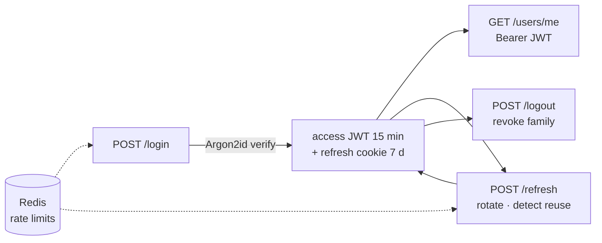

# Day 3 — Authentication, sessions & rate limiting

## Phase 3 — Auth

**Built:** Registration, login, rotating refresh sessions with theft detection, logout, `/users/me`, Redis rate limiting, and 28 new tests (65 in total), including forged-token and log-leak checks.

| Concept | What it means | Where it's applied |
|---|---|---|
| **Authentication vs authorisation** | *Authn*: who are you? *Authz*: what may you do? This phase is authn plus the role data that authz will use | [`api/deps.py`](../../backend/app/api/deps.py) |
| **Password hashing** | Store a slow, salted one-way hash, never the password. Argon2id is memory-hard, which makes GPU cracking expensive | [`core/security.py`](../../backend/app/core/security.py) |
| **Timing-safe login** | Unknown emails still run a dummy hash check, so response time can't reveal which accounts exist | [`services/auth.py`](../../backend/app/services/auth.py) |
| **JWT access token** | A signed, self-contained claim set (`sub`, `exp`, `iss`, `aud`, `type`). The server verifies it without a DB lookup, so it must be short-lived | [`core/security.py`](../../backend/app/core/security.py) |
| **Sessions vs JWT** | A JWT can't be revoked before it expires, so it lives 15 minutes. The revocable part is the refresh token, stored server-side | [`models/refresh_token.py`](../../backend/app/models/refresh_token.py) |
| **Refresh token rotation** | Each refresh token works once. Using it returns a new one and revokes the old one | [`services/auth.py`](../../backend/app/services/auth.py) |
| **Reuse detection** | A second use of a rotated token means someone copied it, so every token in that sign-in's *family* is revoked | same |
| **Secure cookies** | `HttpOnly` (hidden from JS/XSS), `Secure` (HTTPS only), `SameSite=Strict` (blocks CSRF), `Path=/api/v1/auth` (sent nowhere else) | [`routes/auth.py`](../../backend/app/api/v1/routes/auth.py) |
| **CORS** | The browser only lets our frontend origin call the API with credentials; other sites' scripts are blocked | [`core/middleware.py`](../../backend/app/core/middleware.py) |
| **Rate limiting** | Fixed-window counters in Redis (`INCR` + `EXPIRE`) cap login attempts per IP and per email; `429` + `Retry-After` | [`core/rate_limit.py`](../../backend/app/core/rate_limit.py) |
| **Row locking** | `SELECT … FOR UPDATE` stops two refreshes of the same token from both succeeding | [`services/auth.py`](../../backend/app/services/auth.py) |
| **Expand → backfill → contract** | Adding a NOT NULL column to a table with data: add it nullable, fill it, then add NOT NULL | [`migrations/versions/…_add_refresh_token_family.py`](../../backend/migrations/versions/) |
| **Dependency injection** | `CurrentUser` / `OptionalUser` are declared in a route's signature; FastAPI resolves and validates them | [`api/deps.py`](../../backend/app/api/deps.py) |

**Security details worth remembering**

- Only the SHA-256 hash of each refresh token is stored, so a database leak yields no usable sessions.
- The JWT algorithm is pinned to HS256: `alg: none` and algorithm-confusion tokens are rejected (covered by tests).
- Login failures share one message and one status code. Registration conflicts use one message for email or username.
- Passwords are `SecretStr`: they print as `**********` and validation errors never echo input.
- Emails are hashed inside rate-limit keys, and log lines carry user IDs, never emails.
- New accounts get the least-privileged `user` role.

**Decisions & trade-offs**

| Decision | Why | Cost |
|---|---|---|
| Logout needs only the cookie, not an access token | A user whose access token expired can still sign out | Anyone holding the cookie can end that session (harmless) |
| Strict reuse detection | A stolen token is caught on first replay | Two parallel refreshes end the session, so the frontend must serialise refreshes |
| Rate limiter fails open | A Redis outage doesn't block every sign-in | No limits during the outage; Argon2 still slows brute force |
| Client IP from the socket | Can't be spoofed with headers | Behind a proxy, enable uvicorn `--proxy-headers` (Phase 9) |

**Lessons learned**

- A security test that passes can still be wrong. The first reuse test would also have passed if the cookie had never been sent, so a positive control (the legitimate refresh must return 200) now proves the setup works.
- A NOT NULL column can't be added in one step to a table that already has rows; the migration was rewritten as expand → backfill → contract.
- Revoking the family must be committed *before* raising the 401, or the error's rollback would undo the revocation.
- The linter flagged `"access"` and `"bearer"` as hard-coded passwords (S105). They are claim values, so each gets a `noqa` with a written reason rather than a blanket ignore.

**Not applicable yet:** ownership checks and moderator permissions are enforced on posts and comments starting in Phase 4.
