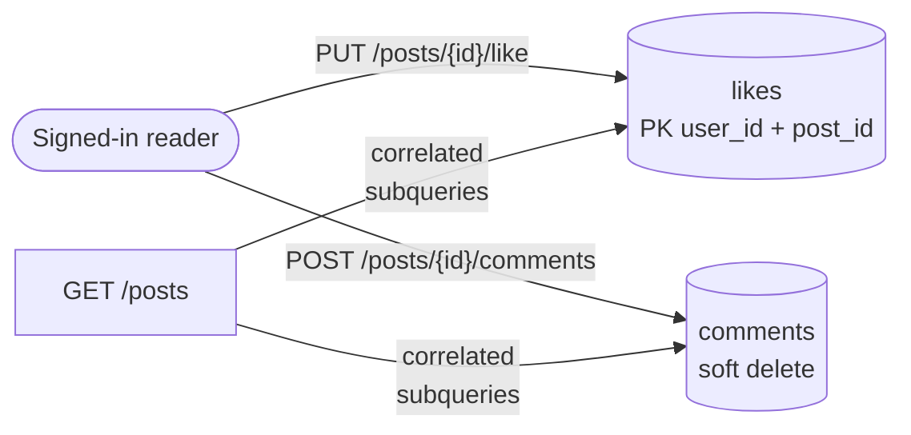
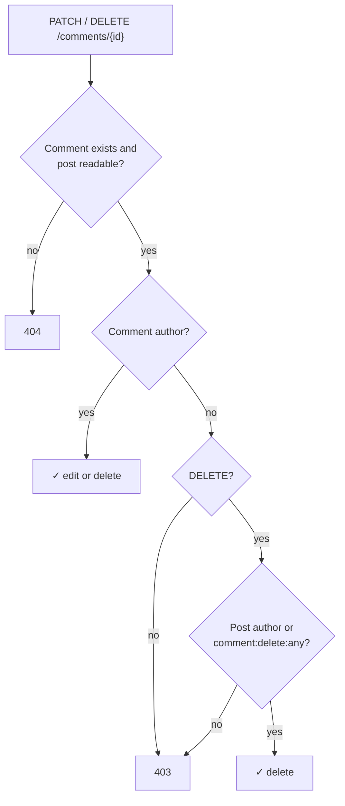
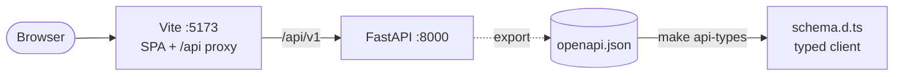
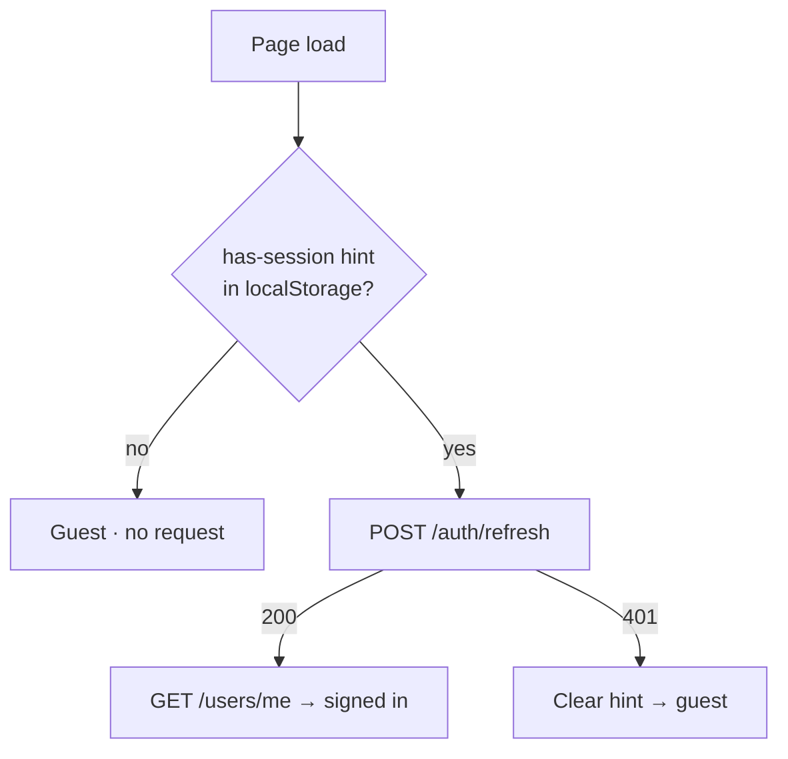

# Day 3 — Engagement and the web app

## Phase 5 — Engagement

**Built:** Likes (like and unlike, no self-likes), flat comments (create, edit, delete, public list), like and comment counts plus `liked_by_me` on every post response, per-user rate limits, and 20 new tests (132 in total). The feed still runs in a fixed number of queries.

```mermaid
flowchart LR
    V([Signed-in reader]) -->|"PUT /posts/{id}/like"| L[(likes<br/>PK user_id + post_id)]
    V -->|"POST /posts/{id}/comments"| C[(comments<br/>soft delete)]
    F["GET /posts"] -->|"correlated<br/>subqueries"| L & C
```

| Concept | What it means | Where it's applied |
|---|---|---|
| **PUT/DELETE instead of a toggle** | `PUT` means "make it liked", `DELETE` means "make it not liked". A `POST /toggle` would flip twice on a double click; these can't | [`routes/posts.py`](../../backend/app/api/v1/routes/posts.py) |
| **Idempotency via the primary key** | `likes` has a composite PK `(user_id, post_id)`, so a second like is impossible. `INSERT … ON CONFLICT DO NOTHING` turns the duplicate into a no-op, even for simultaneous requests | [`repositories/likes.py`](../../backend/app/repositories/likes.py) |
| **Correlated subqueries** | `(SELECT count(*) FROM likes WHERE post_id = posts.id)` inside the feed query computes every row's count in the same round trip, so there's no extra query per post (no N+1) | [`repositories/posts.py`](../../backend/app/repositories/posts.py) |
| **`EXISTS` for "did I like it?"** | Stops at the first match; for signed-out readers it becomes a constant `false` and the field is returned as `null` | same |
| **Two kinds of ownership** | A comment has an author, and so does the post it's on. Only the comment author may *edit*; the comment author, the post author or a moderator may *delete* | [`services/comments.py`](../../backend/app/services/comments.py) |
| **Soft-delete placeholders** | A deleted comment stays in the list as `{"body": null, "author": null, "is_deleted": true}`, so the thread keeps its shape without leaking the removed text or who wrote it | same |
| **Per-user rate limits** | Writes are limited per account (hashed user ID), not per IP, so shared networks aren't punished and one account can't flood a thread | [`core/rate_limit.py`](../../backend/app/core/rate_limit.py) |
| **409 Conflict** | Your own draft is visible to you but not open for comments yet; `409` says "valid request, wrong state" | [`services/posts.py`](../../backend/app/services/posts.py) |

### Who can do what to a comment

```mermaid
flowchart TD
    Q["PATCH / DELETE /comments/{id}"] --> E{"Comment exists and<br/>post readable?"}
    E -->|no| N[404]
    E -->|yes| A{Comment author?}
    A -->|yes| OK["✓ edit or delete"]
    A -->|no| D{DELETE?}
    D -->|no| F[403]
    D -->|yes| P{"Post author or<br/>comment:delete:any?"}
    P -->|yes| OK2["✓ delete"]
    P -->|no| F
```

**Security details worth remembering**

- Comments are **plain text**. The API stores what was sent; the frontend must render it as text, never as HTML (XSS).
- Placeholders drop the body *and* the author, and tests check that the removed text never appears in the response.
- Unpublishing a post hides its comments too; commenters then get `404` on edits, just as if the post were gone.
- Self-likes are refused server-side (`403`), so counts can't be inflated from the author's own account.

**Decisions & trade-offs**

| Decision | Why | Cost |
|---|---|---|
| Flat comments | Simple UI and queries; fits a blog | No reply threads |
| Counts computed on read | Always correct; no counters to drift | More work per feed query; indexes (and caching if needed) in the optimisation phase |
| Moderators delete but can't edit comments | Same principle as posts: remove, don't rewrite | — |
| No `GET /comments/{id}` | Comments are read in the context of a post | `201` has no `Location` header |

**Lessons learned**

- Concurrency tests (`asyncio.gather` of five likes) prove the database constraint, not the application code, is what keeps counts right.
- A signed-in feed costs one extra query (loading the viewer), but that number is still constant; the N+1 test now checks both cases.
- Email validation rejects reserved domains such as `.test`, which shows up in manual smoke tests; use `example.com`.

## Phase 6 — Frontend

**Built:** A React single-page app covering the whole API. It has:
- the public feed (search, tags, sorting), post pages, profiles, likes and comments;
- sign-in and sign-up with silent session restore;
- a Markdown editor with live preview and an unsaved-changes guard;
- an author dashboard;
- light, dark and system themes;
- generated cover art.

It also adds 62 frontend tests, a frontend CI job and an OpenAPI drift check.

```mermaid
flowchart LR
    B([Browser]) --> V["Vite :5173<br/>SPA + /api proxy"]
    V -->|"/api/v1"| A["FastAPI :8000"]
    O[("openapi.json")] -->|"make api-types"| T["schema.d.ts<br/>typed client"]
    A -.->|export| O
```

| Concept | What it means | Where it's applied |
|---|---|---|
| **Token in memory, refresh in a cookie** | Script can't read an httpOnly cookie, and a token kept in a JS variable isn't in storage for injected code to find. A reload costs one refresh call | [`api/client.ts`](../../frontend/src/api/client.ts) |
| **Single-flight refresh** | Refresh tokens are single use, so every 401 waits on one shared promise, and tabs coordinate through a Web Lock. Parallel refreshes would trigger reuse detection | same |
| **Server state vs UI state** | TanStack Query owns everything fetched (caching, retries, invalidation); React state only holds what's on screen | [`main.tsx`](../../frontend/src/main.tsx), pages |
| **Optimistic updates** | The like heart flips immediately and rolls back if the request fails | [`LikeButton.tsx`](../../frontend/src/components/LikeButton.tsx) |
| **Generated API types** | TypeScript types come from the backend's OpenAPI schema; CI fails if they drift, so a renamed field breaks the build, not production | [`api/schema.d.ts`](../../frontend/src/api/schema.d.ts) |
| **Safe Markdown** | Raw HTML is ignored and the output passes through `rehype-sanitize`; comments are plain text nodes | [`Markdown.tsx`](../../frontend/src/components/Markdown.tsx) |
| **Open-redirect guard** | `?next=` after sign-in accepts same-site paths only (`/…`, not `//evil.example`) | [`lib/utils.ts`](../../frontend/src/lib/utils.ts) |
| **Route-level code splitting** | Only the feed is in the first bundle; the Markdown stack loads with the post page and editor | [`main.tsx`](../../frontend/src/main.tsx) |
| **Design tokens** | Colors are CSS variables mapped into Tailwind; one `data-mode` attribute re-themes the whole app | [`index.css`](../../frontend/src/index.css) |
| **No theme flash** | A tiny external script sets the mode before first paint (external so a strict CSP can allow it) | [`public/theme-init.js`](../../frontend/public/theme-init.js) |
| **Deterministic art** | A hash of the slug seeds a small PRNG, so each post always gets the same SVG cover in the current theme's colors | [`lib/covers.ts`](../../frontend/src/lib/covers.ts) |

### Restoring a session on reload

```mermaid
flowchart TD
    L[Page load] --> H{"has-session hint<br/>in localStorage?"}
    H -->|no| G["Guest · no request"]
    H -->|yes| R["POST /auth/refresh"]
    R -->|200| M["GET /users/me → signed in"]
    R -->|401| X["Clear hint → guest"]
```

The hint is just a flag that a cookie probably exists. It isn't a credential, and it saves every guest from a pointless 401.

**Security details worth remembering**

- UI permission checks only hide buttons; the API still decides. Hiding isn't protecting.
- Production builds ship no source maps, so the original source isn't published.
- External links in posts get `rel="noopener noreferrer nofollow ugc"`.
- Leaving the editor with unsaved changes asks first (in-app navigation and tab close).

**Decisions & trade-offs**

| Decision | Why | Cost |
|---|---|---|
| Vite proxy (same origin) in dev | Strict cookie works unchanged; no CORS preflights | Production needs the same routing at the reverse proxy |
| Generated covers instead of uploads | No storage, no moderation of images, always on-theme | Authors can't pick their own image (yet) |
| One theme, three modes | Tested options side by side, then kept Haze · Indigo · Geist · Patterns | Less customization for users |
| Hand-built UI primitives (cva) | Small, no component-library lock-in | More code to own |

**Lessons learned**

- A `position: fixed` backdrop with a negative z-index is hidden by any background on `body`; the base color belongs on `html`.
- CSS cascade layers matter: an unlayered rule beats a utility in `@layer utilities`, whatever the specificity.
- Trying design options live in the running app (then deleting the losers) beat choosing from static mockups.
