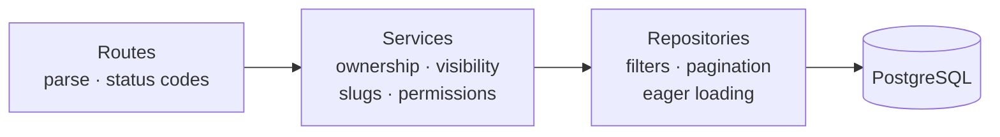
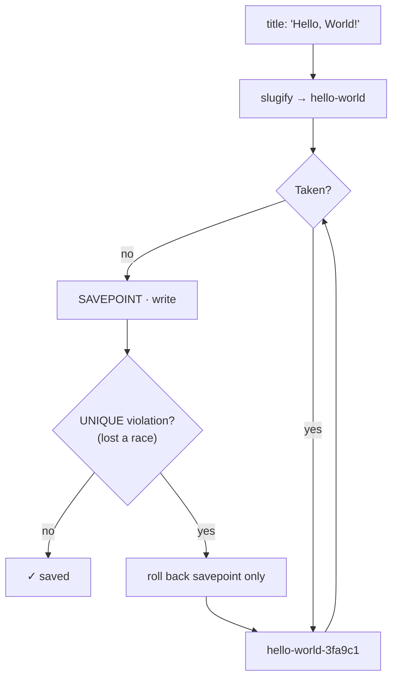

# Day 4 — Posts, public browsing & ownership

## Phase 4 — Posts

**Built:** Post CRUD with a draft → published lifecycle, a public feed (tag, author and text filters, sorting, pagination), author profiles, "my posts", tag counts, moderator deletes, and 47 new tests (112 in total), including a query-count test against N+1 and a simulated slug race.

| Concept | What it means | Where it's applied |
|---|---|---|
| **Resource-oriented REST** | URLs name things (`/posts/{id}`); methods say what to do. State changes that aren't plain field edits get their own action (`/publish`) | [`routes/posts.py`](../../backend/app/api/v1/routes/posts.py) |
| **HTTP semantics** | `201 Created` + `Location` for new resources, `204 No Content` for deletes, `422` for invalid input | same |
| **Idempotency** | Repeating a request has the same effect as sending it once. `publish` twice is harmless, and `published_at` isn't reset | [`services/posts.py`](../../backend/app/services/posts.py) |
| **Path vs query parameters** | Path identifies *which* resource (`/posts/{slug}`); query refines a collection (`?tag=python&limit=20`) | [`schemas/post.py`](../../backend/app/schemas/post.py) |
| **API versioning** | Everything lives under `/api/v1`, so a breaking change can ship as `/v2` without breaking clients | [`api/v1/router.py`](../../backend/app/api/v1/router.py) |
| **Ownership checks** | Every write loads the post and compares `author_id` with the signed-in user *on the server*; the client is never trusted | [`services/posts.py`](../../backend/app/services/posts.py) |
| **404 vs 403** | `403` admits the thing exists. Other people's drafts answer `404` so their existence stays secret; published posts answer `403` | same |
| **Permissions, not role names** | Code asks "may this user `post:delete:any`?" in one `EXISTS` query; roles are just bundles of permissions | [`services/permissions.py`](../../backend/app/services/permissions.py) |
| **Repository layer** | Queries live in one place, so the service reads like the business rules | [`repositories/posts.py`](../../backend/app/repositories/posts.py) |
| **N+1 queries** | Loading 20 posts and then each author one by one = 21 queries. `contains_eager` (JOIN) + `selectinload` (one `IN` query) make it 3, whatever the page size | same · [`tests/test_feed.py`](../../backend/tests/test_feed.py) |
| **Offset pagination** | `LIMIT`/`OFFSET` + a total count. A tie-breaker (`id`) keeps order stable when timestamps are equal; offset is capped to protect the DB | [`schemas/common.py`](../../backend/app/schemas/common.py) |
| **Savepoints** | `SAVEPOINT` lets one statement fail and be retried without losing the rest of the transaction | [`services/posts.py`](../../backend/app/services/posts.py) |
| **LIKE escaping** | `%` and `_` are wildcards; user input is escaped so searching `100%` finds "100%", not everything | [`repositories/posts.py`](../../backend/app/repositories/posts.py) |
| **Mass assignment** | A client sending `author_id` or `status` could hijack fields. Schemas use `extra="forbid"`, so unknown fields are a `422` | [`schemas/post.py`](../../backend/app/schemas/post.py) |
| **Upsert** | `INSERT … ON CONFLICT DO NOTHING` creates missing tags safely even when two requests add the same tag | [`repositories/tags.py`](../../backend/app/repositories/tags.py) |

### How a slug is chosen

The pre-check handles the usual case. The database's `UNIQUE` constraint is the real guarantee: two requests can both pass the check at the same instant.

**Security details worth remembering**

- Drafts never leave the server for anyone but their author: not in the feed, profiles, tag counts, or by direct link.
- Public schemas carry `username` and `display_name` only, never email or IDs of users; tests assert the exact key sets.
- Unknown query parameters are rejected too, so a typo like `?sortt=` fails loudly instead of being silently ignored.
- Sort order comes from a whitelist (`newest`/`oldest`), never from a raw column name.
- Page size ≤ 100 and offset ≤ 10 000 bound how much work one request can cause.
- Deleted posts keep their slug forever, so an old link can never point at someone else's new post.

**Decisions & trade-offs**

| Decision | Why | Cost |
|---|---|---|
| Soft delete (`deleted_at`) | Recoverable and auditable; comments and likes stay consistent | Every query must filter it; covered by shared conditions |
| Slug frozen after first publish | Shared links never break | A renamed post keeps its old slug |
| `/users/me/posts` instead of `/me/posts` | Consistent with `/users/me` | — |
| Offset pagination | Simple, supports "page N" and totals | Slower on very deep pages; cursor pagination later if needed |
| Moderators delete but don't edit | Moderation removes content; it doesn't put words in an author's mouth | — |
| Preview computed in SQL | List pages never transfer full post bodies | `content` access in lists raises (by design) |

**Lessons learned**

- `session.begin_nested()` **flushes pending changes before** creating the savepoint. The first version set the slug and then opened the savepoint, so the clashing `INSERT` ran outside it and rolled back the whole transaction. The race test caught it; the change now happens inside the savepoint.
- A test that simulates a race (patching the pre-check to always say "free") is the only practical way to exercise the retry path.
- Counting SQL statements in a test turns "we avoid N+1" from a claim into a guarantee.
- SQLAlchemy 2.1 deprecates `Result.tuples()`, because rows now unpack with types directly.

**Not applicable yet:** like and comment counts join the feed in Phase 5; indexes are tuned with `EXPLAIN ANALYZE` in the optimisation phase.
