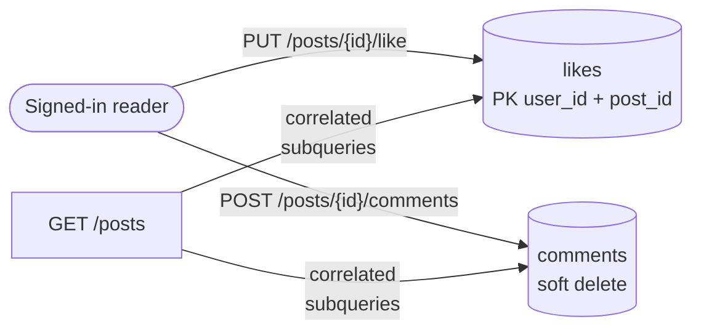
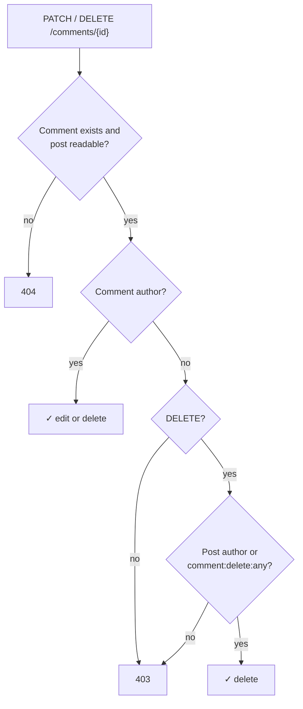

# Day 5 — Likes, comments & engagement

## Phase 5 — Engagement

**Built:** Likes (like and unlike, no self-likes), flat comments (create, edit, delete, public list), like and comment counts plus `liked_by_me` on every post response, per-user rate limits, and 20 new tests (132 in total). The feed still runs in a fixed number of queries.

| Concept | What it means | Where it's applied |
|---|---|---|
| **PUT/DELETE instead of a toggle** | `PUT` means "make it liked", `DELETE` means "make it not liked". A `POST /toggle` would flip twice on a double click; these can't | [`routes/posts.py`](../../backend/app/api/v1/routes/posts.py) |
| **Idempotency via the primary key** | `likes` has a composite PK `(user_id, post_id)`, so a second like is impossible. `INSERT … ON CONFLICT DO NOTHING` turns the duplicate into a no-op, even for simultaneous requests | [`repositories/likes.py`](../../backend/app/repositories/likes.py) |
| **Correlated subqueries** | `(SELECT count(*) FROM likes WHERE post_id = posts.id)` inside the feed query computes every row's count in the same round trip, so there's no extra query per post (no N+1) | [`repositories/posts.py`](../../backend/app/repositories/posts.py) |
| **`EXISTS` for "did I like it?"** | Stops at the first match; for signed-out readers it becomes a constant `false` and the field is returned as `null` | same |
| **Two kinds of ownership** | A comment has an author, and so does the post it's on. Only the comment author may *edit*; the comment author, the post author or a moderator may *delete* | [`services/comments.py`](../../backend/app/services/comments.py) |
| **Soft-delete placeholders** | A deleted comment stays in the list as `{"body": null, "author": null, "is_deleted": true}`, so the thread keeps its shape without leaking the removed text or who wrote it | same |
| **Per-user rate limits** | Writes are limited per account (hashed user ID), not per IP, so shared networks aren't punished and one account can't flood a thread | [`core/rate_limit.py`](../../backend/app/core/rate_limit.py) |
| **409 Conflict** | Your own draft is visible to you but not open for comments yet; `409` says "valid request, wrong state" | [`services/posts.py`](../../backend/app/services/posts.py) |

### Who can do what to a comment

**Security details worth remembering**

- Comments are **plain text**. The API stores what was sent; the frontend must render it as text, never as HTML (XSS).
- Placeholders drop the body *and* the author, and tests check that the removed text never appears in the response.
- Unpublishing a post hides its comments too; commenters then get `404` on edits, just as if the post were gone.
- Self-likes are refused server-side (`403`), so counts can't be inflated from the author's own account.

**Decisions & trade-offs**

| Decision | Why | Cost |
|---|---|---|
| Flat comments | Simple UI and queries; fits a blog | No reply threads |
| Counts computed on read | Always correct; no counters to drift | More work per feed query; indexes (and caching if needed) in the optimisation phase |
| Moderators delete but can't edit comments | Same principle as posts: remove, don't rewrite | — |
| No `GET /comments/{id}` | Comments are read in the context of a post | `201` has no `Location` header |

**Lessons learned**

- Concurrency tests (`asyncio.gather` of five likes) prove the database constraint, not the application code, is what keeps counts right.
- A signed-in feed costs one extra query (loading the viewer), but that number is still constant; the N+1 test now checks both cases.
- Email validation rejects reserved domains such as `.test`, which shows up in manual smoke tests; use `example.com`.
