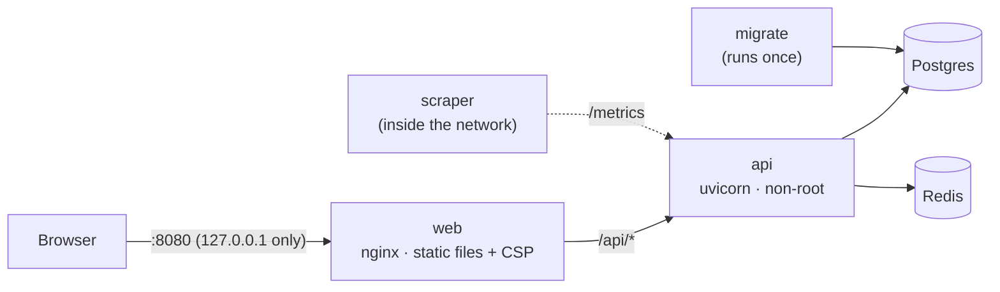
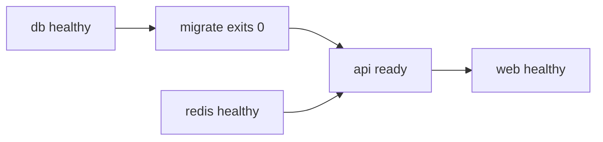
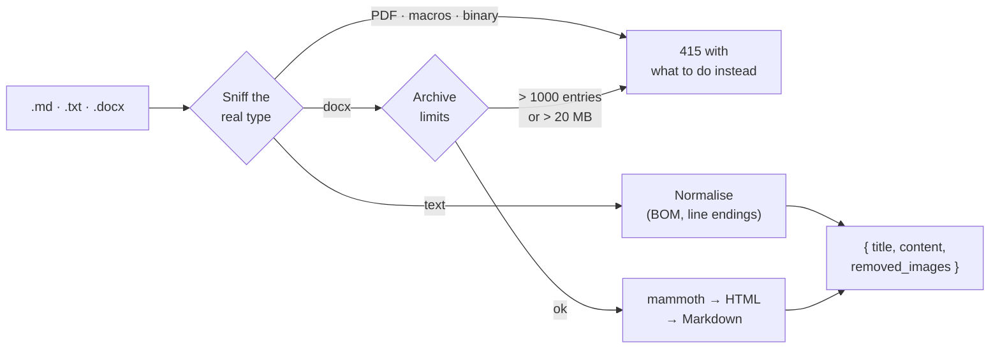
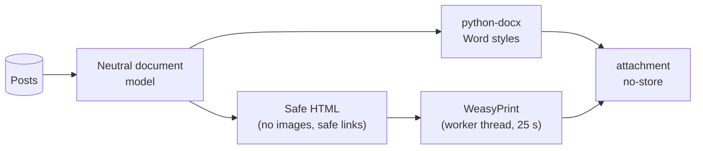

# Day 5 — Production: containers, author tools and release

## Phase 9 — Containers, metrics, request-aware logs and backups

**Built:**
- multi-stage Docker images for the API (Python 3.13 + uv) and the web app (Vite build served by unprivileged nginx);
- a full-stack Compose profile, `make up`: Postgres, Redis, a one-shot `migrate` job, the API and the web proxy;
- Prometheus metrics at `GET /metrics`: request counts and latency per route template;
- access and error logs that carry the route and the signed-in user's id;
- `make backup` / `make restore` with `pg_dump` / `pg_restore`;
- a CI job that builds both images, starts the stack and runs `scripts/smoke-test.sh` against it.

That adds 8 new tests, 190 backend tests in total.

```mermaid
flowchart LR
    B[Browser] -->|":8080 (127.0.0.1 only)"| W["web<br/>nginx · static files + CSP"]
    W -->|"/api/*"| A["api<br/>uvicorn · non-root"]
    A --> DB[(Postgres)]
    A --> R[(Redis)]
    M["migrate<br/>(runs once)"] --> DB
    P["scraper<br/>(inside the network)"] -.->|"/metrics"| A
```

```mermaid
flowchart LR
    db[db healthy] --> m[migrate exits 0] --> a[api ready] --> w[web healthy]
    r[redis healthy] --> a
```

| Concept | What it means | Where it's applied |
|---|---|---|
| **Multi-stage build** | Build tools (uv, npm, compilers) stay in the build stage; the runtime image gets only the virtualenv or the static files | [`backend/Dockerfile`](../../backend/Dockerfile), [`frontend/Dockerfile`](../../frontend/Dockerfile) |
| **Reproducible images** | `uv sync --frozen` and `npm ci` install exactly what the lockfiles say; base images are pinned to a version, and Dependabot proposes updates | same, [`dependabot.yml`](../../.github/dependabot.yml) |
| **Container hardening** | Non-root user, read-only root filesystem, every Linux capability dropped, `no-new-privileges`, `/tmp` on tmpfs | [`docker-compose.yml`](../../docker-compose.yml) |
| **One public door** | Only nginx publishes a port, and only on `127.0.0.1`. The API, database traffic and `/metrics` stay on the internal network | same, [`nginx.conf`](../../frontend/docker/nginx.conf) |
| **Liveness vs readiness** | Liveness: the process answers. Readiness: it can reach Postgres and Redis. The image checks liveness; Compose waits on readiness before starting `web` | [`routes/health.py`](../../backend/app/api/v1/routes/health.py) |
| **Migrations as a job** | A separate container applies migrations and exits; the API starts only after it succeeds, so two API replicas never race to migrate | `docker-compose.yml` |
| **Trusted proxy headers** | nginx *overwrites* `X-Forwarded-For` with the real peer address, so the rate limiter sees the client's IP and a forged header can't reset it | `nginx.conf` |
| **RED metrics** | Rate, Errors, Duration: a counter by status and a latency histogram, per route | [`core/metrics.py`](../../backend/app/core/metrics.py) |
| **Bounded labels** | Labels are route *templates* (`/posts/{slug}`), known methods and status codes. Unmatched paths share one `unmatched` series, so no client can create new series | same |
| **Context in logs** | Request id and user id live in context variables and are copied onto each log record when it's created, so a line logged anywhere in the request carries them | [`core/logging.py`](../../backend/app/core/logging.py) |
| **Consistent backups** | `pg_dump` reads a single snapshot, so a dump taken while the app runs is still consistent | [`scripts/backup.sh`](../../scripts/backup.sh) |
| **Smoke test** | A short end-to-end check against the real running stack: pages, proxy, headers, readiness, and that `/metrics` isn't public | [`scripts/smoke-test.sh`](../../scripts/smoke-test.sh) |

### Three signals

| Signal | Answers | Here |
|---|---|---|
| Logs | *What happened to this request?* | JSON lines with `request_id`, `route`, `user_id`, status and duration |
| Metrics | *How is the system doing overall?* | `nebula_http_requests_total`, `nebula_http_request_duration_seconds` |
| Health | *Should traffic go to this container?* | `/health/live`, `/health/ready` |

**Security details worth remembering**

- Metrics and logs record ids and templates only. Slugs, usernames, emails and request bodies never appear; a test posts `{"password": "hunter2"}` to a failing route and checks the error log doesn't contain it.
- The user id is reset at the start of every request, so an anonymous request can't inherit the previous request's user. A test covers this.
- `/docs` is off in the Docker stack (`APP_ENV=production`), and responses carry no `Server` header or nginx version.
- nginx sends a strict Content-Security-Policy (`script-src 'self'`, no inline scripts, `frame-ancestors 'none'`). The app runs under it with no violations.
- nginx gzips static files only. API responses are compressed by the API, which already skips `/auth/*` (BREACH).
- Backups hold personal data: created with mode `600`, in a git-ignored folder.

**Decisions & trade-offs**

| Decision | Why | Cost |
|---|---|---|
| Expose `/metrics`, don't run Prometheus/Grafana | The endpoint is the part the app owns; a scraper is deployment infrastructure | No dashboards out of the box |
| No distributed tracing | One API process and one database: request-id logs already connect everything | Would need OpenTelemetry once there are several services |
| Same Postgres volume for `make dev` and `make up` | One set of data, one `make seed` | Both modes can't run on different data at the same time |
| Process-local metrics | Simple; correct for one API process | Several uvicorn workers would need `prometheus_client` multiprocess mode |
| Local, on-demand backups | Enough for a local deployment | No schedule, no off-site copy, no point-in-time recovery |

**Lessons learned**

- FastAPI keeps included routers nested, so the matched route alone didn't know its `/api/v1` prefix. Checking the label value in a test caught it before it shipped.
- Reading the user id from a context variable at *format* time was too late: the middleware had already reset it. Stamping it when the record is *created* fixed that.
- `extra={"user_id": …}` already existed in some log calls, and the logging module refuses to overwrite a record attribute. Storing the context under a private attribute avoided the clash.
- Checking the security headers in a real browser mattered: a policy that looks right can still break the app, and a unit test wouldn't show it.

## Phase 10 — Moving writing in and out of Nebula

**Built:**
- `POST /posts/import`: turns a `.md`, `.txt` or `.docx` file into an unsaved draft. Images are dropped and counted; PDFs, macro documents and anything that isn't really text are rejected;
- `GET /exports/posts/{slug}` and `GET /exports/posts`: download one post, or all of them, as a Word document or a PDF. The all-posts file has a contents list and puts each post on a new page;
- `POST /writing/check`: spelling, grammar and style suggestions from LanguageTool, with offsets that point into the Markdown;
- in the editor, **Import file**, a **Check writing** panel (apply or ignore each suggestion) and a reusable confirmation dialog; on the dashboard, an **Export** menu on each post and **Export all**;
- PDF libraries (Pango, HarfBuzz, DejaVu fonts) in the API image and in CI, plus a smoke-test check that the image can render a PDF;
- new demo content: fictional authors writing realistic technology and market posts.

That adds 38 new backend tests (228 in total) and new frontend tests (71 in total).

```mermaid
flowchart LR
    F[".md · .txt · .docx"] --> S{"Sniff the<br/>real type"}
    S -->|"PDF · macros · binary"| X["415 with<br/>what to do instead"]
    S -->|text| N["Normalise<br/>(BOM, line endings)"]
    S -->|docx| Z{"Archive<br/>limits"} -->|ok| C["mammoth → HTML<br/>→ Markdown"]
    Z -->|"> 1000 entries<br/>or > 20 MB"| X
    N & C --> D["{ title, content,<br/>removed_images }"]
```

```mermaid
flowchart LR
    P[("Posts")] --> M["Neutral document<br/>model"]
    M --> W["python-docx<br/>Word styles"]
    M --> H["Safe HTML<br/>(no images, safe links)"] --> WP["WeasyPrint<br/>(worker thread, 25 s)"]
    W & WP --> A["attachment<br/>no-store"]
```

| Concept | What it means | Where it's applied |
|---|---|---|
| **Content sniffing** | Decide a file's type from its bytes (`%PDF`, a zip header, valid UTF-8), not from its name, so a renamed file is caught | [`services/imports.py`](../../backend/app/services/imports.py) |
| **Zip-bomb limits** | A `.docx` is a zip. Entry count and the *declared unpacked size* are checked before anything is extracted | same |
| **Body-size limit** | A middleware counts bytes as they arrive, so even a streamed upload with no `Content-Length` stops at 2 MB with `413` | [`core/middleware.py`](../../backend/app/core/middleware.py) |
| **Stateless import** | Import returns a draft and saves nothing; the author reviews it and saves normally, through the same validation as any post | [`routes/posts.py`](../../backend/app/api/v1/routes/posts.py) |
| **One model, two renderers** | Posts become one document model; Word and PDF render from it, so both exports have the same content and order | [`rendering/`](../../backend/app/rendering/) |
| **Blocking work off the event loop** | PDF rendering is CPU-heavy, so it runs in a worker thread with a time limit and the API stays responsive | [`services/exports.py`](../../backend/app/services/exports.py) |
| **Content-Disposition** | `attachment; filename="…"` makes the browser download instead of display; the frontend keeps only the last path segment of the name | same, [`api/client.ts`](../../frontend/src/api/client.ts) |
| **Markup annotation** | LanguageTool receives the text as *text* and *markup* pieces, so it checks the prose and skips `##`, code and URLs, while offsets still count every character | [`services/writing.py`](../../backend/app/services/writing.py) |
| **UTF-16 offsets** | LanguageTool counts UTF-16 code units, the same unit as JavaScript's `String.length`, so offsets can be used in the editor without converting | [`lib/writing.ts`](../../frontend/src/lib/writing.ts) |
| **Shifting ranges** | Applying one fix changes the text length: later issues move by the difference, and issues that overlap the fix are dropped | same |
| **Global rate limit** | Besides the per-user limit, one shared limit keeps the whole server inside the free LanguageTool quota | `services/writing.py` |
| **Feature flag** | `WRITING_CHECK_ENABLED=false` doesn't register the route at all, so draft text never leaves the server | [`main.py`](../../backend/app/main.py) |

### Limits at a glance

| What | Limit |
|---|---|
| Import file | 1 MB; request body 2 MB |
| Imported text | 100,000 characters |
| Word archive | 1,000 entries, 20 MB unpacked |
| Export all | 500 posts; 25 s to render |
| Writing check text | 20,000 bytes |
| Rate limits | import 20/hour · export 10/hour · writing check 10/minute per user and 15/minute overall |

**Security details worth remembering**

- Exports never fetch anything. Images become `[Image: alt text]`, so a post can't make the server call a URL (SSRF) or put a tracking pixel in a PDF.
- Only `http`, `https` and `mailto` links survive into an export; a `javascript:` link stays as plain text. Raw HTML in a post is escaped, never rendered.
- Only the owner can export a post, drafts included. Anyone else gets `404`, even for a published post, so the endpoint doesn't reveal which slugs exist.
- Macro documents are rejected by extension (`.docm`) *and* by content type inside the archive, so renaming a `.docm` to `.docx` doesn't help.
- Draft text sent to the writing check isn't stored or logged, and the check panel says so.
- Exports are sent with `Cache-Control: no-store` and aren't gzipped (both formats are already compressed).
- Error messages say what to do next ("save it as .docx") without echoing file contents.

**Decisions & trade-offs**

| Decision | Why | Cost |
|---|---|---|
| Reject PDF imports | PDF stores positioned glyphs, not paragraphs; converted text comes out with broken lines and lost headings | Authors save as `.docx` first |
| Drop images on import | Nothing to host them safely without a review step; external image URLs would leak readers' IPs | Images have to be re-added by hand |
| Word and PDF export, not Markdown/CSV zips | Word is what most people open and edit; PDF is what they share | No bulk re-import format |
| Public LanguageTool API | Free, no key, good quality | Text leaves the server (hence the flag), and the free quota is small |
| Render in-process, not a job queue | Exports are small and usually take well under a second | A very large export holds a worker thread for up to 25 s |
| WeasyPrint for PDF | HTML and CSS in, reliable pagination and a contents page out | Needs Pango and fonts in the API image |

**Lessons learned**

- On macOS, System Integrity Protection strips `DYLD_*` variables from anything started through a system shell, so WeasyPrint couldn't find Homebrew's Pango. Setting the variable inline in the Makefile, for that command only, fixed it.
- On a read-only filesystem, Fontconfig logged "No writable cache directories" on every render. Building the font cache into the image and pointing `XDG_CACHE_HOME` at `/tmp` fixed it.
- Offset units are easy to get wrong: Python counts code points, JavaScript and LanguageTool count UTF-16 units. A test with an emoji (outside the Basic Multilingual Plane) pins that down.
- A route switched off by a flag is best tested through `app.openapi()`: if the path isn't in the schema, it isn't served.
- markdown-it's link validation already blocks `javascript:`, but checking the generated HTML in a test made that a guarantee instead of an assumption.
- CodeQL flagged two regular expressions in the Markdown masking as ReDoS risks. Measured, a 20 KB line of `](` repeated took 2.6 s, on the event loop, blocking every other request. Making each pattern stop at the next opening character brought it to 0.03 s, and a test with hostile input keeps it there.
- The query-plan probe searched for a word with a trailing comma, which made the search skip the trigram index. Stripping punctuation made the measurement honest again.

## Phase 11 — Documentation and the v1.0.0 release

**Built:**
- a user guide for readers, authors and moderators, with screenshots;
- ADRs 0002–0005: authentication, the layered backend, soft delete and the self-like rule;
- a README covering features, what makes the project production-grade, the architecture, the quickstart, configuration and testing.

| Concept | What it means | Where it's applied |
|---|---|---|
| **Docs by audience** | The README says what the project is and how to run it; the user guide says how to use it; architecture, API and database docs say how it works; ADRs say why | [`README.md`](../../README.md), [`docs/`](../) |
| **One home per fact** | Each detail lives in one document and the others link to it, so an update can't leave a stale copy behind | links between docs |
| **ADR format** | Context, decision, alternatives and consequences, dated. A superseded decision gets a new ADR instead of an edit | [`docs/adr/`](../adr/) |

**Lessons learned**

- Every claim in the docs was checked against the code before publishing. That caught several that sounded right but weren't: rate limits on post creation that don't exist, an account-deletion path that doesn't exist, and "the audit log can't be deleted", which ignored `TRUNCATE`.
- Diagrams drift too: the architecture overview still showed cover-image storage and a stock-photo service that were planned but never built.
- Commands in a demo script are worth running once for real: quoting `~` inside double quotes, for example, stops it from expanding.
