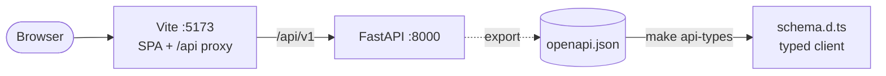
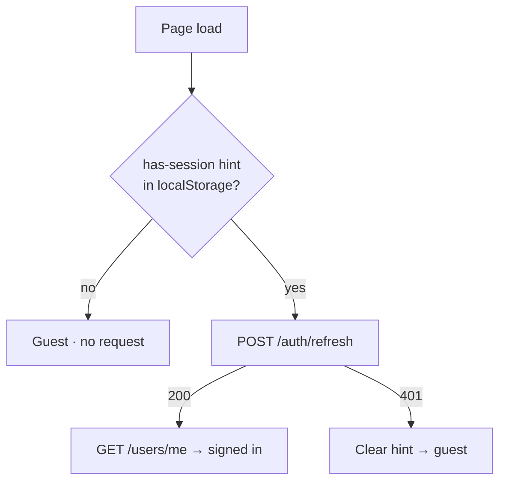

# Day 6 — The web app

## Phase 6 — Frontend

**Built:** A React single-page app covering the whole API. It has:
- the public feed (search, tags, sorting), post pages, profiles, likes and comments;
- sign-in and sign-up with silent session restore;
- a Markdown editor with live preview and an unsaved-changes guard;
- an author dashboard;
- light, dark and system themes;
- generated cover art.

It also adds 62 frontend tests, a frontend CI job and an OpenAPI drift check.

| Concept | What it means | Where it's applied |
|---|---|---|
| **Token in memory, refresh in a cookie** | Script can't read an httpOnly cookie, and a token kept in a JS variable isn't in storage for injected code to find. A reload costs one refresh call | [`api/client.ts`](../../frontend/src/api/client.ts) |
| **Single-flight refresh** | Refresh tokens are single use, so every 401 waits on one shared promise, and tabs coordinate through a Web Lock. Parallel refreshes would trigger reuse detection | same |
| **Server state vs UI state** | TanStack Query owns everything fetched (caching, retries, invalidation); React state only holds what's on screen | [`main.tsx`](../../frontend/src/main.tsx), pages |
| **Optimistic updates** | The like heart flips immediately and rolls back if the request fails | [`LikeButton.tsx`](../../frontend/src/components/LikeButton.tsx) |
| **Generated API types** | TypeScript types come from the backend's OpenAPI schema; CI fails if they drift, so a renamed field breaks the build, not production | [`api/schema.d.ts`](../../frontend/src/api/schema.d.ts) |
| **Safe Markdown** | Raw HTML is ignored and the output passes through `rehype-sanitize`; comments are plain text nodes | [`Markdown.tsx`](../../frontend/src/components/Markdown.tsx) |
| **Open-redirect guard** | `?next=` after sign-in accepts same-site paths only (`/…`, not `//evil.example`) | [`lib/utils.ts`](../../frontend/src/lib/utils.ts) |
| **Route-level code splitting** | Only the feed is in the first bundle; the Markdown stack loads with the post page and editor | [`main.tsx`](../../frontend/src/main.tsx) |
| **Design tokens** | Colors are CSS variables mapped into Tailwind; one `data-mode` attribute re-themes the whole app | [`index.css`](../../frontend/src/index.css) |
| **No theme flash** | A tiny external script sets the mode before first paint (external so a strict CSP can allow it) | [`public/theme-init.js`](../../frontend/public/theme-init.js) |
| **Deterministic art** | A hash of the slug seeds a small PRNG, so each post always gets the same SVG cover in the current theme's colors | [`lib/covers.ts`](../../frontend/src/lib/covers.ts) |

### Restoring a session on reload

The hint is just a flag that a cookie probably exists. It isn't a credential, and it saves every guest from a pointless 401.

**Security details worth remembering**

- UI permission checks only hide buttons; the API still decides. Hiding isn't protecting.
- Production builds ship no source maps, so the original source isn't published.
- External links in posts get `rel="noopener noreferrer nofollow ugc"`.
- Leaving the editor with unsaved changes asks first (in-app navigation and tab close).

**Decisions & trade-offs**

| Decision | Why | Cost |
|---|---|---|
| Vite proxy (same origin) in dev | Strict cookie works unchanged; no CORS preflights | Production needs the same routing at the reverse proxy |
| Generated covers instead of uploads | No storage, no moderation of images, always on-theme | Authors can't pick their own image (yet) |
| One theme, three modes | Tested options side by side, then kept Haze · Indigo · Geist · Patterns | Less customization for users |
| Hand-built UI primitives (cva) | Small, no component-library lock-in | More code to own |

**Lessons learned**

- A `position: fixed` backdrop with a negative z-index is hidden by any background on `body`; the base color belongs on `html`.
- CSS cascade layers matter: an unlayered rule beats a utility in `@layer utilities`, whatever the specificity.
- Trying design options live in the running app (then deleting the losers) beat choosing from static mockups.
