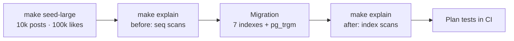
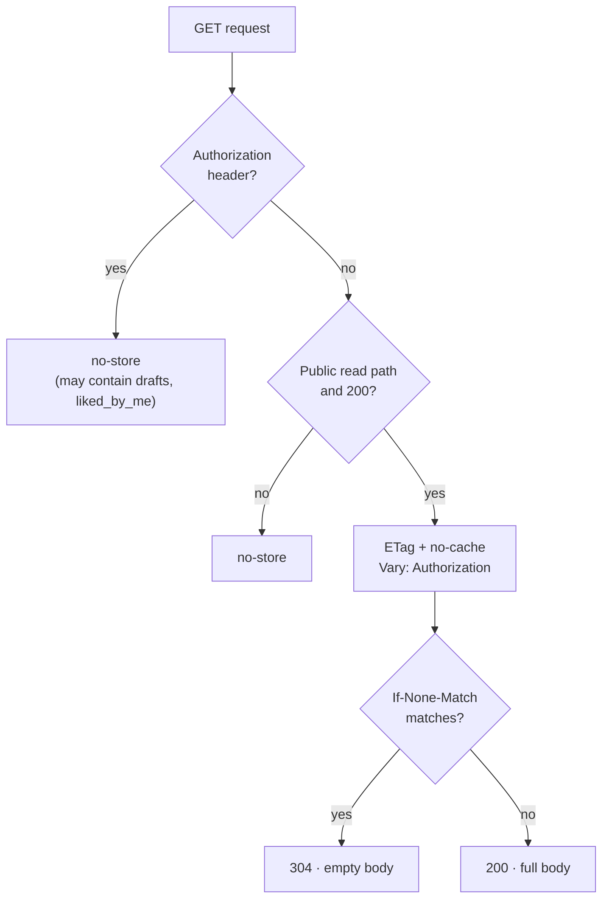

# Day 7 — Performance

## Phase 7 — Indexes, query plans and HTTP caching

**Built:**
- a 10k-post seed (`make seed-large`) and a script that runs `EXPLAIN ANALYZE` on every hot read path (`make explain`);
- seven indexes chosen from those plans, in one migration (including pg_trgm for search);
- plan tests that fail if a query can no longer use its index;
- weak ETags with `304 Not Modified` for anonymous public reads, and gzip for large responses.

That adds 13 new tests, 145 in total. The slowest query went from 9.4 s to 18 ms; the feed's first page from 59 ms to 0.9 ms.

| Query | Before | After |
|---|---:|---:|
| Feed, page 1 | 59 ms | 0.9 ms |
| Feed, offset 5000 | 9,377 ms | 18 ms |
| Search `?q=` | 75 ms | 2.0 ms |
| Dashboard | 57 ms | 0.4 ms |

Full table and index list: [database.md](../database.md#indexes-and-query-performance).

| Concept | What it means | Where it's applied |
|---|---|---|
| **Measure first** | `EXPLAIN (ANALYZE, BUFFERS)` runs the query and shows each step's real time and rows. Indexes are added only where a plan shows a scan that hurts | [`scripts/explain.py`](../../backend/scripts/explain.py) |
| **Seq scan vs index scan** | Without an index, PostgreSQL reads the whole table. A B-tree jumps straight to the matching rows, already in order, so `ORDER BY … LIMIT 20` stops after 20 | [`models/post.py`](../../backend/app/models/post.py) |
| **Composite index column order** | `likes` has PK `(user_id, post_id)`: great for "did I like it?", useless for "count this post's likes". An index is used left to right, so that needs its own `(post_id)` index | [`models/like.py`](../../backend/app/models/like.py) |
| **Partial index** | `WHERE status = 'published' AND deleted_at IS NULL` indexes only public posts: smaller, and exactly what the feed asks for | `ix_posts_feed` |
| **Generic plans vs partial indexes** | A prepared statement can be re-planned without its parameter values; then `status = $1` can't be matched to the index's `status = 'published'`. Rendering the constant inline fixes it | [`repositories/posts.py`](../../backend/app/repositories/posts.py) |
| **Index-only scan** | When the index holds every column a query needs, the table isn't read at all. The feed's `COUNT(*)` got this after dropping an unneeded join | same |
| **Trigram (pg_trgm) search** | `ILIKE '%term%'` can't use a B-tree (no fixed prefix). A GIN index of 3-letter fragments can | migration `bb601d208e54` |
| **Why a deep offset was slow** | The count subqueries run for every row *skipped* by `OFFSET`, not only the 20 returned. With indexes each is a quick lookup | [database.md](../database.md#indexes-and-query-performance) |
| **Conditional requests (ETag / 304)** | The response carries a fingerprint; the browser sends it back as `If-None-Match` and gets an empty `304` if nothing changed | [`core/middleware.py`](../../backend/app/core/middleware.py) |
| **Compression** | A 20-post page shrinks from 11.8 KB to 3.8 KB with gzip | same |

### What gets cached

**Security details worth remembering**

- Signed-in responses are `no-store`: they can hold drafts and per-user flags, so they never sit in a shared or on-disk cache.
- `Vary: Authorization` stops a shared cache from serving an anonymous copy to a signed-in reader.
- `/auth/*` responses are never gzipped. Compressing a secret next to attacker-influenced input can leak it through the response size (BREACH).
- List queries no longer load authors' email or password hash at all; the fewer places a secret travels, the fewer places it can leak.

**Decisions & trade-offs**

| Decision | Why | Cost |
|---|---|---|
| `no-cache` (revalidate) instead of `max-age` | Like counts and comments are never stale | One round trip per view, though a `304` has no body |
| ETag computed from the response body | Always correct, no version columns to maintain | The query still runs; it saves bandwidth, not database time |
| No Redis response cache | With indexes every read is 2 ms or less; a cache would add invalidation bugs for little gain | Revisit if traffic grows |
| Offset pagination kept | Simple, and page numbers work with the existing UI | Deep pages cost more; keyset pagination is the next step if needed |
| Plain `CREATE INDEX` | Fine at this size, inside a transaction | A large live table would need `CONCURRENTLY` |

**Lessons learned**

- Planner choices depend on statistics: on a 2,000-row test table the trigram index lost to a plain index scan, and at 10,000 rows it won. Plan tests need realistic data (and `ANALYZE`).
- A test is only useful if it can fail: reverting the inline status made the generic-plan test fail, and restoring it made it pass.
- The seed itself had an O(n²) loop (every user could like every post). Capping likes per post and inserting in bulk loads 10k posts in under 10 seconds.
