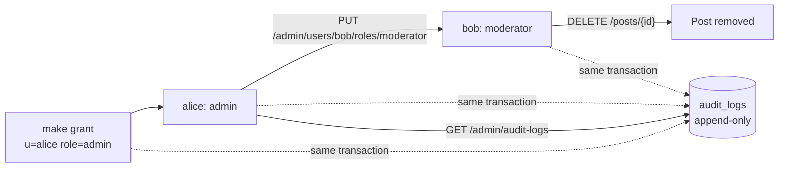

# Day 8 — Roles and audit

## Phase 8 — Permissions, account management and an audit log

**Built:**
- an `admin` role with two new permissions, `user:manage` and `audit:read`;
- a `require_permission(code)` route guard;
- the `/admin` API: list accounts, grant and revoke roles, deactivate and reactivate;
- `make grant` / `make revoke` to create the first admin from the command line;
- an append-only `audit_logs` table recording moderator deletes, role changes and account status changes.

That adds 37 new tests, 182 in total. The biggest is a permission matrix: 4 viewers × 7 actions.

| Concept | What it means | Where it's applied |
|---|---|---|
| **Roles vs permissions** | Code checks a permission (`user:manage`), never a role name. Roles are rows that bundle permissions, so changing what a role can do is data, not code | [`services/permissions.py`](../../backend/app/services/permissions.py) |
| **Least privilege** | New accounts get `user` only. Moderators can remove content but not manage people; admins manage people but can't remove content | migration `59ff4137ce49` |
| **Guard dependency** | `Depends(require_permission(...))` rejects the request before the handler runs: `401` anonymous, `403` without the permission | [`api/deps.py`](../../backend/app/api/deps.py) |
| **Permission matrix test** | Every viewer × every protected action, with the expected status in one table. A missing guard shows up as one wrong cell | [`test_admin.py`](../../backend/tests/test_admin.py) |
| **Lockout prevention** | No demoting or deactivating yourself; the last active admin can't be removed | [`services/admin.py`](../../backend/app/services/admin.py) |
| **Check-then-act race (TOCTOU)** | Two admins demoting each other at once could both pass the check. A row lock serialises the changes, and the permission is checked again after the lock | same |
| **Bootstrap trust** | The first admin can't come from the API. The CLI needs database access, which is already the highest trust level | [`scripts/roles.py`](../../backend/scripts/roles.py) |
| **Audit in the same transaction** | The action and its log entry commit or roll back together | [`services/audit.py`](../../backend/app/services/audit.py) |
| **Append-only in the database** | A trigger rejects `UPDATE` and `DELETE`, so even buggy code or a manual query can't rewrite history | same migration |
| **Deactivate, don't delete** | Blocks sign-in and revokes every refresh token. Access tokens stop working on the next request because each one re-checks `is_active`. Content and history stay, and it's reversible | same service |

### Who can do what

| Action | user | moderator | admin |
|---|:-:|:-:|:-:|
| Manage own posts and comments | ✓ | ✓ | ✓ |
| Delete anyone's post or comment | | ✓ | |
| List accounts, change roles, deactivate | | | ✓ |
| Read the audit log | | | ✓ |

**Security details worth remembering**

- The account listing is the only place, besides your own profile, where emails appear. It still never includes password hashes: the response schema lists its fields explicitly.
- Audit entries hold ids and role names only. Copying a deleted comment's text into the log would keep content that a moderator removed.
- An owner deleting their own post isn't audited, and neither is a post author removing a comment on their own post. Only uses of an override permission are.

**Decisions & trade-offs**

| Decision | Why | Cost |
|---|---|---|
| Admin has no moderation rights | Separate duties; an admin who needs them grants `moderator` to themselves, and that's audited | One extra step for small teams |
| One lock for all account changes | Simple, and the lockout rules can't race | Account changes run one at a time (they are rare) |
| Audit table blocks `UPDATE`/`DELETE` but not `TRUNCATE` | The seed reset and tests truncate everything | A database superuser can still wipe it; shipping logs off-box would cover that |
| No admin web page yet | The API, CLI and tests cover it; the UI can come later | Admin tasks use the API docs at `/docs` or the CLI |

**Lessons learned**

- Checking permissions rather than role names made the matrix test simple: the table *is* the specification.
- The "can't demote yourself" rule alone doesn't prevent a lockout. Two admins can demote each other at the same moment, so the lock and the re-check are what actually close the gap.
