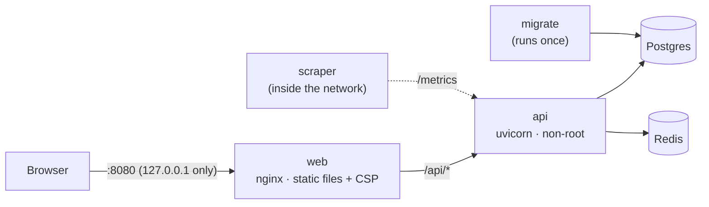
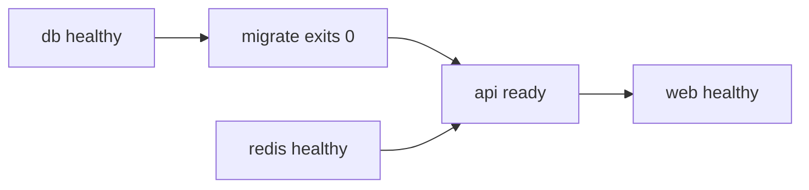

# Day 9 — Docker full stack and observability

## Phase 9 — Containers, metrics, request-aware logs and backups

**Built:**
- multi-stage Docker images for the API (Python 3.13 + uv) and the web app (Vite build served by unprivileged nginx);
- a full-stack Compose profile, `make up`: Postgres, Redis, a one-shot `migrate` job, the API and the web proxy;
- Prometheus metrics at `GET /metrics`: request counts and latency per route template;
- access and error logs that carry the route and the signed-in user's id;
- `make backup` / `make restore` with `pg_dump` / `pg_restore`;
- a CI job that builds both images, starts the stack and runs `scripts/smoke-test.sh` against it.

That adds 8 new tests, 190 backend tests in total.

| Concept | What it means | Where it's applied |
|---|---|---|
| **Multi-stage build** | Build tools (uv, npm, compilers) stay in the build stage; the runtime image gets only the virtualenv or the static files | [`backend/Dockerfile`](../../backend/Dockerfile), [`frontend/Dockerfile`](../../frontend/Dockerfile) |
| **Reproducible images** | `uv sync --frozen` and `npm ci` install exactly what the lockfiles say; base images are pinned to a version, and Dependabot proposes updates | same, [`dependabot.yml`](../../.github/dependabot.yml) |
| **Container hardening** | Non-root user, read-only root filesystem, every Linux capability dropped, `no-new-privileges`, `/tmp` on tmpfs | [`docker-compose.yml`](../../docker-compose.yml) |
| **One public door** | Only nginx publishes a port, and only on `127.0.0.1`. The API, database traffic and `/metrics` stay on the internal network | same, [`nginx.conf`](../../frontend/docker/nginx.conf) |
| **Liveness vs readiness** | Liveness: the process answers. Readiness: it can reach Postgres and Redis. The image checks liveness; Compose waits on readiness before starting `web` | [`routes/health.py`](../../backend/app/api/v1/routes/health.py) |
| **Migrations as a job** | A separate container applies migrations and exits; the API starts only after it succeeds, so two API replicas never race to migrate | `docker-compose.yml` |
| **Trusted proxy headers** | nginx *overwrites* `X-Forwarded-For` with the real peer address, so the rate limiter sees the client's IP and a forged header can't reset it | `nginx.conf` |
| **RED metrics** | Rate, Errors, Duration: a counter by status and a latency histogram, per route | [`core/metrics.py`](../../backend/app/core/metrics.py) |
| **Bounded labels** | Labels are route *templates* (`/posts/{slug}`), known methods and status codes. Unmatched paths share one `unmatched` series, so no client can create new series | same |
| **Context in logs** | Request id and user id live in context variables and are copied onto each log record when it's created, so a line logged anywhere in the request carries them | [`core/logging.py`](../../backend/app/core/logging.py) |
| **Consistent backups** | `pg_dump` reads a single snapshot, so a dump taken while the app runs is still consistent | [`scripts/backup.sh`](../../scripts/backup.sh) |
| **Smoke test** | A short end-to-end check against the real running stack: pages, proxy, headers, readiness, and that `/metrics` isn't public | [`scripts/smoke-test.sh`](../../scripts/smoke-test.sh) |

### Three signals

| Signal | Answers | Here |
|---|---|---|
| Logs | *What happened to this request?* | JSON lines with `request_id`, `route`, `user_id`, status and duration |
| Metrics | *How is the system doing overall?* | `nebula_http_requests_total`, `nebula_http_request_duration_seconds` |
| Health | *Should traffic go to this container?* | `/health/live`, `/health/ready` |

**Security details worth remembering**

- Metrics and logs record ids and templates only. Slugs, usernames, emails and request bodies never appear; a test posts `{"password": "hunter2"}` to a failing route and checks the error log doesn't contain it.
- The user id is reset at the start of every request, so an anonymous request can't inherit the previous request's user. A test covers this.
- `/docs` is off in the Docker stack (`APP_ENV=production`), and responses carry no `Server` header or nginx version.
- nginx sends a strict Content-Security-Policy (`script-src 'self'`, no inline scripts, `frame-ancestors 'none'`). The app runs under it with no violations.
- nginx gzips static files only. API responses are compressed by the API, which already skips `/auth/*` (BREACH).
- Backups hold personal data: created with mode `600`, in a git-ignored folder.

**Decisions & trade-offs**

| Decision | Why | Cost |
|---|---|---|
| Expose `/metrics`, don't run Prometheus/Grafana | The endpoint is the part the app owns; a scraper is deployment infrastructure | No dashboards out of the box |
| No distributed tracing | One API process and one database: request-id logs already connect everything | Would need OpenTelemetry once there are several services |
| Same Postgres volume for `make dev` and `make up` | One set of data, one `make seed` | Both modes can't run on different data at the same time |
| Process-local metrics | Simple; correct for one API process | Several uvicorn workers would need `prometheus_client` multiprocess mode |
| Local, on-demand backups | Enough for a local deployment | No schedule, no off-site copy, no point-in-time recovery |

**Lessons learned**

- FastAPI keeps included routers nested, so the matched route alone didn't know its `/api/v1` prefix. Checking the label value in a test caught it before it shipped.
- Reading the user id from a context variable at *format* time was too late: the middleware had already reset it. Stamping it when the record is *created* fixed that.
- `extra={"user_id": …}` already existed in some log calls, and the logging module refuses to overwrite a record attribute. Storing the context under a private attribute avoided the clash.
- Checking the security headers in a real browser mattered: a policy that looks right can still break the app, and a unit test wouldn't show it.
