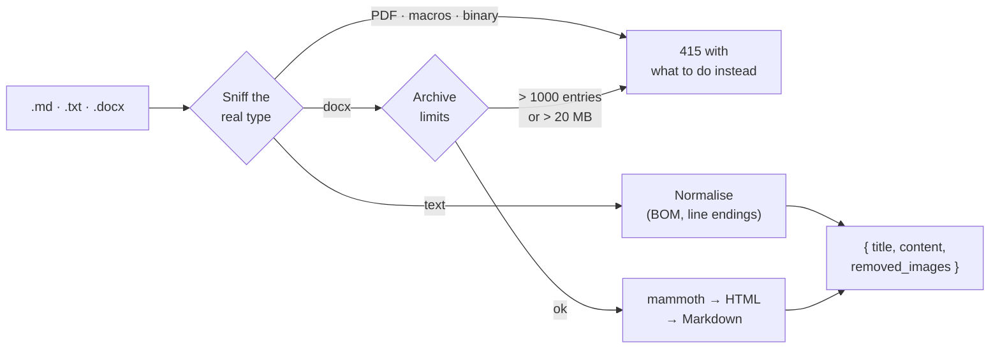
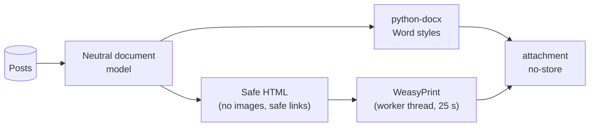

# Day 10 — Import, export and writing check

## Phase 10 — Moving writing in and out of Nebula

**Built:**
- `POST /posts/import`: turns a `.md`, `.txt` or `.docx` file into an unsaved draft. Images are dropped and counted; PDFs, macro documents and anything that isn't really text are rejected;
- `GET /exports/posts/{slug}` and `GET /exports/posts`: download one post, or all of them, as a Word document or a PDF. The all-posts file has a contents list and puts each post on a new page;
- `POST /writing/check`: spelling, grammar and style suggestions from LanguageTool, with offsets that point into the Markdown;
- in the editor, **Import file**, a **Check writing** panel (apply or ignore each suggestion) and a reusable confirmation dialog; on the dashboard, an **Export** menu on each post and **Export all**;
- PDF libraries (Pango, HarfBuzz, DejaVu fonts) in the API image and in CI, plus a smoke-test check that the image can render a PDF;
- new demo content: fictional authors writing realistic technology and market posts.

That adds 36 new backend tests (226 in total) and new frontend tests (71 in total).

| Concept | What it means | Where it's applied |
|---|---|---|
| **Content sniffing** | Decide a file's type from its bytes (`%PDF`, a zip header, valid UTF-8), not from its name, so a renamed file is caught | [`services/imports.py`](../../backend/app/services/imports.py) |
| **Zip-bomb limits** | A `.docx` is a zip. Entry count and the *declared unpacked size* are checked before anything is extracted | same |
| **Body-size limit** | A middleware counts bytes as they arrive, so even a streamed upload with no `Content-Length` stops at 2 MB with `413` | [`core/middleware.py`](../../backend/app/core/middleware.py) |
| **Stateless import** | Import returns a draft and saves nothing; the author reviews it and saves normally, through the same validation as any post | [`routes/posts.py`](../../backend/app/api/v1/routes/posts.py) |
| **One model, two renderers** | Posts become one document model; Word and PDF render from it, so both exports have the same content and order | [`rendering/`](../../backend/app/rendering/) |
| **Blocking work off the event loop** | PDF rendering is CPU-heavy, so it runs in a worker thread with a time limit and the API stays responsive | [`services/exports.py`](../../backend/app/services/exports.py) |
| **Content-Disposition** | `attachment; filename="…"` makes the browser download instead of display; the frontend keeps only the last path segment of the name | same, [`api/client.ts`](../../frontend/src/api/client.ts) |
| **Markup annotation** | LanguageTool receives the text as *text* and *markup* pieces, so it checks the prose and skips `##`, code and URLs, while offsets still count every character | [`services/writing.py`](../../backend/app/services/writing.py) |
| **UTF-16 offsets** | LanguageTool counts UTF-16 code units, the same unit as JavaScript's `String.length`, so offsets can be used in the editor without converting | [`lib/writing.ts`](../../frontend/src/lib/writing.ts) |
| **Shifting ranges** | Applying one fix changes the text length: later issues move by the difference, and issues that overlap the fix are dropped | same |
| **Global rate limit** | Besides the per-user limit, one shared limit keeps the whole server inside the free LanguageTool quota | `services/writing.py` |
| **Feature flag** | `WRITING_CHECK_ENABLED=false` doesn't register the route at all, so draft text never leaves the server | [`main.py`](../../backend/app/main.py) |

### Limits at a glance

| What | Limit |
|---|---|
| Import file | 1 MB; request body 2 MB |
| Imported text | 100,000 characters |
| Word archive | 1,000 entries, 20 MB unpacked |
| Export all | 500 posts; 25 s to render |
| Writing check text | 20,000 bytes |
| Rate limits | import 20/hour · export 10/hour · writing check 10/minute per user and 15/minute overall |

**Security details worth remembering**

- Exports never fetch anything. Images become `[Image: alt text]`, so a post can't make the server call a URL (SSRF) or put a tracking pixel in a PDF.
- Only `http`, `https` and `mailto` links survive into an export; a `javascript:` link stays as plain text. Raw HTML in a post is escaped, never rendered.
- Only the owner can export a post, drafts included. Anyone else gets `404`, even for a published post, so the endpoint doesn't reveal which slugs exist.
- Macro documents are rejected by extension (`.docm`) *and* by content type inside the archive, so renaming a `.docm` to `.docx` doesn't help.
- Draft text sent to the writing check isn't stored or logged, and the check panel says so.
- Exports are sent with `Cache-Control: no-store` and aren't gzipped (both formats are already compressed).
- Error messages say what to do next ("save it as .docx") without echoing file contents.

**Decisions & trade-offs**

| Decision | Why | Cost |
|---|---|---|
| Reject PDF imports | PDF stores positioned glyphs, not paragraphs; converted text comes out with broken lines and lost headings | Authors save as `.docx` first |
| Drop images on import | Nothing to host them safely without a review step; external image URLs would leak readers' IPs | Images have to be re-added by hand |
| Word and PDF export, not Markdown/CSV zips | Word is what most people open and edit; PDF is what they share | No bulk re-import format |
| Public LanguageTool API | Free, no key, good quality | Text leaves the server (hence the flag), and the free quota is small |
| Render in-process, not a job queue | Exports are small and usually take well under a second | A very large export holds a worker thread for up to 25 s |
| WeasyPrint for PDF | HTML and CSS in, reliable pagination and a contents page out | Needs Pango and fonts in the API image |

**Lessons learned**

- On macOS, System Integrity Protection strips `DYLD_*` variables from anything started through a system shell, so WeasyPrint couldn't find Homebrew's Pango. Setting the variable inline in the Makefile, for that command only, fixed it.
- On a read-only filesystem, Fontconfig logged "No writable cache directories" on every render. Building the font cache into the image and pointing `XDG_CACHE_HOME` at `/tmp` fixed it.
- Offset units are easy to get wrong: Python counts code points, JavaScript and LanguageTool count UTF-16 units. A test with an emoji (outside the Basic Multilingual Plane) pins that down.
- A route switched off by a flag is best tested through `app.openapi()`: if the path isn't in the schema, it isn't served.
- markdown-it's link validation already blocks `javascript:`, but checking the generated HTML in a test made that a guarantee instead of an assumption.
- The query-plan probe searched for a word with a trailing comma, which made the search skip the trigram index. Stripping punctuation made the measurement honest again.
