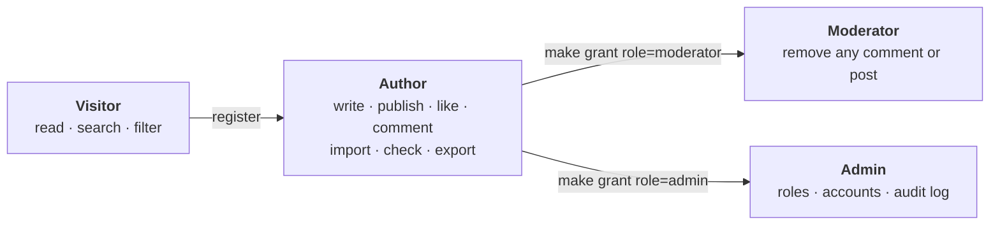

# User guide

How to use Nebula as a reader, an author and a moderator. To install and run it, see the [README](../README.md#quickstart).



## 1. Reading

No account is needed to read.


- **Feed** (`/`): the newest published posts first. Switch to **Oldest** to reverse the order.
- **Search**: matches words in titles and excerpts.
- **Tags**: select a tag chip under the search box to show only posts with that tag. Select it again to clear it.
- **Pages**: use the page controls at the bottom of the feed.
- **Post page**: select a card to read the full post, with its reading time, tags, likes and comments.
- **Author profile**: select an author's name to see their bio and published posts (`/u/<username>`).
- **Theme**: the moon/sun button in the header cycles through system, light and dark mode. Your choice is remembered on this device.


## 2. Your account

1. Select **Join Nebula** in the header.
2. Enter an email, a username (3–30 lowercase letters, digits or `_`), a display name, and a password of at least 12 characters.
3. You're signed in straight away and stay signed in for up to 7 days, even after closing the tab.

Your email is private. Other people see only your username, display name and bio. To change your display name or bio, open your menu (your avatar, top right), choose **Profile**, then **Edit profile**.

**Sign out** in the same menu ends the session on this device.

## 3. Writing a post

Select **Write** in the header.

1. Add a **Title**, up to 200 characters.
2. Optionally add an **Excerpt**: the short summary shown on feed cards, up to 300 characters. If you leave it empty, the opening lines of the post are used.
3. Add up to 5 **Tags**. Type one and press Enter, or pick a popular tag.
4. Write the **Content** in Markdown. The preview beside it (or under it, on a phone) shows exactly how the post will look.
5. **Save draft** keeps it private. **Publish** makes it public. **Cmd/Ctrl + S** saves at any time.

If you try to leave with unsaved changes, Nebula asks first.

### Import a file

**Import file** fills the editor from a file on your computer.

| Format | What happens |
|---|---|
| `.md`, `.txt` | Used as-is. The first `# Heading` becomes the title |
| `.docx` | Headings, lists, bold, italics, links and tables are converted to Markdown |
| `.pdf`, `.doc`, `.docm` | Not accepted. Save the file as `.docx` first |

Limits: 1 MB per file and 100,000 characters. Images aren't imported, and Nebula tells you how many were left out.

Importing doesn't save anything. Review the draft, then save it as usual. If the editor already has text, Nebula asks before replacing it.

### Check writing

**Check writing** looks for spelling, grammar and style problems.


- Each suggestion shows the problem and the text around it. Select a replacement to apply it, or **×** to ignore it.
- Code, links and Markdown syntax are skipped, so applying a suggestion never breaks your formatting.
- If you edit the text afterwards, the panel says the results are out of date. Select **Check again**.
- Your text is sent to [LanguageTool](https://languagetool.org) for checking. Nebula doesn't store it. Up to about 20,000 characters (20 KB) can be checked in one go.

## 4. Managing your posts

**My posts** (in your menu) lists everything you've written.


- Filter by **All**, **Drafts** or **Published**.
- **Edit**, **Preview** (drafts) or **View** (published posts).
- **Publish** or **Unpublish**. An unpublished post becomes a private draft again, and its likes and comments are kept.
- **Delete** asks for confirmation. A deleted post disappears everywhere.

Only you can see or change your drafts. If someone else opens a draft's link, they see "not found".

### Export

- **Export** on a post downloads it as a **Word (.docx)** file or a **PDF**.
- **Export all** downloads every post you've written, drafts included, as one file with a contents list.

Exports contain text and formatting only. Images appear as `[Image: description]`.

## 5. Likes and comments

Sign in to like and comment. You can't like your own posts.

- **Like**: select the heart on a post page. Select it again to take the like back.
- **Comment**: write in the box under the post and select **Comment**. Comments are plain text.
- **Edit** or **Delete** your own comments at any time. Edited comments are marked as edited.
- On **your own posts**, you can also delete other people's comments.

A deleted comment leaves a "This comment was deleted." placeholder, so replies around it still make sense.

## 6. Moderation and administration

Roles are granted by whoever runs the server:

```bash
make grant u=<username> role=moderator   # or role=admin
make revoke u=<username> role=moderator
```

The API applies a new role immediately. The person reloads the page to see the matching buttons.

| Role | Can |
|---|---|
| **Moderator** | Delete any comment, from the post page. Delete any post, through the API (`DELETE /api/v1/posts/{id}`) |
| **Admin** | List accounts, grant and revoke roles, deactivate and reactivate accounts, read the audit log. Available through the [admin API](api.md) |

Every moderator and admin action is recorded in the audit log: who did it, what, to which item and when. The database itself rejects any change to an existing entry.

## 7. Limits

To keep the service fair, some actions are rate-limited. If you hit a limit, Nebula tells you how long to wait.

| Action | Limit |
|---|---|
| Sign-in attempts | 5 a minute from one address, 10 per 15 minutes for one account |
| New accounts | 10 an hour from one address |
| Comments | 10 a minute |
| Imports · exports | 20 an hour · 10 an hour |
| Writing checks | 10 a minute |
